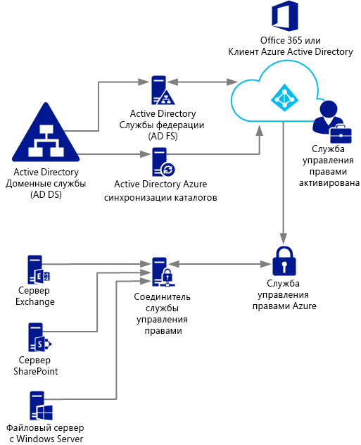
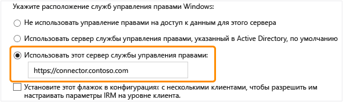

# Развертывание соединителя службы Azure Rights Management
Используйте эту информацию для ознакомления с соединителем Microsoft Rights Management (RMS) и способом его применения для защиты информации с помощью существующих местных развертываний, где используются Microsoft Exchange Server, Microsoft SharePoint Server или файловые серверы, на которых работает Windows Server и применяется инфраструктура классификации файлов (FCI) диспетчера ресурсов файлового сервера.

> [!TIP]
> Высокоуровневый пример сценария со снимками экрана см. в разделе [Автоматическая защита файлов на файловых серверах под управлением Windows Server с инфраструктурой классификации файлов](../Topic/What_is_Azure_Rights_Management_.md#BKMK_Example_FCI) статьи [Что такое управление правами Azure?](../Topic/What_is_Azure_Rights_Management_.md).

## <a name="OverviewConnector"></a>Общие сведения о соединителе Microsoft Rights Management (RMS)
Соединитель Microsoft Rights Management (RMS) позволяет быстро включать существующие местные серверы для использования их функции управления правами на доступ к данным (IRM) с облачными службами управления правами Майкрософт (Azure RMS). Благодаря этой функции, отделы ИТ и отдельные пользователи могут легко защищать документы и изображения как внутри вашей организации, так и за ее пределами. Причем, при этом не нужно создавать дополнительную инфраструктуру или устанавливать отношения доверия с другими организациями. Можно использовать этот соединитель, даже если некоторые пользователи подключаются к веб-службам в гибридном сценарии. Например, некоторые почтовые ящики пользователей могут использовать Exchange Online, а некоторые почтовые ящики пользователей — сервер Exchange Server. После установки соединителя RMS все пользователи смогут защищать и получать сообщения электронной почты и вложения с помощью Azure RMS, прозрачно взаимодействуя в рамках защиты информации между двумя конфигурациями развертывания.

Соединитель Microsoft Rights Management (RMS) представляет собой компактную службу, устанавливаемую на местных серверах, на которых работают Windows Server 2012 R2, Windows Server 2012 или Windows Server 2008 R2. Наряду с выполнением соединителя на физических компьютерах его можно также запустить на виртуальных машинах, включая ВМ IaaS Azure. После установки и настройки соединитель функционирует как коммуникационный интерфейс (ретранслятор) между местными серверами и облачной службой.

Если вы управляете собственным ключом клиента (сценарий BYOK), соединитель RMS и локальные серверы, которые используют его, не имеют доступа к аппаратному модулю безопасности (HSM), в котором хранится ваш ключ клиента. Это достигается выполнением всех операций шифрования, для которых требуется ключ клиента, в Azure RMS, а не локально.



Соединитель RMS поддерживает следующие локальные серверы: Exchange Server, SharePoint Server и файловые серверы, на которых выполняется Windows Server и используется инфраструктура классификации файлов для классификации и документов в папке и применения к ним политик. Если вы хотите защитить все типы файлов с помощью классификации файлов, не следует использовать соединитель RMS. Вместо этого используйте [командлеты для защиты RMS](https://msdn.microsoft.com/library/azure/mt433195.aspx).

> [!NOTE]
> Сведения о поддерживаемых версиях местных серверов см. в пп. "Местные серверы, которые поддерживают службу управления правами Azure" в подразделе [Поддерживающие Azure RMS приложения](../Topic/Requirements_for_Azure_Rights_Management.md#BKMK_SupportedApplications) раздела [Требования для службы Azure Rights Management](../Topic/Requirements_for_Azure_Rights_Management.md).

Используйте информацию в следующих разделах при планировании, установке и настройке соединителя Rights Management Service. Впоследствии будет необходимо выполнить дополнительную настройку, чтобы серверы могли использовать данный соединитель.

-   [Необходимые условия для соединителя Rights Management Service](../Topic/Deploying_the_Azure_Rights_Management_Connector.md#BKMK_Prereqs)

-   **Шаг 1.**  [Установка соединителя Rights Management Service](../Topic/Deploying_the_Azure_Rights_Management_Connector.md#BKMK_InstallingConnector)

-   **Шаг 2.**  [Ввод учетных данных](../Topic/Deploying_the_Azure_Rights_Management_Connector.md#EnteringCredentials)

-   **Шаг 3**  [Авторизация серверов для применения соединителя Rights Management Service](../Topic/Deploying_the_Azure_Rights_Management_Connector.md#AuthorizingServers)

-   **Шаг 4.**  [Настройка балансировки нагрузки и высокой доступности](../Topic/Deploying_the_Azure_Rights_Management_Connector.md#ConfiguringConnector)

-   Необязательно. [Настройка соединителя Rights Management Service для использования протокола HTTPS](../Topic/Deploying_the_Azure_Rights_Management_Connector.md#BKMK_ConfiguringHTTPS)

-   Необязательно. [Настройка соединителя Rights Management Service для сервера веб-прокси](../Topic/Deploying_the_Azure_Rights_Management_Connector.md#BKMK_ConfiguringWebProxy)

-   Необязательно. [Установка средства администрирования соединителя Rights Management Service на административных компьютерах](../Topic/Deploying_the_Azure_Rights_Management_Connector.md#BKMK_InstallingStandaloneTool)

-   **Шаг 5.**  [Настройка серверов для применения соединителя Rights Management Service](../Topic/Deploying_the_Azure_Rights_Management_Connector.md#ConfiguringServers)

    -   [Настройка сервера Exchange для использования соединителя](../Topic/Deploying_the_Azure_Rights_Management_Connector.md#BKMK_ExchangeServer)

    -   [Настройка сервера SharePoint для использования соединителя](../Topic/Deploying_the_Azure_Rights_Management_Connector.md#BKMK_ConfiguringSharePoint)

    -   [Настройка файлового сервера для инфраструктуры классификации файлов для использования соединителя](../Topic/Deploying_the_Azure_Rights_Management_Connector.md#BKMK_FileServer)

-   [Дальнейшие шаги](../Topic/Deploying_the_Azure_Rights_Management_Connector.md#BKMK_NextSteps)

## <a name="BKMK_Prereqs"></a>Необходимые условия для соединителя Rights Management Service
Перед установкой соединителя Rights Management Service убедитесь, что соблюдаются следующие требования.

|Требование|Дополнительные сведения|
|--------------|---------------------------|
|Активирована служба управления правами (RMS)|[Активация управления правами Azure](../Topic/Activating_Azure_Rights_Management.md)|
|Синхронизированы каталоги между вашими лесами Active Directory и Azure Active Directory|После того как активирована служба управления правами, необходимо настроить службу Azure Active Directory для работы с пользователями и группами в вашей базе данных Active Directory. **Important:** Этот шаг синхронизации каталогов требуется для работы соединителя RMS даже в случае тестовой сети. Можно использовать Office 365 и Azure Active Directory с помощью учетных записей, созданных вручную в Azure Active Directory, но для этого соединителя требуется, чтобы учетные записи в Azure Active Directory синхронизировались с доменными службами Active Directory; ручной синхронизации паролей недостаточно.<br />Для получения дополнительных сведений см. следующие ресурсы:<br /><br />-   [Инструкции по настройке вашего клиента Azure AD](http://technet.microsoft.com/library/hh967611.aspx)<br />-   [Инструкции по синхронизации каталогов с AAD с помощью DirSync](http://technet.microsoft.com/library/hh967642.aspx)|
|Не обязательно, но рекомендуется:<br /><br />-   Включите федерацию между своей местной Active Directory и Azure Active Directory|Можно включить федерацию удостоверений между местным каталогом и Azure Active Directory. Такая конфигурация обеспечивает более удобный режим работы пользователя благодаря использованию единого входа в службу управления правами. Если единый вход не поддерживается, то перед использованием защищенного контента пользователи будут должны вводить свои учетные данные.<br /><br />Инструкции по настройке федерации с помощью служб федерации Active Directory (FS AD) между службами доменов Active Directory и Azure Active Directory см. в разделе [Контрольный список: использование AD FS для реализации единого входа и управления им](http://technet.microsoft.com/library/jj205462.aspx) в библиотеке Windows Server .|
|Как минимум два компьютера-члена, на которых следует установить соединитель RMS:<br /><br /><ul><li>64-разрядный физический или виртуальный компьютер, на котором выполняется одна из следующих операционных систем:<br /><br /><ul><li>Windows Server 2012 R2</li><li>Windows Server 2012</li><li>Windows Server 2008 R2</li></ul></li><li>По крайней мере, 1 ГБ ОЗУ</li><li>Не менее 64 ГБ свободного места на диске</li><li>По крайней мере, один сетевой интерфейс</li><li>Доступ к Интернету через брандмауэр (или веб-прокси), для которого не требуется проверка подлинности</li><li>Должен находиться в лесу или домене, который доверяет другим лесам в организации, где установлены серверы Exchange или SharePoint, которые вы хотите использовать с соединителем Rights Management Service</li></ul>|Для обеспечения отказоустойчивости и высокого уровня доступности соединитель Rights Management Service необходимо установить, как минимум, на двух компьютерах. **Tip:** Если вы используете Outlook Web Access или мобильные устройства, которые используют Exchange ActiveSync IRM, и вам очень важен доступ к письмам и вложениям, защищенным Azure RMS, мы рекомендуем вам развернуть балансировщик нагрузки в виде группы серверов соединителя для обеспечения высокой доступности.<br />Для обеспечения работы соединителя выделенные серверы не нужны, но его необходимо установить на отдельном компьютере, отличном от серверов, которые будут использовать данный соединитель. **Important:** Не устанавливайте соединитель на компьютере, где выполняется сервер Exchange Server, SharePoint Server или файловый сервер, который настроен для инфраструктуры классификации файлов, если вы хотите использовать функции этих служб со службой управления правами Azure. Кроме того, не устанавливайте этот соединитель на контроллере домена.|

## <a name="BKMK_InstallingConnector"></a>Установка соединителя Rights Management Service
После проверки соблюдения необходимых условий в предыдущем разделе выполните следующую процедуру для установки соединителя Rights Management Service:

1.  Определите компьютеры (как минимум два), на которых будет работать соединитель Rights Management Service. Они должны соответствовать минимальным требованиям, перечисленным в предыдущем разделе.

    > [!NOTE]
    > Необходимо установить по одному соединителю Rights Management Service (состоящему из нескольких серверов для обеспечения высокой доступности) для каждого клиента (клиента Office 365 или Azure AD). В отличие от Rights Management Service Active Directory, соединитель Rights Management Service в каждом лесу устанавливать не нужно.

2.  Загрузите исходные файлы для соединителя RMS из[центра загрузки Майкрософт](http://go.microsoft.com/fwlink/?LinkId=314106).

    Для установки соединителя Rights Management Service загрузите файл RMSConnectorSetup.exe.

    Кроме того:

    -   Если вы хотите позже настроить соединитель из 32-разрядного компьютера, также загрузите файл RMSConnectorAdminToolSetup_x86.exe.

    -   Если вы хотите использовать средство настройки сервера для соединителя Rights Management Service с целью автоматизации процесса настройки параметров реестра на своих местных серверах, также загрузите файл GenConnectorConfig.ps1.

3.  На компьютере, где вы хотите установите соединитель RMS, запустите файл **RMSConnectorSetup.exe** с правами администратора.

4.  На странице приветствия для страницы "Установка соединителя Microsoft Rights Management" выберите **Установить соединитель Microsoft Rights Management на компьютере**, а затем нажмите кнопку **Далее**.

5.  Прочтите и примите условия лицензии для соединителя RMS, а затем нажмите кнопку **Далее**.

Для продолжения процесса настройки соединителя Rights Management Service введите имя учетной записи и пароль.

## <a name="EnteringCredentials"></a>Ввод учетных данных
Перед настройкой соединителя Rights Management Service необходимо ввести учетные данные для учетной записи, которая имеет достаточные права для настройки такого соединителя.

Кроме того, если реализованы [элементы управления внедрением](https://technet.microsoft.com/library/jj658941.aspx), убедитесь в том, что у указанной учетной записи есть возможность защитить содержимое. Например если возможность защиты содержимого ограничена группой «ИТ-отдела», то учетная запись, указанная здесь, должна быть членом этой группы. В противном случае будет выдано сообщение об ошибке: **Не удалось обнаружить расположение службы администрирования и организации. Убедитесь, что включена служба Microsoft Rights Management для вашей организации.**

Можно использовать учетную запись, которая имеет одно из следующих прав:

-   **Администратор клиента Office 365**: учетная запись глобального администратора для клиента Office 365.

-   **Глобальный администратор Azure Rights Management**: учетная запись с правами администратора для клиента Azure RMS.

-   **Администратор соединителя Microsoft RMS**: учетная запись в Azure Active Directory, которой предоставлены права на установку и администрирование соединителя RMS для вашей организации.

    > [!NOTE]
    > Если вы хотите использовать учетную запись администратора соединителя Microsoft Rights Management, то для назначения роли администратора соединителя Rights Management Service сначала необходимо сделать следующее:
    > 
    > 1.  На том же самом компьютере загрузите и установите Windows PowerShell для управления правами. Дополнительные сведения см. в [Установка Windows PowerShell для Azure Rights Management](../Topic/Installing_Windows_PowerShell_for_Azure_Rights_Management.md).
    > 
    >     Запустите Windows PowerShell с помощью команды **Запуск от имени администратора** и подключитесь к службе управления правами Azure с помощью команды [Connect-AadrmService](https://msdn.microsoft.com/library/azure/dn629415.aspx):
    > 
    >     ```
    >     Connect-AadrmService                   //provide Office 365 tenant administrator or Azure RMS global administrator credentials
    >     ```
    > 2.  Затем выполните команду [Add-AadrmRoleBasedAdministrator](https://msdn.microsoft.com/library/azure/dn629417.aspx) с помощью только одного из следующих параметров:
    > 
    >     ```
    >     Add-AadrmRoleBasedAdministrator -EmailAddress <email address> -Role "ConnectorAdministrator"
    >     ```
    > 
    >     ```
    >     Add-AadrmRoleBasedAdministrator -ObjectId <object id> -Role "ConnectorAdministrator"
    >     ```
    > 
    >     ```
    >     Add-AadrmRoleBasedAdministrator -SecurityGroupDisplayName <group Name> -Role "ConnectorAdministrator"
    >     ```
    >     Например, введите: **Add-AadrmRoleBasedAdministrator -EmailAddress melisa@contoso.com -Role " ConnectorAdministrator "**.
    > 
    >     Несмотря на то что эти команды используют роли ConnectorAdministrator, здесь можно также использовать роли GlobalAdministrator.

В процессе установки соединителя RMS проверяется и устанавливается все обязательное программное обеспечение, устанавливаются службы Internet Information Services (IIS) (если они отсутствуют), а также устанавливается и настраивается программное обеспечение соединителя. Кроме того, Azure RMS соответствующим образом подготавливается к настройке.

-   Создается пустая таблица серверов, которые имеют право использовать соединитель для взаимодействия со службой Azure RMS. Вы добавите серверы в эту таблицу позже.

-   Набор токенов безопасности для соединителя, которые разрешают операции с Azure RMS. Эти токены загружаются из Azure RMS и устанавливаются в реестре локального компьютера. Они защищены с помощью интерфейса защиты данных (DPAPI) и учетных данных учетной записи локальной системы.

На последней странице мастера выполните следующие действия, а затем щелкните **Готово**:

-   Если это первый установленный соединитель, на этом этапе не устанавливайте флажок **Запустить консоль администратора соединителей для авторизации серверов**. Этот вариант будет нужно выбирать установки второго (или последнего) соединителя Rights Management Service. Вместо этого, запустите мастер снова, по крайней мере, на одном другом компьютере. Необходимо установить, как минимум, два соединителя.

-   Если установлен второй (или последний) соединитель, установите флажок **Запустить консоль администратора соединителей для авторизации серверов**.

> [!TIP]
> На этом этапе предусмотрена возможность проверки того, работоспособны ли веб-службы для соединителя Rights Management Service:
> 
> -   В веб-браузере откройте страницу **http://&lt;connectoraddress&gt;/_wmcs/certification/servercertification.asmx**; вместо *&lt;connectoraddress&gt;* введите адрес или имя сервера, на котором установлен соединитель RMS. При успешном соединении отображается страница **ServerCertificationWebService**.

Если нужно удалить соединитель Rights Management Service, запустите мастер снова и выберите вариант удаления.

## <a name="AuthorizingServers"></a>Авторизация серверов для применения соединителя Rights Management Service
После установки соединителя Rights Management Service по крайней мере на двух компьютерах вы готовы к авторизации серверов, которые должны использовать данный соединитель. Например, серверы, на которых выполняется Exchange Server 2013 или SharePoint Server 2013.

Для определения этих серверов запустите средство администрирования соединителей Rights Management Service и добавьте значения в список разрешенных серверов. Это средство можно запустить в случае установки флажка **Запустить консоль администратора соединителей для авторизации серверов** в конце работы мастера установки соединителя Microsoft Rights Management, или его можно запустить отдельно от мастера.

В ходе авторизации этих серверов следует учитывать следующие моменты:

-   Серверам, которые вы добавляете, будут предоставлены специальные права. Все учетные записи, указываемые для роли сервера Exchange Server в конфигурации соединителя, получат [роль суперпользователя](https://technet.microsoft.com/library/mt147272.aspx) в Azure RMS, что дает им доступ ко всему содержимому этого клиента RMS. На этом этапе функция суперпользователя автоматически включается при необходимости. Во избежание снижения уровня безопасности из-за повышения прав доступа предоставляйте это право только тем учетным записям, которые будут использоваться серверами Exchange вашей организации. Всем серверам, настроенным как серверы SharePoint или файловые серверы, которые используют FCI, будут предоставлены обычные привилегии пользователя.

-   Множественные серверы можно добавлять в виде одиночного значения путем указания группы распространения или безопасности Active Directory, или учетной записи службы, которая используется несколькими серверами. При использовании такой конфигурации группа серверов будет совместно использовать одни и те же сертификаты Rights Management Service. Все серверы будут считаться владельцами контента, который был защищен любым из данных серверов. С целью сокращения административной нагрузки для авторизации серверов Exchange организации или фермы серверов SharePoint мы рекомендуем использовать именно такую конфигурацию в виде отдельной группы, а не индивидуальные серверы.

На странице **Серверы, которые могут использовать соединитель**, щелкните **Добавить**.

### <a name="BKMK_AddServer"></a>Добавьте сервер в список разрешенных серверов
На странице **Разрешить серверу использовать соединитель** введите имя объекта или выберите объект, который следует авторизовать.

Крайне важно, чтобы вы авторизовали нужный объект. Чтобы сервер мог использовать соединитель, учетную запись, которая запускает местную службу (например, Exchange или SharePoint), необходимо выбрать для авторизации. Например, если служба выполняется в виде настроенной учетной записи службы, добавьте имя этой учетной записи службы в список. Если служба выполняется в виде локальной системы, добавьте имя объекта-компьютера (например, SERVERNAME$). Лучше всего будет сделать так: создайте группу, которая содержит эти учетные записи, и укажите группу вместо отдельных имен серверов.

Дополнительная информация о различных ролях сервера:

-   Для серверов, на которых выполняется служба Exchange: Необходимо указать группу безопасности и можно использовать группу по умолчанию **Exchange Servers**, которую служба Exchange автоматически создает (из всех серверов Exchange Server) и обслуживает в лесу.

-   Для серверов, на которых выполняется служба SharePoint:

    -   Если сервер SharePoint 2010 настроен на работу в качестве локальной системы (не использует учетную запись службы), вам необходимо вручную создать группу безопасности в доменных службах Active Directory и добавить объект имени компьютера для сервера в этой конфигурации в данную группу.

    -   Если сервер SharePoint настроен на использование учетной записи службы (рекомендуемый подход для SharePoint 2010 и единственно возможный вариант для SharePoint 2013), сделайте следующее.

        1.  Добавьте учетную запись службы, которая запускает службу центра администрирования SharePoint, чтобы разрешить настройку службы SharePoint с его консоли администрирования.

        2.  Добавьте учетную запись, настроенную для пула приложений SharePoint.

        > [!TIP]
        > Если две эти учетные записи отличаются друг от друга, то для сокращения административной нагрузки создайте группу, которая содержит обе учетные записи.

-   Для файловых серверов, которые используют инфраструктуру классификации файлов, связанные службы выполняются в виде учетной записи локальной системы. Таким образом, необходимо авторизовать учетную запись компьютера для файловых серверов (например, SERVERNAME$) или группы, которая содержит такие учетные записи компьютеров.

После добавления всех серверов в список щелкните **Закрыть**.

Если это еще не сделано, то теперь необходимо настроить балансировку нагрузки для серверов, на которых установлен соединитель Rights Management Service, и определить, следует ли использовать протокол HTTPS для соединений между этими серверами и теми серверами, которые были только что авторизованы.

## <a name="ConfiguringConnector"></a>Настройка балансировки нагрузки и высокой доступности
После установки второго или последнего экземпляра соединителя Rights Management Service определите имя сервера в URL-адресе соединителя и настройте систему балансировки нагрузки.

Имя сервера в URL-адресе соединителя может быть любым именем в пространстве доступных вам имен. Например, вы можете создать сущность в своей системе DNS для **rmsconnector.contoso.com** и настроить эту сущность для использования IP-адреса в системе балансировки нагрузки. Для этого имени никаких особых требований не существует. Его не нужно настраивать на самих серверах соединителя. Если ваши серверы Exchange и SharePoint не будут взаимодействовать с соединителем по Интернету, то это имя не нужно разрешать в Интернете.

> [!IMPORTANT]
> Мы рекомендуем не изменять это имя после настройки серверов Exchange или SharePoint для использования соединителя. В противном случае, эти серверы всех конфигураций IRM нужно будет сбросить, а затем перенастроить.

После того, как имя создано в DNS и настроено для IP-адреса, настройте балансировку нагрузки для того адреса, который направляет трафик на серверы соединителя. Для этого можно использовать любую подсистему балансировки нагрузки на основе IP, которая включает функцию балансировки сетевой нагрузки (NLB) на сервере Windows Server. Дополнительные сведения см. в разделе [Руководство по развертыванию балансировки нагрузки](http://technet.microsoft.com/library/cc754833%28v=WS.10%29.aspx).

Для настройки кластера NLB используйте следующие параметры:

-   Порты: 80 (для HTTP) или 443 (для HTTPS)

    Дополнительную информацию о том, какой протокол следует использовать (HTTP или HTTPS), см. в следующем разделе.

-   Сходство: Нет

-   Метод распределения: Равно

Это имя, которое вы определяете для балансировщика нагрузки системы (для серверов, работающих под управлением службы соединителя RMS) является именем соединителя RMS вашей организации, которое вы будете использовать в дальнейшем при настройке серверов организации для использования Azure RMS.

## <a name="BKMK_ConfiguringHTTPS"></a>Настройка соединителя Rights Management Service для использования протокола HTTPS
> [!NOTE]
> Эта операция настройки не является обязательной, но рекомендуется для обеспечения дополнительной безопасности.

Несмотря на то, что использование TLS или SSL не является обязательным для соединителя Rights Management Service, мы рекомендуем применять его для любой службы на основе HTTP, чувствительной к уровню безопасности. Такая конфигурация позволяет проверять подлинность серверов, на которых работает соединитель с вашими серверами Exchange и SharePoint, использующими соединитель. Кроме того, все данные, посылаемые с этих серверов на соединитель, шифруются.

Чтобы разрешить соединителю Rights Management Service использовать TLS, на каждом сервере, где работает такой соединитель, установите сертификат проверки подлинности сервера, содержащий имя, которое вы будете использовать для соединителя. Например, если именем соединителя RMS, которое вы определили в DNS, является **rmsconnector.contoso.com**, разверните сертификат проверки подлинности сервера, содержащий имя **rmsconnector.contoso.com**, в субъекте сертификата в виде общего имени. Либо введите **rmsconnector.contoso.com** в альтернативное имя сертификата в виде значения DNS. Сертификат не должен содержать имя сервера. Затем в IIS привяжите этот сертификат к веб-сайту по умолчанию.

В случае применения протокола HTTPS убедитесь, что все серверы, на которых работает соединитель, имеют действительный сертификат проверки подлинности сервера, связанный с корневым ЦС, которому доверяют ваши серверы Exchange и SharePoint. Кроме того, если центр сертификации (CA), выдающий сертификаты для серверов соединителя, публикует список отзыва сертификатов (CRL), то серверы Exchange и SharePoint должны быть в состоянии загрузить этот CRL.

> [!TIP]
> Для запроса и установки сертификата проверки подлинности сервера, а также привязки этого сертификата к веб-сайту по умолчанию в IIS, можно использовать следующую информацию и ресурсы:
> 
> -   В случае использования служб сертификации Active Directory (AD CS) и центра сертификации предприятия (CA) для развертывания этих сертификатов проверки подлинности сервера можно дублировать, а затем применять шаблон сертификата веб-сервера. В этом шаблоне сертификата используется **Предоставляется в запросе** для имени субъекта сертификата. Это означает, что при запросе сертификата для имени субъекта сертификата или альтернативного имени субъекта можно предоставить FQDN имени соединителя RMS.
> -   При использовании автономного центра сертификации (ЦС) или приобретении сертификата у другой компании см. раздел [Настройка сертификатов Интернет-сервера (IIS 7)](http://technet.microsoft.com/library/cc731977%28v=ws.10%29.aspx)в библиотеке документации [Веб-сервер (IIS)](http://technet.microsoft.com/library/cc753433%28v=ws.10%29.aspx) на сайте TechNet.
> -   Чтобы настроить IIS для использования сертификата, см. раздел [Добавление привязки к сайту (IIS 7)](http://technet.microsoft.com/library/cc731692.aspx)в библиотеке документации [Веб-сервер (IIS)](http://technet.microsoft.com/library/cc753433%28v=ws.10%29.aspx) на сайте TechNet.

## <a name="BKMK_ConfiguringWebProxy"></a>Настройка соединителя Rights Management Service для сервера веб-прокси
Если ваши серверы соединителя установлены в сети, в которой нет прямой связи с Интернетом и где требуется ручная настройка сервера веб-прокси для исходящего Интернет-доступа, то для соединителя Rights Management Service необходимо настроить реестр на серверах.

#### Настройка соединителя Rights Management Service для использования сервера веб-прокси

1.  На каждом сервере, где работает соединитель Rights Management Service, откройте редактор реестра, например Regedit.

2.  Перейдите к **HKEY_LOCAL_MACHINE\SOFTWARE\Microsoft\AADRM\Connector**

3.  Добавьте строковый параметр **ProxyAddress** и введите для него значение **http://&lt;MyProxyDomainOrIPaddress&gt;:&lt;MyProxyPort&gt;**

    Например: **http://proxyserver.contoso.com:8080**

4.  Закройте редактор реестра, затем перезапустите сервер или выполните команду IISReset для перезапуска IIS.

## <a name="BKMK_InstallingStandaloneTool"></a>Установка средства администрирования соединителя Rights Management Service на административных компьютерах
Средство администрирования соединителя Rights Management Service можно запускать с компьютера, на котором нет такого соединителя, если данный компьютер удовлетворяет следующим требованиям.

-   Физический или виртуальный компьютер, на котором выполняется Windows Server 2012 или Windows Server 2012 R2 (все выпуски), Windows Server 2008 R2 или Windows Server 2008 R2 с пакетом обновления 1 (все выпуски), Windows 8.1, Windows 8 или Windows 7.

-   По крайней мере, 1 ГБ ОЗУ.

-   Не менее 64 ГБ свободного места на диске.

-   По крайней мере, один сетевой интерфейс.

-   Доступ к Интернету через брандмауэр (или веб-прокси).

Для установки средства администрирования соединителя Rights Management Service выполните следующие файлы:

-   Для 32-разрядного компьютера: RMSConnectorAdminToolSetup_x86.exe

-   Для 64-разрядного компьютера: RMSConnectorSetup.exe

Если вы еще не загрузили эти файлы, это можно сделать из[центра загрузки Майкрософт](http://go.microsoft.com/fwlink/?LinkId=314106).

## <a name="ConfiguringServers"></a>Настройка серверов для применения соединителя Rights Management Service
После того как вы установили и настроили соединитель RMS, можно приступать к настройке локальных серверов, которые будут использовать управление правами и подключиться к Azure RMS с помощью соединителя. Необходимо настроить следующие серверы.

-   Для Exchange 2013: серверы доступа клиентов и серверы почтовых ящиков.

-   Для Exchange 2010: серверы доступа клиентов и транспортные серверы-концентраторы.

-   Для SharePoint: интерфейсные веб-серверы SharePoint, в том числе на которых размещен сервер центрального администрирования.

-   Для инфраструктуры классификации файлов: компьютеры с Windows Server, на которых установлен диспетчер ресурсов файлового сервера.

В процессе настройки требуется настроить параметры реестра. Это можно сделать одним из двух способов:

|Вариант настройки|Преимущества|Недостатки|
|---------------------|----------------|--------------|
|Автоматически с помощью средства настройки сервера для соединителя Microsoft Rights Management|Прямое редактирование реестра не выполняется. Процесс можно автоматизировать с помощью скрипта.<br /><br />Для получения URL-адреса Microsoft Rights Management командлет Windows PowerShell запускать не нужно.<br /><br />Если запустить его локально, система автоматически проверит все необходимые условия вы (но ошибки автоматически не устраняются).|При запуске средства необходимо установить соединение с сервером, на котором уже выполняется соединитель Rights Management Service.|
|Вручную путем редактирования реестра|Никакая связь с сервером, на котором выполняется соединитель Rights Management Service, не нужна.|Более высокая административная нагрузка и вероятность ошибок.<br /><br />Необходимо получить URL-адрес Microsoft Rights Management, для чего нужно выполнить команду Windows PowerShell.<br /><br />Вы должны всегда самостоятельно проверять все предварительные условия.|
> [!IMPORTANT]
> В обоих случаях необходимо вручную выполнить все предварительные условия и настроить Exchange, SharePoint и инфраструктуру классификации файлов для использования управления правами.

Для большинства организаций автоматическая настройка с помощью средства настройки сервера для соединителя Microsoft Rights Management является более удобным вариантом, так как она обеспечивает более высокую эффективность и надежность, чем ручная настройка.

После внесения изменений в настройки этих серверов необходимо перезапустить их, если на них работают Exchange или SharePoint и они были ранее настроены на использование службы AD RMS. Необходимости в перезагрузке серверов нет, если вы настраиваете их для управления правами впервые. Вы всегда должны перезапускать файловый сервер, который настроен на использование классификации инфраструктуры файлов после внесения изменений в конфигурацию.

#### Как использовать средство настройки сервера для соединителя Microsoft Rights Management

1.  Если вы еще не загрузили скрипт для средства настройки сервера для соединителя Microsoft Rights Management (GenConnectorConfig.ps1), загрузите его из[центра загрузки Майкрософт](http://go.microsoft.com/fwlink/?LinkId=314106).

2.  Сохраните файл GenConnectorConfig.ps1 на компьютере, на котором вы будете запускать средство. Если вы будете запускать данное средство локально, то делайте это на сервере, который вы хотите настроить. В противном случае можно сохранить его на любом компьютере.

3.  Выберите метод запуска средства:

    -   **Локально**: Средство можно запускать в интерактивном режиме с сервера, подлежащего настройке для взаимодействия с соединителем RMS. Этот вариант удобен для одноразовой настройки, например, для среды тестирования.

    -   **Развертывание программного обеспечения**: Средство можно запускать для создания файлов реестра, которые вы затем развертываете на одном или нескольких соответствующих серверах с помощью приложения для управления систем, поддерживающего развертывание ПО, например, System Center Configuration Manager.

    -   **Групповая политика**: Средство можно запускать для создания скрипта, предназначенного для администратора, который может создавать объекты Групповая политика для серверов, подлежащих настройке. Этот скрипт создает один объект Групповая политика для каждого типа сервера, подлежащего настройке, который администратор может затем назначить соответствующим серверам.

    > [!NOTE]
    > Это средство настраивает серверы, которые будут взаимодействовать с соединителем RMS и которые перечислены в начале данного раздела. Не запускайте это средство на серверах, на которых запущен соединитель RMS.

4.  Запустите Windows PowerShell с параметром **Запуск от имени администратора** и используйте команду Get-help для получения инструкций об использовании средства для выбранного метода настройки:

    ```
    Get-help .\GenConnectorConfig.ps1 -detailed
    ```

Для выполнения скрипта необходимо ввести URL-адрес соединителя RMS для вашей организации. Введите префикс протокола (HTTP:// или HTTPS://) и имя соединителя, определенного в DNS для сбалансированного по нагрузке адреса вашего соединителя. Например, https://connector.contoso.com. Затем средство использует данный URL-адрес для связи с серверами, на которых работает соединитель RMS, и получения других параметров, применяемых для создания требуемых конфигураций.

> [!IMPORTANT]
> Когда вы запускаете это средство, убедитесь, что вы указываете имя с соединителя RMS с балансировкой нагрузки для вашей организации, а не название отдельного сервера, на котором работает служба соединителя RMS.

Соответствующую информацию для каждого типа службы см. в следующих разделах:

-   [Настройка сервера Exchange для использования соединителя](../Topic/Deploying_the_Azure_Rights_Management_Connector.md#BKMK_ExchangeServer)

-   [Настройка сервера SharePoint для использования соединителя](../Topic/Deploying_the_Azure_Rights_Management_Connector.md#BKMK_ConfiguringSharePoint)

-   [Настройка файлового сервера для инфраструктуры классификации файлов для использования соединителя](../Topic/Deploying_the_Azure_Rights_Management_Connector.md#BKMK_FileServer)

> [!NOTE]
> После того как серверы настроены для использования соединителя, может оказаться, что клиентские приложения, установленные локально на данных серверах, не работают со службой управления правами. Это может происходить потому, что приложения пытаются использовать соединитель, а не саму службу управления правами, которая не поддерживается.
> 
> Кроме того, если Office 2010 установлен локально на сервере Exchange, то функции IRM клиентского приложения может работать с данного компьютера после того, как сервер настроен для использования соединителя, но это не поддерживается.
> 
> В обоих случаях необходимо установить клиентские приложения на отдельных компьютерах, которые не настроены на использование соединителя. Тогда они будут правильно использовать службу управления правами напрямую.

### <a name="BKMK_ExchangeServer"></a>Настройка сервера Exchange для использования соединителя
С соединителем RMS взаимодействуют следующие роли Exchange.

-   Для Exchange 2013: сервер доступа клиентов и сервер почтовых ящиков.

-   Для Exchange 2010: сервер доступа клиентов и транспортный сервер-концентратор.

Для использования соединителя Rights Management Service на серверах, на которых выполняется служба Exchange, должна применяться одна из следующих версий программного обеспечения.

-   Exchange Server 2013 с Exchange 2013 с накопительным обновлением 3

-   Exchange Server 2010 с Exchange 2010 с пакетом обновления 3 с накопительным пакетом обновления 6

Вы также должны установить на этих серверах версию клиента RMS, которая включает поддержку RMS с криптографическим режимом 2. Минимальная версия, поддерживаемая в Windows Server 2008, включена в исправление, которое можно загрузить из[Длина RSA-ключа увеличена до 2048 бит для AD RMS в Windows Server 2008 R2 и Windows Server 2008](http://support.microsoft.com/kb/2627272). Минимальная версия для Windows Server 2008 R2 может быть загружена из[Длина RSA-ключа увеличена до 2048 бит для AD RMS в Windows 7 или Windows Server 2008 R2](http://support.microsoft.com/kb/2627273). Windows Server 2012 и Windows Server 2012 R2 поддерживают режим шифрования 2 по умолчанию.

> [!IMPORTANT]
> Если эти версии или более поздние версии службы Exchange и клиента Rights Management Service не установлены, то вы не сможете настроить Exchange для использования соединителя. Перед продолжением процедуры убедитесь, что эти версии установлены.

##### Настройка серверов Exchange для использования соединителя

1.  Для ролей сервера Exchange Server, которые взаимодействуют с соединителем RMS, выполните одно из следующих действий.

    -   Запустите средство настройки сервера для соединителя Microsoft Rights Management. Дополнительные сведения см. в разделе [Как использовать средство настройки сервера для соединителя Microsoft Rights Management](../Topic/Deploying_the_Azure_Rights_Management_Connector.md#BKMK_HowToRunTheTool) этой статьи.

        Пример локального выполнения средства для настройки сервера с Exchange 2013:

        ```
        .\GenConnectorConfig.ps1 -ConnectorUri https://rmsconnector.contoso.com -SetExchange2013
        ```

    -   Отредактируйте вручную реестр с помощью таблиц, приведенных в следующих разделах, для ручного добавления параметров реестра на серверах.

2.  Включение функции IRM на Exchange. Дополнительные сведения см. в разделе[Процедуры управления правами информирования](https://technet.microsoft.com/library/dd351212%28v=exchg.150%29.aspx)в библиотеке Exchange.

Используйте таблицы в следующих разделах только в том случае, если вы хотите вручную добавить или проверить параметры реестра на серверах, позволяющие настроить серверы для использования соединителя Rights Management Service. Инструкции о времени использования этих таблиц:

-   *MicrosoftRMSURL*— URL-адрес службы Microsoft Rights Management вашей организации. Процедура поиска этого значения:

    1.  Выполните командлет[Get-AadrmConfiguration](http://msdn.microsoft.com/library/windowsazure/dn629410.aspx) для Azure RMS. Если вы еще не установили модуль Windows PowerShell для Rights Management Service Azure, см. [Установка Windows PowerShell для Azure Rights Management](../Topic/Installing_Windows_PowerShell_for_Azure_Rights_Management.md).

    2.  В выводимых данных определите значение **LicensingIntranetDistributionPointUrl**.

        Например: **LicensingIntranetDistributionPointUrl   : https://5c6bb73b-1038-4eec-863d-49bded473437.rms.na.aadrm.com/_wmcs/licensing**

    3.  В этом значении удалите **/_wmcs/licensing** из строки. Остаток строки — ваш URL-адрес Microsoft Rights Management. В нашем примере URL-адрес Microsoft Rights Management будет иметь следующее значение:

        **https://5c6bb73b-1038-4eec-863d-49bded473437.rms.na.aadrm.com**

-   *ConnectorFQDN*— имя балансировщика нагрузки, которое было определено в DNS для соединителя. Например: **rmsconnector.contoso.com**.

-   Используйте префикс HTTPS для URL-адреса соединителя, если вы настроили соединитель на режим использования протокола HTTPS для взаимодействия с местными серверами. Для получения дополнительных сведений см. подраздел [Настройка соединителя Rights Management Service для использования протокола HTTPS](../Topic/Deploying_the_Azure_Rights_Management_Connector.md#BKMK_ConfiguringHTTPS) в этом разделе. В URL-адресах Microsoft Rights Management всегда используется HTTPS.

#### Таблица для параметров реестра Exchange 2013

|Путь реестра|Тип|Значение|Миграция|
|----------------|-------|------------|------------|
|HKEY_LOCAL_MACHINE\Software\Microsoft\MSDRM\ServiceLocation\Activation|Reg_SZ|Диапазон|https://*MicrosoftRMSURL/_wmcs/certification*|
|HKEY_LOCAL_MACHINE\Software\Microsoft\MSDRM\ServiceLocation\EnterprisePublishing|Reg_SZ|Диапазон|https://MicrosoftRMSURL/_wmcs/Licensing|
|HKEY_LOCAL_MACHINE\SOFTWARE\Microsoft\ExchangeServer\v15\IRM\CertificationServerRedirection|Reg_SZ|https://*MicrosoftRMSURL*|Один из следующих параметров, в зависимости от того, используется ли протокол HTTP или HTTPS с вашего сервера Exchange до соединителя Rights Management Service:<br /><br />-   http://*ConnectorFQDN*<br />-   https://*ConnectorFQDN*|
|HKEY_LOCAL_MACHINE\SOFTWARE\Microsoft\ExchangeServer\v15\IRM\LicenseServerRedirection|Reg_SZ|https://*MicrosoftRMSURL*|Один из следующих параметров, в зависимости от того, используется ли протокол HTTP или HTTPS с вашего сервера Exchange до соединителя Rights Management Service:<br /><br />-   http://*ConnectorFQDN*<br />-   https://*ConnectorFQDN*|

#### Таблица для параметров реестра Exchange 2010

|Путь реестра|Тип|Значение|Миграция|
|----------------|-------|------------|------------|
|HKEY_LOCAL_MACHINE\Software\Microsoft\MSDRM\ServiceLocation\Activation|Reg_SZ|Диапазон|https://*MicrosoftRMSURL*/_wmcs/certification|
|HKEY_LOCAL_MACHINE\Software\Microsoft\MSDRM\ServiceLocation\EnterprisePublishing|Reg_SZ|Диапазон|https://*MicrosoftRMSURL*/_wmcs/Licensing|
|HKEY_LOCAL_MACHINE\SOFTWARE\Microsoft\ExchangeServer\v14\IRM\CertificationServerRedirection|Reg_SZ|https://*MicrosoftRMSURL*|Один из следующих параметров, в зависимости от того, используется ли протокол HTTP или HTTPS с вашего сервера Exchange до соединителя Rights Management Service:<br /><br />-   http://*ConnectorFQDN*<br />-   https://*ConnectorFQDN*|
|HKEY_LOCAL_MACHINE\SOFTWARE\Microsoft\ExchangeServer\v14\IRM\LicenseServerRedirection|Reg_SZ|https://*MicrosoftRMSURL*|Один из следующих параметров, в зависимости от того, используется ли протокол HTTP или HTTPS с вашего сервера Exchange до соединителя Rights Management Service:<br /><br />-   http://*ConnectorFQDN*<br />-   https://*ConnectorFQDN*|

### <a name="BKMK_ConfiguringSharePoint"></a>Настройка сервера SharePoint для использования соединителя
С соединителем RMS взаимодействуют следующие роли SharePoint.

-   интерфейсные веб-серверы SharePoint, в том числе на которых размещен сервер центрального администрирования.

Для использования соединителя Rights Management Service на серверах, на которых выполняется служба SharePoint, должна применяться одна из следующих версий программного обеспечения.

-   SharePoint Server 2013

-   SharePoint Server 2010

На сервере SharePoint 2013 также должна выполняться следующая версия клиента MSIPC 2.1: с 1.0.622.34 по 1.0.10907.0.

> [!WARNING]
> Существует несколько версий клиента MSIPC 2.1, поэтому убедитесь, что вы установили версию, указанную в статье.
> 
> Проверить версию клиента можно, просмотрев номер версии файла MSIPC.dll, который можно найти в **\Program Files\Active Directory Rights Management Services Client 2.1**. Номер версии клиента MSIPC 2.1 указан в диалоговом окне "Свойства".

На эти серверы под управлением SharePoint 2010 необходимо установить версию клиента MSDRM, который включает поддержку режима шифрования 2 RMS. Минимальная версия, поддерживаемая в Windows Server 2008, включена в исправление, которое можно загрузить из[Длина RSA-ключа увеличена до 2048 бит для AD RMS в Windows Server 2008 R2 и Windows Server 2008](http://support.microsoft.com/kb/2627272)и минимальная версия для Windows Server 2008 R2 может быть загружена из[Длина RSA-ключа увеличена до 2048 бит для AD RMS в Windows 7 или Windows Server 2008 R2](http://support.microsoft.com/kb/2627273). Windows Server 2012 и Windows Server 2012 R2 поддерживают режим шифрования 2 по умолчанию.

##### Настройка серверов SharePoint для использования соединителя

1.  Для серверов SharePoint, которые взаимодействуют с соединителем RMS, выполните одно из следующих действий.

    -   Запустите средство настройки сервера для соединителя Microsoft Rights Management. Дополнительные сведения см. в разделе [Как использовать средство настройки сервера для соединителя Microsoft Rights Management](../Topic/Deploying_the_Azure_Rights_Management_Connector.md#BKMK_HowToRunTheTool) этой статьи.

        Пример локального выполнения средства для настройки сервера с SharePoint 2013:

        ```
        .\GenConnectorConfig.ps1 -ConnectorUri https://rmsconnector.contoso.com -SetSharePoint2013
        ```

    -   В случае применения SharePoint 2013 отредактируйте вручную реестр с помощью таблицы в следующем разделе для ручного добавления параметров реестра на серверах.

2.  Включите IRM в SharePoint. Дополнительные сведения см. в разделе [Настройка управления правами на доступ к данным (SharePoint Server 2010)](https://technet.microsoft.com/library/hh545607%28v=office.14%29.aspx) в библиотеке SharePoint.

    При выполнении этой процедуры необходимо настроить SharePoint для использования соединителя путем указания варианта **Использовать этот сервер Rights Management Service**, а затем ввести заданный URL-адрес балансировщика нагрузки соединителя. Введите префикс протокола (HTTP:// или HTTPS://) и имя соединителя, определенного в DNS для сбалансированного по нагрузке адреса вашего соединителя. Например, если имя соединителя — https://connector.contoso.com, конфигурация будет выглядеть, как на рисунке ниже:

    

    После включения IRM на ферме SharePoint можно включить IRM в индивидуальных библиотеках путем использования варианта **Управление правами на доступ к данным** на странице **Параметры библиотеки** для каждой из библиотек.

    > [!IMPORTANT]
    > Чтобы служба SharePoint могла получать доступ к службе управления правами с помощью соединителя, необходимо авторизовать соответствующие учетные записи в средстве администрирования соединителя Rights Management Service. Если вы этого еще не сделали, см. подраздел [Авторизация серверов для применения соединителя Rights Management Service](../Topic/Deploying_the_Azure_Rights_Management_Connector.md#AuthorizingServers) в этом разделе.

Используйте таблицу в следующем разделе только в том случае, если вы хотите вручную добавить или проверить параметры реестра на сервере, на котором выполняется SharePoint 2013.

#### Таблица для параметров реестра SharePoint 2013
Инструкции о времени использования этой таблицы:

-   *MicrosoftRMSURL*— URL-адрес службы Microsoft Rights Management вашей организации. Процедура поиска этого значения:

    1.  Выполните командлет[Get-AadrmConfiguration](http://msdn.microsoft.com/library/windowsazure/dn629410.aspx) для Azure RMS. Если вы еще не установили модуль Windows PowerShell для Rights Management Service Azure, см. [Установка Windows PowerShell для Azure Rights Management](../Topic/Installing_Windows_PowerShell_for_Azure_Rights_Management.md).

    2.  В выводимых данных определите значение **LicensingIntranetDistributionPointUrl**.

        Например: **LicensingIntranetDistributionPointUrl   : https://5c6bb73b-1038-4eec-863d-49bded473437.rms.na.aadrm.com/_wmcs/licensing**

    3.  В этом значении удалите **/_wmcs/licensing** из строки. Остаток строки — ваш URL-адрес Microsoft Rights Management. В нашем примере URL-адрес Microsoft Rights Management будет иметь следующее значение:

        **https://5c6bb73b-1038-4eec-863d-49bded473437.rms.na.aadrm.com**

-   *ConnectorFQDN*— имя балансировщика нагрузки, которое было определено в DNS для соединителя. Например: **rmsconnector.contoso.com**.

-   Используйте префикс HTTPS для URL-адреса соединителя, если вы настроили соединитель на режим использования протокола HTTPS для взаимодействия с местными серверами. Для получения дополнительных сведений см. подраздел [Настройка соединителя Rights Management Service для использования протокола HTTPS](../Topic/Deploying_the_Azure_Rights_Management_Connector.md#BKMK_ConfiguringHTTPS) в этом разделе. В URL-адресах Microsoft Rights Management всегда используется HTTPS.

|Путь реестра|Тип|Значение|Миграция|
|----------------|-------|------------|------------|
|HKEY_LOCAL_MACHINE\SOFTWARE\Microsoft\MSIPC\ServiceLocation\LicensingRedirection|Reg_SZ|https://*MicrosoftRMSURL*/_wmcs/licensing|Один из следующих вариантов в зависимости от того, используется ли протокол HTTP или HTTPS для связи вашего сервера Exchange с соединителем RMS:<br /><br />-   http://*ConnectorFQDN*/_wmcs/licensing<br />-   https://*ConnectorFQDN*/_wmcs/licensing|
|HKEY_LOCAL_MACHINE\SOFTWARE\Microsoft\MSIPC\ServiceLocation\EnterpriseCertification|Reg_SZ|Диапазон|Один из следующих параметров в зависимости от того, используется ли протокол HTTP или HTTPS с вашего сервера SharePoint до соединителя RMS:<br /><br />-   http://*ConnectorFQDN*/_wmcs/certification<br />-   https://*ConnectorFQDN*/_wmcs/certification|
|HKEY_LOCAL_MACHINE\SOFTWARE\Microsoft\MSIPC\ServiceLocation\EnterprisePublishing|Reg_SZ|Диапазон|Один из следующих вариантов в зависимости от того, используется ли протокол HTTP или HTTPS для связи вашего сервера Exchange с соединителем RMS:<br /><br />-   http://*ConnectorFQDN*/_wmcs/licensing<br />-   https://*ConnectorFQDN*/_wmcs/licensing|

### <a name="BKMK_FileServer"></a>Настройка файлового сервера для инфраструктуры классификации файлов для использования соединителя
Для использования соединителя RMS и инфраструктуры классификации файлов для защиты документов Office на файловом сервере должна выполняться одна из следующих операционных систем:

-   Windows Server 2012 R2

-   Windows Server 2012

##### Настройка файловых серверов для использования соединителя

1.  Для файловых серверов, которые настроены для инфраструктуры классификации файлов и взаимодействуют с соединителем RMS, выполните одно из следующих действий.

    -   Запустите средство настройки сервера для соединителя Microsoft Rights Management. Дополнительные сведения см. в разделе [Как использовать средство настройки сервера для соединителя Microsoft Rights Management](../Topic/Deploying_the_Azure_Rights_Management_Connector.md#BKMK_HowToRunTheTool) этой статьи.

        Пример локального выполнения средства для настройки файлового сервера c инфраструктурой классификации файлов:

        ```
        .\GenConnectorConfig.ps1 -ConnectorUri https://rmsconnector.contoso.com -SetFCI2012
        ```

    -   Отредактируйте вручную реестр с помощью таблицы, приведенной в следующем разделе, для ручного добавления параметров реестра на серверах.

2.  Создайте правила классификации и задачи управления файлами для защиты документов с помощью шифрования RMS, а затем укажите шаблон RMS для автоматического применения политики управления правами. Дополнительные сведения см. в разделе[Обзор диспетчера ресурсов файлового сервера](http://technet.microsoft.com/library/hh831701.aspx)в библиотеке документации Windows Server.

Используйте таблицу в следующем разделе только в том случае, если вы хотите вручную добавить или проверить параметры реестра на файловом сервере, на котором для защиты документов применяется инфраструктура классификации файлов.

#### Таблица для параметров реестра файлового сервера и инфраструктуры классификации файлов
Инструкции о времени использования этой таблицы:

-   *ConnectorFQDN*— имя балансировщика нагрузки, которое было определено в DNS для соединителя. Например: **rmsconnector.contoso.com**.

-   Используйте префикс HTTPS для URL-адреса соединителя, если вы настроили соединитель на режим использования протокола HTTPS для взаимодействия с местными серверами. Для получения дополнительных сведений см. подраздел [Настройка соединителя Rights Management Service для использования протокола HTTPS](../Topic/Deploying_the_Azure_Rights_Management_Connector.md#BKMK_ConfiguringHTTPS) в этом разделе. В URL-адресах Microsoft Rights Management всегда используется HTTPS.

|Путь реестра|Тип|Значение|Миграция|
|----------------|-------|------------|------------|
|HKEY_LOCAL_MACHINE\SOFTWARE\Microsoft\MSDRM\ServiceLocation\EnterprisePublishing|Reg_SZ|Диапазон|http://*ConnectorFQDN*/_wmcs/licensing|
|HKEY_LOCAL_MACHINE\SOFTWARE\Microsoft\MSDRM\ServiceLocation\Activation|Reg_SZ|Диапазон|http://*ConnectorFQDN*/_wmcs/certification|

## <a name="BKMK_NextSteps"></a>Дальнейшие шаги
Теперь, когда соединитель Rights Management Service установлен и настроен и ваши серверы настроены для его использования, администраторы и пользователи могут защищать и работать с электронными письмами, документами и рисунками, используя Azure RMS. Чтобы облегчить этот процесс для пользователей, разверните общее приложение RMS, которое устанавливает надстройку для Office и добавляет новые возможности в контекстное меню Проводника. Дополнительные сведения см. в [Руководстве администратора приложения управления доступом Rights Management](http://technet.microsoft.com/library/%20dn339003%28v=ws.10%29.aspx).

Кроме того, существуют и другие средства, которые могут помочь при мониторинге соединителя RMS и использования Azure RMS в вашей организации:

-   Встроенные счетчики производительности **соединителя Microsoft Rights Management**.

-   [Анализатор RMS](https://www.microsoft.com/en-us/download/details.aspx?id=46437) с использованием соединителя RMS для помощи при мониторинге работоспособности соединителя и при выявлении каких-либо проблем конфигурации.

-   [Ведение журнала и анализ использования Azure Rights Management](../Topic/Logging_and_Analyzing_Azure_Rights_Management_Usage.md)

Используйте [Стратегия развертывания Azure Rights Management](../Topic/Azure_Rights_Management_Deployment_Roadmap.md), чтобы проверить, есть ли другие шаги настройки, которые стоит выполнить перед развертыванием [!INCLUDE[aad_rightsmanagement_1](../Token/aad_rightsmanagement_1_md.md)] для пользователей и администраторов. Если других шагов нет, обратитесь к разделу [Использование службы Azure Rights Management](../Topic/Using_Azure_Rights_Management.md) за рекомендациями по поддержке успешного развертывания в организации.

## См. также
[Настройка службы Azure Rights Management](../Topic/Configuring_Azure_Rights_Management.md)

