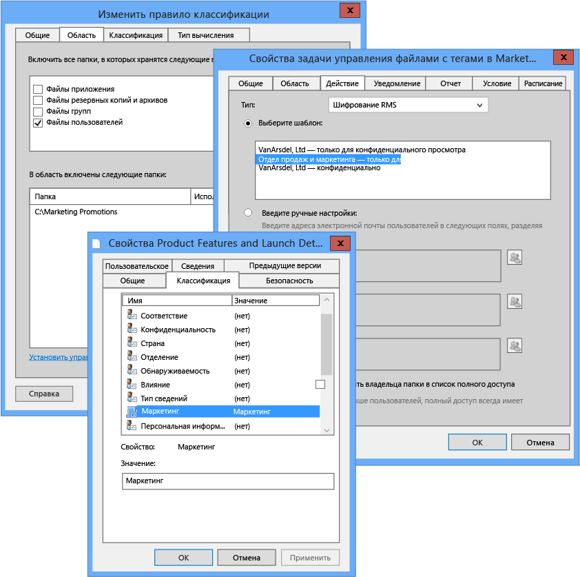

# Изображение во весь экран: настройка инфраструктуры классификации файлов для категории &quot;Маркетинг&quot;

Назад к разделу [Azure RMS в действии: Автоматическая защита файлов на файловых серверах под управлением Windows Server с инфраструктурой классификации файлов](http://technet.microsoft.com/library/jj585026.aspx).

