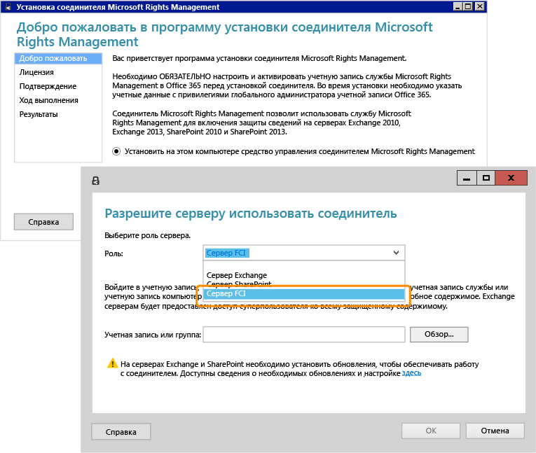

# Изображение во весь экран: установка и настройка соединителя RMS для инфраструктуры классификации файлов

Назад к разделу [Azure RMS в действии: Автоматическая защита файлов на файловых серверах под управлением Windows Server с инфраструктурой классификации файлов](http://technet.microsoft.com/library/jj585026.aspx).

