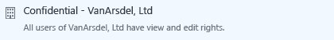

# Безопасная отправка документа по электронной почте

## &lt; инструкции для администраторов — удалите этот раздел перед передачей пользователям &gt;
Используйте этот документ в качестве отправной точки при создании собственных инструкций для конечных пользователей, которые помогают им безопасно совместно использовать документы по электронной почте.Сделайте любые изменения в инструкциях в следующем разделе, затем удалите первый раздел и предоставьте пользователям этот документ.

Эти инструкции предназначены для вымышленной компании**VanArsdel, Ltd**.Прежде чем предоставить эти инструкции для пользователей, либо заменить снимки экрана и инструкции, чтобы они отображали название вашей собственной организации, либо измените инструкции и проинформируйте пользователей, что там, где инструкции относятся к VanArsdel, Ltd, они будут видеть имя собственной компании.Другие настройки, которые может потребоваться сделать:

-   На шаге 2 мы советуем использовать только два из доступных параметров при отправке пользователям за пределами организации.Может потребоваться изменить эти предложения.

-   На шаге 2 мы предлагаем описания, которые помогут пользователям определиться с выбором необходимого шаблона.Может потребоваться изменить эти описания на более конкретные или понятные для вашей компании и пользователей.

-   На шаге 3 мы советуем использовать параметр**Разрешить мне мгновенно отзывать доступ к этим документам**для**Наблюдателя — только просмотр** в качестве примера сценария, когда может потребоваться включить этот параметр конфигурации для пользователей.Тем не менее, можно решить, что пользователи всегда должны выбирать этот параметр, когда они отправляют документ для кого-либо вне организации, или никогда не выбирать данный параметр.

-   На шаге 4 мы советуем использовать параметр**Отправить мне сообщение электронной почты, когда кто-то пытается открыть этот документ**.Если пользователи отслеживают свои документы с помощью портала отслеживания документов, можно решить, что уведомления по электронной почте не являются обязательными, и удалить этот шаг.

> [!NOTE]
> Дополнительные сведения о каждом из параметров, которые пользователи могут выбрать, см. в разделе [Параметры диалогового окна для приложения управления доступом Rights Management](https://technet.microsoft.com/library/dn574738.aspx)

Для того, чтобы инструкции пользователя работали в этом сценарии, должны быть выполнены следующие условия.

|Check|Требование|Нужна дополнительная информация?|
|---------|--------------|------------------------------------|
||Подготовлены учетные записи и группы для Azure Active Directory|[Подготовка к установке службы Azure Rights Management](https://technet.microsoft.com/library/jj585029.aspx)|
||Azure Rights Management активировано|[Активация управления правами Azure](https://technet.microsoft.com/library/jj658941.aspx)|
||Приложение управления доступом Rights Management развернуто на пользовательских компьютерах под управлением Windows|[Автоматическое развертывание приложения для управления доступом Microsoft Rights Management](https://technet.microsoft.com/library/dn339003%28v=ws.10%29.aspx)|
||Если вы используете Exchange Server, а не Exchange Online:  -   Соединитель RMS развернут и роли сервера Exchange Server настроены для его использования|[Развертывание соединителя службы Azure Rights Management](https://technet.microsoft.com/library/dn375964.aspx)|
||Пользователи используют Outlook из Office 2010|Если пользователи имеют Office 2013, замените снимки экрана на эквивалентные версии, чтобы они соответствовали тому, что видят пользователи.|
||Пользовательские шаблоны настроены, как описано далее|[Настройка настраиваемых шаблонов для службы Azure Rights Management](https://technet.microsoft.com/library/dn642472.aspx)|

#### Настройка пользовательских шаблонов:

1.  Архивирование 2 шаблонов по умолчанию.

2.  Создание 3 новых шаблонов путем копирования шаблонов по умолчанию и внесения следующих изменений:

    |Шаблон для копирования|Новое имя|Новое описание|Предоставьте эти пользовательские права|Другие настройки|
    |--------------------------|-------------|------------------|-------------------------------------------|--------------------|
    |**&lt;имя организации&gt; — Только для конфиденциального просмотра**|**Строго конфиденциально - &lt; имя организации &gt;**|Все пользователи &lt; имя организации &gt; имеют права на просмотр и редактирование.Нет автономного доступа|**просмотр контента**  **Сохранение файла**  **Изменение содержимого**|Обновите имя и описание для языков, которые используют пользователи.  Для **срока действия содержимого**: Оставьте значение по умолчанию**Срок действия содержимого неограничен**  Для **автономного доступа**: Выберите **Содержимое доступно только при подключении к Интернету**|
    |**&lt;имя организации&gt; — Только для конфиденциального просмотра**|**Строго конфиденциально - &lt; имя организации &gt;**|Все пользователи &lt; имя организации &gt; имеют права на просмотр и редактирование.|**просмотр контента**  **Сохранение файла**  **Изменение содержимого**|Обновите имя и описание для языков, которые используют пользователи.  Для **срока действия содержимого**: Оставьте значение по умолчанию**Срок действия содержимого неограничен**  Для **автономного доступа**: Выберите **Число дней, в течение которых содержимое доступно без подключения к Интернету** и ведите **1**|
    |**&lt;имя организации&gt; — Конфиденциально**|**Для внутреннего использования — &lt; имя организации &gt;**|Все пользователи &lt; имя организации &gt; имеют полные права доступа, но не могут снять защиту содержимого.|**просмотр контента**  **Сохранение файла**  **Изменение содержимого**  **Копирование и извлечение содержимого**  **Печать**|Обновите имя и описание для языков, которые используют пользователи.  Для **срока действия содержимого**: Оставьте значение по умолчанию**Срок действия содержимого неограничен**  Для **автономного доступа**: Выберите значение по умолчанию для параметра **Число дней, в течение которых содержимое доступно без подключения к Интернету** и сохраните значение по умолчанию **7**|

3.  Опубликуйте 3 новых шаблона.

## &lt; инструкции пользователя начните здесь, удалите этот заголовок &gt;
Теперь при отправке важных документов кому-либо по электронной почте, используйте следующие инструкции для предотвращения чтения документа пользователями, которые не должны его видеть.

1.  Создайте сообщение электронной почты, указав адрес электронной почты или адреса, введите текст сообщения и вложите файл, которым вы хотите безопасно поделиться, в сообщение электронной почты.Затем на вкладке **Сообщение** группы **RMS** щелкните **Защищенный общий доступ**, а затем щелкните**Защищенный общий доступ** еще раз:

    

2.  В диалоговом окне**Защищенный общий доступ** укажите следующее:

    При отправке документа по крайней мере одному человеку, который работает в другой организации:

    |Если это применимо к вам...|сделайте следующее:|
    |-------------------------------|-----------------------|
    |**Универсальная защита**выбирается автоматически, для →|Сохраните этот параметр:  |
    |Информация в документе не должна изменяться →|Выберите **Наблюдатель — только просмотр**.  |
    |Информация в документе может изменяться →|Выберите **Соавтор — просмотр, редактирование, копирование и печать**.  |
    При отправке документа пользователям внутри организации:

    |Если это применимо к вам...|сделайте следующее:|
    |-------------------------------|-----------------------|
    |**Универсальная защита**выбирается автоматически, для →|Сохраните этот параметр:  |
    |Сведения в документе строго конфиденциальны и могут причинить организации или ее сотрудникам серьезный ущерб, если станут доступны широкой публике →|Выберите**Строго конфиденциально - VanArsdel, Ltd**:  |
    |Сведения в документе конфиденциальны и могут причинить организации или ее сотрудникам ущерб, если станут доступны широкой публике →|Выберите**Конфиденциально - VanArsdel, Ltd**:  |
    |Сведениями из этого документа нельзя делиться с людьми за пределами вашей организации, однако эта информация не содержит конфиденциальных данных об организации или ее сотрудниках →|Выберите**Для внутреннего использования — VanArsdel, Ltd**:  |

3.  Если вы выбрали**Наблюдатель — только просмотр**: Выберите параметр **Разрешить мне мгновенно отзывать доступ к этим документам**.

    

4.  Выберите параметр **Отправить мне сообщение электронной почты, когда кто-то пытается открыть эти документы**.

    

5.  Щелкните **Отправить сейчас**.

    

Если тот человек, которому вы отправили защищенный документ, получает сообщение электронной почты, он увидит сообщение с инструкциями для его чтения.Он сможет прочесть документ на несколько устройствах, включая iPad, iPhone, планшеты и телефоны Android, компьютеры под управлением Mac и Windows.

Для отслеживания, открыли ли люди отправленные вами защищенные документы, используйте[сайт отслеживания документов](https://track.azurerms.com/).

**Требуется помощь?**

-   Дополнительная информация:

    -   [Защита файла для отправки по электронной почте](https://technet.microsoft.com/library/dn574735%28v=ws.10%29.aspx)

    -   [Отслеживание и отзыв документов](https://technet.microsoft.com/library/dn986611.aspx)

-   Обратитесь в службу поддержки:

    -   &lt; контактные сведения &gt;

