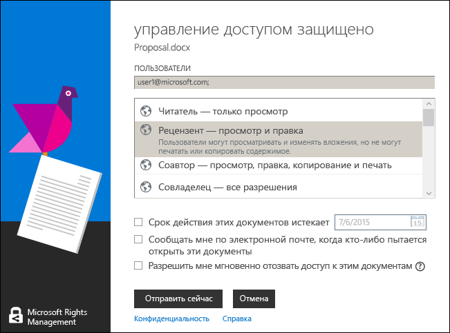

# Руководство пользователя по приложению для управления доступом Microsoft Rights Management: исходная публикация
Данное руководство пользователя для приложения управления доступом Microsoft Rights Management для Windows включает следующие разделы:

-   [Оценка и установка приложения для управления доступом Microsoft Rights Management](../Topic/Microsoft_Rights_Management_sharing_application_user_guide_-_original_publication.md#BKMK_Eval)

-   [Использование приложения для управления доступом Microsoft Rights Management](../Topic/Microsoft_Rights_Management_sharing_application_user_guide_-_original_publication.md#BKMK_UsingMSRMSApp)

-   [Использование созданных пользователем разрешений и общего доступа к защищенному содержимому](../Topic/Microsoft_Rights_Management_sharing_application_user_guide_-_original_publication.md#BKMK_Custom)

-   [Использование надстройки «Панель инструментов Office»](../Topic/Microsoft_Rights_Management_sharing_application_user_guide_-_original_publication.md#BKMK_OfficeToolbar)

-   [Руководство администратора по приложению для управления доступом Microsoft Rights Management](../Topic/Microsoft_Rights_Management_sharing_application_user_guide_-_original_publication.md#BKMK_AdminGuide)

Часто задаваемые вопросы и сведения об устранении неполадок см. в разделе [Часто задаваемые вопросы относительно приложения для управления доступом Microsoft Rights Management для Windows](http://go.microsoft.com/fwlink/?LinkId=303971).

## <a name="BKMK_Eval"></a>Оценка и установка приложения для управления доступом Microsoft Rights Management
В этом разделе объясняется, что собой представляет приложение для управления доступом Microsoft Rights Management и как установить.

-   [Что такое приложение для управления доступом Microsoft Rights Management?](../Topic/Microsoft_Rights_Management_sharing_application_user_guide_-_original_publication.md#BKMK_WhatIs)

-   [Требования приложения для управления доступом Microsoft Rights Management](../Topic/Microsoft_Rights_Management_sharing_application_user_guide_-_original_publication.md#BKMK_Reqs)

-   [Установка приложения для управления доступом Microsoft Rights Management](../Topic/Microsoft_Rights_Management_sharing_application_user_guide_-_original_publication.md#BKMK_Install)

### <a name="BKMK_WhatIs"></a>Приложение для управления доступом Microsoft Rights Management, что это такое?
Приложение для управления доступом Rights Management является дополнительно загружаемым приложением для Microsoft Windows, которое предоставляет следующие возможности:

-   расширяет возможности Проводника (также известного как «Проводник Windows» в Windows 7 и более ранних версий) для обеспечения защиты одного файла или множественной защиты нескольких файлов, а также всех файлов в выбранной папке;

-   добавляет поддержку для защиты файла любого типа и встроенные средства просмотра для часто используемых типов текстовых файлов и файлов изображений;

-   добавляет новые кнопки панели инструментов Microsoft Office для Word, Excel и PowerPoint.

### <a name="BKMK_Reqs"></a>Требования для приложения для управления доступом Microsoft Rights Management
Чтобы использовать приложение для управления доступом Microsoft Rights Management, на компьютере должна быть запущена ОС Windows 8.1, Windows 8 или Windows 7.

Приложение для управления доступом Microsoft Rights Management требует наличия клиента AD RMS версии 2.1, который устанавливается как часть пакета установки.Приложение для управления доступом Microsoft Rights Management будет работать только с данной версией клиента AD RMS.

### <a name="BKMK_Install"></a>Установка приложения для управления доступом Microsoft Rights Management
Для установки приложения для управления доступом Microsoft Rights Management выполните следующие действия.

1.  Перейдите на страницу [Microsoft Rights Management](http://go.microsoft.com/fwlink/?LinkId=303970) на веб-сайте Майкрософт.

2.  В разделе **Компьютеры** щелкните значок **Приложение RMS для Windows** и сохраните установочный пакет приложения для управления доступом Microsoft Rights Management на компьютере.

3.  Дважды щелкните сжатый файл, который был загружен, а затем дважды щелкните файл **setup.exe**.Если будет предложено продолжить, нажмите кнопку **Да**.

4.  На странице **Установка Microsoft RMS** щелкните **Далее**, и дождитесь завершения установки.

5.  По завершении установки нажмите кнопку **Перезапустить** для перезагрузки компьютера и завершения установки.Или щелкните **Закрыть** и перезагрузите компьютер позже для завершения установки.

## <a name="BKMK_UsingMSRMSApp"></a>Использование приложения для управления доступом Rights Management
В этом разделе описаны различные способы использования приложения для управления доступом Rights Management

-   [Создание защищенного текстового файла (PTXT-файла)](../Topic/Microsoft_Rights_Management_sharing_application_user_guide_-_original_publication.md#BKMK_CreatePTXT)

-   [Просмотр защищенного текста (PTXT-файла) или защищенного файла изображения](../Topic/Microsoft_Rights_Management_sharing_application_user_guide_-_original_publication.md#BKMK_ViewPTXT)

-   [Создание файла с универсальной защитой (PFILE-файла)](../Topic/Microsoft_Rights_Management_sharing_application_user_guide_-_original_publication.md#BKMK_CreatePFILE)

-   [Просмотр файла с универсальной защитой (PFILE-файла)](../Topic/Microsoft_Rights_Management_sharing_application_user_guide_-_original_publication.md#BKMK_ViewPFILE)

-   [Удаление защиты из файла.](../Topic/Microsoft_Rights_Management_sharing_application_user_guide_-_original_publication.md#BKMK_Unprotect)

### <a name="BKMK_CreatePTXT"></a>Создание защищенного текстового файла (.ptxt)
Приложение для управления доступом Microsoft Rights Management позволяет преобразовать обычный текстовый файл (.txt) в защищенный файл (.ptxt).

##### Для создания защищенного текстового файла (.ptxt):

1.  В Проводнике щелкните правой кнопкой мыши папку, выберите пункт **Создать**, а затем нажмите кнопку **Текстовый документ**.

2.  Переименуйте файл (например, в Sample.txt).

3.  Дважды щелкните файл, чтобы открыть его в Блокноте.

4.  В Блокноте добавьте несколько строк текста в файл, подобные приведенным ниже, а затем сохранить его:

    ```
    This is a sample text file.
    This is a sample text file.
    This is a sample text file.
    This is a sample text file. 
    This is a sample text file.
    This is a sample text file.
    ```

5.  Щелкните файл правой кнопкой, нажмите **Защита на месте** и выберите шаблон из списка.(Обратите внимание, что при первом использовании средства будет необходимо выбрать пункт **Защита для компании**, чтобы загрузить шаблоны для вашей организации.)

6.  На экране **Приложение для управления доступом Microsoft Rights Management** подтвердите политику, которую требуется применить, нажмите **Применить**, и после того, как файл будет защищен, нажмите кнопку **Закрыть**.

### <a name="BKMK_ViewPTXT"></a>Просмотр защищенного текстового файла (.ptxt) или защищенного файла изображения
Чтобы просмотреть защищенный текстовый файл (.ptxt), в Проводнике дважды щелкните файл (например, Sample.ptxt).Вам может быть предложено разрешить приложению получить права.Политика защиты отображается в верхней части файла.

Аналогичным образом можно открывать и просматривать защищенные изображения.

### <a name="BKMK_CreatePFILE"></a>Создание универсального защищенного файла (.pfile)
Формат файла универсальный защиты (.pfile) можно использовать для обеспечения универсального уровня защиты для типов файлов, которые непосредственно не поддерживаются приложением для управления доступом Microsoft Rights Management или другими приложениями, предоставляющими встроенную защиту RMS.

Например, с помощью формата файла универсальный защиты можно защитить VSD-файлы, созданные с помощью приложения Microsoft Visio (которое не поддерживает встроенную защиту).

> [!NOTE]
> Файлы, использующие универсальную защиту, защищены только для проверки подлинности.Пользователь, имеющий право на использование защищенного файла (.pfile), пройдет проверку подлинности, права и разрешения пользователя отображаются, но не могут быть реализованы, если файл открыт в исходном формате (например, когда открывается VSD-файл в Visio).Пользователь, который не имеет прав или который не может пройти проверку подлинности, не сможет открыть защищенный файл.

##### Чтобы создать универсальный защищенный файл (.pfile) в приложении Visio (VSD-файл)

1.  В Проводнике щелкните правой кнопкой мыши папку, выберите пункт **Создать**, а затем нажмите кнопку **Документ Visio**.

2.  Переименуйте файл (например, в Sample.vsd).

3.  Дважды щелкните файл, чтобы открыть его в Visio.

4.  В Visio добавьте элементы в документ и затем сохраните и закройте файл.

5.  Щелкните файл правой кнопкой, нажмите **Защита на месте** и выберите шаблон политики из списка.(Обратите внимание, что при первом использовании средства будет необходимо выбрать пункт **Защита для компании**, чтобы загрузить шаблоны для вашей организации.)

6.  На экране **Приложение для управления доступом Microsoft Rights Management** подтвердите политику, которую требуется применить, затем нажмите **Применить**.

7.  Появится сообщение о том, что защищенный файл был сохранен как Sample.vsd.pfile (исходный файл удален).

### <a name="BKMK_ViewPFILE"></a>Просмотр универсального защищенного файла (.pfile)
Чтобы просмотреть универсальный защищенный файл (.pfile), в Проводнике дважды щелкните универсальный защищенный файл (.pfile) (например, Sample.vsd.pfile) и нажмите кнопку **Открыть**.

### <a name="BKMK_Unprotect"></a>Снятие защиты с файла
Приложение для управления доступом Microsoft Rights Management предоставляет возможность снять защиту с файлов, которые были защищены ранее.

Чтобы снять защиту (то есть сделать незащищенным) файл, защищенный ранее, воспользуйтесь возможностью **Удалить защиту** следующим образом:

1.  Щелкните правой кнопкой мыши файл **Sample.ptxt**, выберите пункт **Защита на месте** и нажмите **Удалить защиту**.Вам может быть предложено разрешить приложению получить права.

2.  Файл Sample.ptxt будет удален и заменен файлом Sample.txt.

## <a name="BKMK_Custom"></a>Использование созданного пользователем разрешений и предоставление общего доступа к защищенному содержимому
В этом разделе рассматриваются вопросы защиты и использования файлов с помощью созданного пользователем разрешения, совместного использования защищенного содержимого и как защитить несколько файлов:

-   [Защита файла с помощью разрешений, созданных пользователем](../Topic/Microsoft_Rights_Management_sharing_application_user_guide_-_original_publication.md#BKMK_ProtectCustom)

-   [Использование файлов, имеющих защиту, созданную пользователем](../Topic/Microsoft_Rights_Management_sharing_application_user_guide_-_original_publication.md#BKMK_UserDefined)

-   [Совместное использование защищенного содержимого](../Topic/Microsoft_Rights_Management_sharing_application_user_guide_-_original_publication.md#BKMK_ShareProtected)

-   [Использование сочетаний клавиш](../Topic/Microsoft_Rights_Management_sharing_application_user_guide_-_original_publication.md#BKMK_AccessKeys)

-   [Применение защиты к нескольким файлам и папкам](../Topic/Microsoft_Rights_Management_sharing_application_user_guide_-_original_publication.md#BKMK_Multiple)

### <a name="BKMK_ProtectCustom"></a>Защита файла с разрешениями, созданными пользователем
Созданную пользователем защиту можно использовать для достижения следующих целей:

-   чтобы ограничить доступ к файлам определенным списком пользователей, идентифицируемых своими адресами электронной почты;

-   чтобы ограничить использование файла лишь определенными правами, например правом только для чтения к документу.

Чтобы защитить файл с разрешениями, созданными пользователем, щелкните правой кнопкой мыши файл, нажмите кнопку **Защита на месте** и нажмите кнопку **Пользовательские разрешения**.Откроется следующий экран:


Введите адреса электронной почты списка пользователей, выберите разрешения для файла с помощью ползунка и нажмите кнопку **Применить**.

### <a name="BKMK_UserDefined"></a>Использование файлов, которые имеют защиту, созданную пользователем
Большинство защищенных файлов, обрабатываемых приложением для управления доступом Microsoft Rights Management, будет защищены с использованием уровней защиты на основе шаблона.Однако, существует также возможность поддержки приложением для управления доступом Microsoft Rights Management файлов, которым был присвоен уровень защиты, созданный пользователем.

Созданную пользователем защиту можно использовать для достижения следующих видов защиты файлов:

-   ограничение доступа к файлу определенным списком пользователей, идентифицируемых своими адресами электронной почты;

-   ограничение использования файла лишь одним определенным правом, например правом только на печать документа.

Для текстовых и графических форматов файлов этот уровень защиты требует, чтобы все приложения, которые используются для редактирования, сохранения или ограничения текстовых или графических файлов могли поддерживать защиту RMS и реализовывали API-интерфейсы, предоставляемые в SDK RMS AD.

При просмотре защищенного текстового файла, к которому была применена защита, созданная пользователем, можно заметить незначительные различия в разрешениях, отображаемых в файле, как показано в следующем примере.

Для файлов, защищенных с помощью формата файла универсальный защиты (.pfile) вместо имени шаблона, который использовался для защиты файла, на экране подтверждения отображаются определенные права и разрешения, которые были созданы пользователем, как это показано на следующем рисунке.


### <a name="BKMK_ShareProtected"></a>Совместное использование защищенного содержимого
Для защиты и совместного доступа к содержимому, щелкните правой кнопкой мыши файл и выберите **Общий доступ к защищенным файлам**.Откроется следующий экран:


Введите адреса электронной почты в список пользователей, выберите разрешения для файла с помощью ползунка и нажмите **Отправить**.Запустится приложение Outlook с черновиком сообщения электронной почты с вложенным защищенным файлом.Исходный файл не будет защищен.

Чтобы разрешить пользователям просматривать защищенные файлы на устройствах с операционной системой, отличной от Windows, нажмите кнопку **Разрешить использование на всех устройствах**.Пользователи должны будут [загрузить приложение для управления доступом Microsoft Rights Management](http://go.microsoft.com/fwlink/?LinkId=303970) для своего устройства.

### <a name="BKMK_AccessKeys"></a>Использование сочетаний клавиш
Нажмите клавишу **Alt**, чтобы просмотреть доступные клавиши быстрого доступа.Нажмите клавишу **Alt** вместе с клавишей быстрого доступа для выбора параметра.Например, в диалоговом окне **Общий доступ к защищенным файлам** нажмите клавишу **Alt** для просмотра клавиш быстрого доступа и нажмите сочетание клавиш **Alt + u** для выбора пункта **Пользователи должны входить в систему каждый раз при открытии этого файла**.



### <a name="BKMK_Multiple"></a>Применение защиты к нескольким файлам и папкам
Приложение для управления доступом Microsoft Rights Management может также использоваться для применения защиты к более чем одному файлу, например, при выборе нескольких файлов или папок, содержащих незащищенные файлы в Проводнике.

##### Чтобы защитить несколько файлов или все файлы в выбранной папке

1.  В Проводнике выберите несколько файлов или выберите папку, содержащую несколько файлов, которые необходимо защитить.

2.  Щелкните правой кнопкой мыши выбранную папку или файлы, перейдите к пункту **Защита на месте** и выберите шаблон из списка.(Обратите внимание, что при первом использовании средства будет необходимо выбрать пункт **Защита для компании**, чтобы загрузить шаблоны для вашей организации.)

3.  На экране **Приложение для управления доступом Microsoft Rights Management** подтвердите защищенные файлы.

При наличии ошибок см. [Часто задаваемые вопросы относительно приложения для управления доступом Microsoft Rights Management для Windows](http://go.microsoft.com/fwlink/?LinkId=303971).

## <a name="BKMK_OfficeToolbar"></a>Использование надстройки панели инструментов Office
Можно защитить и совместно использовать файлы Word, PowerPoint и Excel непосредственно в Microsoft Office с помощью надстройки ленты Office для приложения управления доступом Microsoft Rights Management.Щелкните **Общий доступ к защищенным файлам** на ленте, чтобы запустить приложение для управления доступом Microsoft Rights Management.


## <a name="BKMK_AdminGuide"></a>Руководство администратора приложения для управления доступом Microsoft Rights Management
Данное руководство администратора приложения управления доступом Microsoft Rights Management включает следующие разделы:

-   [Технический обзор приложения для управления доступом Microsoft Rights Management](../Topic/Microsoft_Rights_Management_sharing_application_user_guide_-_original_publication.md#BKMK_AdminOverview)

-   [Поддерживаемые типы файлов](../Topic/Microsoft_Rights_Management_sharing_application_user_guide_-_original_publication.md#BKMK_SupportFileTypes)

-   [Автоматическое развертывание приложения для управления доступом Microsoft Rights Management](../Topic/Microsoft_Rights_Management_sharing_application_user_guide_-_original_publication.md#BKMK_ScriptedInstall)

### <a name="BKMK_AdminOverview"></a>Технический обзор приложения для управления доступом Microsoft Rights Management
Приложение для управления доступом Microsoft Rights Management является дополнительно загружаемым приложением для Microsoft Windows и других платформ, которое предоставляет следующие возможности:

-   защита отдельного файла или нескольких файлов, а также всех файлов в выбранной папке;

-   полная поддержка для защиты файла любого типа и встроенные средства просмотра для часто используемых типов текстовых файлов и файлов изображений;

-   универсальная защита для файлов, которые не поддерживают защиту RMS;

-   полное взаимодействие с файлами, защищенных с помощью управления правами на доступ к данным Office (IRM);

-   полное взаимодействие с PDF-файлами, защищенными с помощью SharePoint, FCI и поддерживаемых средств создания PDF;

Приложение для управления доступом Microsoft Rights Management использует новый [клиент AD RMS версии 2.1](http://www.microsoft.com/download/details.aspx?id=38396).Он предоставляет пользователям возможность защиты содержимого с помощью стандартных и пользовательских шаблонов, которые можно настраивать и развертывать для вашей организации.Используя возможности AD RMS версии 2.1, приложение для управления доступом Microsoft Rights Management предоставляет конечным пользователям простой интерфейс защиты и использования.

С выпуском Microsoft Azure AD RMS от октября 2013 г. можно защищать документы непосредственно в Office 2010 и отправлять их другим пользователям в другой компании, которые затем смогут использовать их с помощью Microsoft Azure AD RMS.Кроме того, в этом выпуске при использовании AD RMS в режиме шифрования 2 можно использовать службу RMS для частных лиц и использовать содержимое, полученное от сотрудников другой компании, которая использует Microsoft Azure AD RMS.Дополнительные сведения о режиме шифрования 2 см. в разделе [Режимы шифрования AD RMS](http://technet.microsoft.com/library/hh867439%28v=ws.10%29.aspx).

Для загрузки приложения для управления доступом Microsoft Rights Management выполните следующие действия.

1.  Войдите в [Microsoft Connect](http://connect.microsoft.com/) с учетной записью Майкрософт (ранее известной как идентификатор Live ID).

2.  На странице **Главная** выполните поиск строки **Службы управления правами** и присоединитесь к группе.

3.  Щелкните **Загрузки**, а затем нажмите **Приложение для управления доступом Microsoft Rights Management**.

4.  На странице **Сведения о загрузке** выберите **приложение для управления доступом Microsoft Rights Management.zip** и нажмите кнопку **Загрузить**.

5.  При необходимости установите Microsoft File Transfer Manager и выполните действия, чтобы загрузить приложение для управления доступом Microsoft Rights Management.

#### Уровни защиты, поддерживаемые приложением для управления доступом Microsoft Rights Management
Приложение для управления доступом Microsoft Rights Management на двух различных уровнях, как описано в следующей таблице.

||||
|-|-|-|
|Тип защиты|Собственный|Универсальный шаблон|
|Описание|Для текстовых файлов, изображений, файлов Microsoft Office (Word, Excel, PowerPoint), PDF-файлов и некоторых других типов файлов Azure RMS обеспечивает встроенную защиту, включающую шифрование и обеспечение прав доступа (разрешений).|Для других приложений и типов файлов универсальная защита обеспечивает уровень защиты, включающий инкапсуляцию файлов с помощью файлов типа .pfile и проверку подлинности, чтобы проверить, имеет ли пользователь права для открытия файла.|
|Защита|Полное шифрование файлов и защита обеспечивается одним из следующих способов:<br /><br />-   Перед подготовкой к просмотру защищенного содержимого необходима успешная проверка подлинности для тех лиц, кто получил файл по электронной почте или получает доступ к нему через разрешения для файла или общего доступа.<br />-   Кроме того, права на использование и политики, установленные владельцем содержимого при защите файлов, полностью применяются при подготовке к просмотру содержимого в средстве просмотра IP (для защищенных текстовых и графических файлов) или связанного приложения (для всех других поддерживаемых типов файлов).|Защита файлов обеспечивается одним из следующих способов:<br /><br />-   Перед подготовкой к просмотру защищенного содержимого необходимо успешно пройти проверку подлинности для тех, кто авторизован для открытия файла и получения доступа к нему.В случае ошибки авторизации файл не открывается.<br />-   Права на использование и политика, установленные владельцем содержимого, отображаются для информирования авторизованных пользователей о политике использования.<br />-   Для приложений, которые не поддерживают права на использование, производится ведение журнала аудита авторизованных пользователей, открытия и доступа к файлам.|
|По умолчанию для типов файлов|Это значение уровня защиты по умолчанию для следующих типов:<br /><br />-   Текстовые и графические файлы<br />-   Файлы Microsoft Office (Word, Excel, PowerPoint)<br />-   Переносимый формат документов (PDF)<br /><br />Дополнительные сведения см. в разделе «Поддерживаемые типы файлов».|Этот уровень является уровнем по умолчанию для всех остальных типов файлов (например, .vsdx, .rtf и т. д.), которые не поддерживаются полной защитой.|

### <a name="BKMK_SupportFileTypes"></a>Поддерживаемые типы файлов
В таблице ниже перечислены типы файлов, поддерживаемых приложением для управления доступом Microsoft Rights Management.

|Расширение файла|Описание|Расширение исходного файла|
|--------------------|------------|------------------------------|
|.ptxt|Защищенный текстовый файл|.txt|
|.pxml|Защищенный файл XML|.xml|
|.pjpg|Защищенный файл изображения JPG|.jpg|
|.pjpeg|Защищенный файл изображения JPEG|.jpeg|
|.ppng|Защищенный файл изображения PNG|.png|
|.ptiff|Защищенный файл изображения TIFF|.tiff|
|.pbmp|Защищенный файл растрового изображения Windows|.bmp|
|.pgif|Защищенный файл изображения GIF|.gif|
|.pgiff|Защищенный файл изображения GIFF|.giff|
|.pjpe|Защищенный файл изображения JPE|.jpe|
|.pjfif|Защищенный файл изображения JFIF|.jfif|
|.pjif|Защищенный файл изображения JIF|.jif|
В следующей таблице перечислены типы файлов, поддерживаемых Microsoft Office 2013, Office 2010 и Office 2007.Существует два типа защиты: MsoIrmProtector и OpcIrmProtector.Дополнительные сведения об этих типах защиты см. в разделе [Системы защиты файлов формата Microsoft Office](http://archive.msdn.microsoft.com/OfficeProtectors).

|||
|-|-|
|MsoIrmProtector поддерживает следующие типы файлов:<br /><br />-   doc<br />-   dot<br />-   xla<br />-   xls<br />-   xlt<br />-   pps<br />-   ppt|OpcIrmProtector поддерживает следующие типы файлов:<br /><br />-   docm<br />-   docx<br />-   dotm<br />-   dotx<br />-   xlam<br />-   xlsb<br />-   xlsm<br />-   xlsx<br />-   xltm<br />-   xltx<br />-   xps<br />-   potm<br />-   potx<br />-   ppsx<br />-   ppsm<br />-   pptm<br />-   pptx<br />-   thmx|

### <a name="BKMK_ScriptedInstall"></a>Автоматическое развертывание приложения для управления доступом Microsoft Rights Management
Версия приложения для управления доступом Microsoft Rights Management для Windows поддерживает сценарий установки, который вполне подходит для корпоративного развертывания.

##### Чтобы загрузить приложение для управления доступом Microsoft Rights Management для автоматического развертывания

1.  Перейдите на страницу [Приложение для управления доступом Microsoft Rights Management для Windows](http://www.microsoft.com/download/details.aspx?id=40857) в центре загрузки Майкрософт и нажмите кнопку **Загрузить**.

2.  Выберите и загрузите необходимые файлы.Существует два пакета установки клиента: один для 64-разрядных систем Windows (Microsoft Rights Management sharing application x64.zip), а второй — для 32-разрядных систем Windows (Microsoft Rights Management sharing application x86.zip).

3.  Извлеките файлы из сжатых установочных пакетов, например, двойным щелчком.Затем скопируйте извлеченные файлы в сетевую папку, к которой имеют доступ клиентские компьютеры.

Установочные пакеты для приложения для управления доступом RMS поддерживают различные сценарии развертывания и включают следующее:

|Описание|Сценарий развертывания|
|------------|--------------------------|
|Помощник доступа к интерактивным службам Майкрософт|Необходимы следующие компоненты:<br /><br />-   Office 2010 и Microsoft Azure RMS|
|Исправление для Office (KB 2596501)|Необходимы следующие компоненты:<br /><br />-   Office 2010 и Microsoft Azure RMS|
|Исправление для режима шифрования 2 (KB 2627273)|Необходимы следующие компоненты:<br /><br />-   Office 2010 и Microsoft Azure RMS|
|Надстройка Outlook для приложения для управления доступом RMS|Необходимы следующие компоненты:<br /><br />-   Office 2013 и Microsoft Azure RMS<br />-   Office 2010 и Microsoft Azure RMS<br />-   Office 2013 и Active Directory RMS<br />-   Office 2010 и Active Directory RMS<br />-   Обновление приложения для управления доступом RMS|
|Надстройка Office для ленты|Необходимы следующие компоненты:<br /><br />-   Office 2013 и Microsoft Azure RMS<br />-   Office 2013 и Active Directory RMS<br />-   Office 2010 и Active Directory RMS<br />-   Обновление приложения для управления доступом RMS|
|Средство подготовки управления правами Microsoft Azure Active Directory|Необходимы следующие компоненты:<br /><br />-   Office 2010 и Microsoft Azure RMS|
> [!NOTE]
> Для сценария **Office 2010 и Microsoft Azure RMS** вы можете использовать Microsoft Azure RMS или службы управления правами Active Directory и вам требуется безопасно отправить документы сотрудникам в другой компании, использующей Microsoft Azure RMS.
> 
> Если установить и запустить средство подготовки управления правами Microsoft Azure Active Directory для поддержки Office 2010, оно выполнит две функции:
> 
> -   вносит изменения в реестр для поддержки приложения для управления доступом RMS;
> -   «подготавливает» пользователя, то есть компьютер связывается с сервером AD RMS или Microsoft Azure RMS и получает сертификаты компьютера и пользователя, необходимые для использования RMS.

Используйте следующие процедуры для определения команд, необходимых для развертывания приложений для управления доступом RMS в этих сценариях развертывания:

-   Office 2013 и Microsoft Azure RMS

-   Office 2010 и Microsoft Azure RMS

-   Office 2013 или Office 2010 и Active Directory RMS

-   Обновление приложения для управления доступом RMS

В примерах команд предполагается, что загруженные и извлеченные файлы были скопированы в общую сетевую папку, к которой клиентские компьютеры получают доступ с помощью **\\server5\apps\rms**, и что на клиентских компьютерах уже есть папка с именем **C:\Log files**, где хранятся файлы журналов установки приложения.Для каждой установки можно выбрать имя файла журнала установки, но он должен иметь расширение LOG.

> [!IMPORTANT]
> Перед развертыванием приложения для управления доступом RMS необходимо упаковать нужные команды в этих процедурах, чтобы их можно установить в контексте всех пользователей компьютера, с правами локального администратора.Затем можно развернуть пакет на компьютерах, используя механизм стандартного развертывания приложений, например, групповую политику или System Center Configuration Manager.
> 
> Исключение составляет средство подготовки управления правами Microsoft Azure Active Directory. Его необходимо запустить один раз для каждого пользователя на компьютере и средство необходимо запускать с повышенными привилегиями для успешного редактирования реестра.Существуют различные способы достижения этого результата, включая запрос пользователей на выполнение команды (например, с помощью ссылки в сообщении электронной почты или ссылки на портал службы поддержки), или можно добавить команды в сценарий входа.Если нельзя использовать запуск команд от имени другого пользователя, когда пользователи не имеют учетной записи локального администратора, существуют средства развертывания, которые автоматически могут повысить права для выполняемой команды согласно заданным правилам.

##### Чтобы развернуть приложение управления доступом RMS для Office 2013 и Microsoft Azure RMS

1.  Установите клиент AD RMS и приложение для управления доступом для RMS с помощью следующих команд:

    -   Для 64-разрядной версии Windows:x64\setup_ipviewer.exe /norestart /quiet /msicl «MSIRESTARTMANAGERCONTROL=Disable» /log «&lt;путь_и_имя_файла_журнала&gt;»

        ```
        x64\setup_ipviewer.exe /norestart /quiet /msicl "MSIRESTARTMANAGERCONTROL=Disable" /log "<log file path and name>"
        ```

    -   Для 32-разрядной версии Windows:

        ```
        X86\setup_ipviewer.exe /norestart /quiet /msicl "MSIRESTARTMANAGERCONTROL=Disable" /log "<log file path and name>"
        ```

    Например: `\\server5\apps\rms\x64\setup_ipviewer.exe /norestart /quiet /msicl "MSIRESTARTMANAGERCONTROL=Disable" /log "C:\Log files\ipviewerinstall.log"`

2.  Установите надстройку Office с помощью следующих команд:

    -   Для 64-разрядной версии Office:

        ```
        msiexec.exe /norestart /quiet MSIRESTARTMANAGERCONTROL=Disable /i "x64\Setup64.msi" /L*v "<log file path and name>"
        ```

    -   Для 32-разрядной версии Office:

        ```
        msiexec.exe /norestart /quiet MSIRESTARTMANAGERCONTROL=Disable /i "x86\Setup.msi" /L*v "<log file path and name>"
        ```

    > [!NOTE]
    > Чтобы завершить установку, необходимо перезагрузить компьютер.Автоматический перезапуск можно выполнить с помощью команды shutdown /i.

    Например: `\\server5\apps\rms\msiexec.exe /norestart /quiet MSIRESTARTMANAGERCONTROL=Disable /i "x64\Setup64.msi" /L*v "C:\Log files\rmsoffice.log"`

##### Развертывание приложения для управления доступом RMS для Office 2010 и службы Microsoft Azure RMS

1.  Установите помощник доступа к интерактивным службам Майкрософт с помощью следующих команд:

    -   Для 64-разрядной версии Windows:

        ```
        msiexec.exe /norestart /quiet MSIRESTARTMANAGERCONTROL=Disable /i "x64\msoidcli_64bit.msi" /L*v "<log file path and name >"
        ```

    -   Для 32-разрядной версии Windows:

        ```
        msiexec.exe /norestart /quiet MSIRESTARTMANAGERCONTROL=Disable /i "x64\msoidcli_64bit.msi" /L*v "<log file path and name>"
        ```

    Например: `\\server5\apps\rms\msiexec.exe /norestart /quiet MSIRESTARTMANAGERCONTROL=Disable /i "x64\msoidcli_64bit.msi" /L*v "C:\Log files\assistant.log"`

2.  Установите исправление Office с помощью следующих команд:

    -   Для 64-разрядной версии Office:

        ```
        x64\office2010-kb2596501-fullfile-x64-glb.exe /norestart /quiet /log:"<log file path and name >"
        ```

    -   Для 32-разрядной версии Office:

        ```
        x86\office2010-kb2596501-fullfile-x86-glb.exe /norestart /quiet /log:"<log file path and name>"
        ```

    Например: `\\server5\apps\rms\x64\office2010-kb2596501-fullfile-x64-glb.exe /norestart /quiet /log:"C:\Log files\kb2596501install.log"`

3.  Установите исправление режима шифрования 2 с помощью следующих команд:

    -   Для 64-разрядной версии Windows:

        ```
        wusa.exe /norestart /quiet "x64\Windows6.1-KB2627273-v4-x64.msu" /log:"<log file path and name >"
        ```

    -   Для 32-разрядной версии Windows:

        ```
        wusa.exe /norestart /quiet "x86\Windows6.1-KB2627273-v4-x86.msu" /log:"<log file path and name>"
        ```

    Например: `\\server5\apps\rms\wusa.exe /norestart /quiet "x64\Windows6.1-KB2627273-v4-x64.msu" /log:"C:\Log files\kb267273.log"`

4.  Установите клиент AD RMS и приложение для управления доступом RMS с помощью следующей команды:

    -   Для 64-разрядной версии Windows:

        ```
        x64\setup_ipviewer.exe /norestart /quiet /msicl "MSIRESTARTMANAGERCONTROL=Disable" /log "<log file path and name >"
        ```

    -   Для 32-разрядной версии Windows:

        ```
        X86\setup_ipviewer.exe /norestart /quiet /msicl "MSIRESTARTMANAGERCONTROL=Disable" /log "<log file path and name>"
        ```

    Например: `\\server5\apps\rms\x64\setup_ipviewer.exe /norestart /quiet /msicl "MSIRESTARTMANAGERCONTROL=Disable" /log "C:\Log files\ipviewerinstall.log"`

5.  Установите надстройку Office с помощью следующих команд:

    -   Для 64-разрядной версии Office:

        ```
        msiexec.exe /norestart /quiet MSIRESTARTMANAGERCONTROL=Disable /i "x64\Setup64.msi" /L*v "<log file path and name>"
        ```

    -   Для 32-разрядной версии Office:

        ```
        msiexec.exe /norestart /quiet MSIRESTARTMANAGERCONTROL=Disable /i "x86\Setup.msi" /L*v "<log file path and name>"
        ```

    > [!NOTE]
    > Чтобы завершить установку, необходимо перезагрузить компьютер.Автоматический перезапуск можно выполнить с помощью команды shutdown /i.

    Например: `\\server5\apps\rms\msiexec.exe /norestart /quiet MSIRESTARTMANAGERCONTROL=Disable /i "x64\Setup64.msi" /L*v "C:\Log files\rmsoffice.log"`

6.  Установите средство подготовки управления правами Microsoft Azure Active Directory, добавив следующую команду в сценарии входа в систему:

    > [!IMPORTANT]
    > Для успешного выполнения этой команды пользователи должны иметь права локального администратора.

    -   Для Windows 8, 64-разрядная версия:

        ```
        x64\aadrmprep.exe /initiateMe /logfile "<log file path and name>"
        ```

    -   Для Windows 8, 32-разрядная версия:

        ```
        X86\aadrmprep.exe /initiateMe /logfile "<log file path and name>"
        ```

    -   Для Windows 7, 64-разрядная версия:

        ```
        x64\win7\aadrmprep.exe /initiateMe /logfile "<log file path and name>"
        ```

    -   Для Windows 7, 32-разрядная версия:

        ```
        X86\win7\aadrmprep.exe /initiateMe /logfile "<log file path and name>"
        ```

    > [!NOTE]
    > Эта команда может предложить пользователю ввести учетные данные Microsoft Azure.Если компьютер не входит в домен, пользователю будет предложено ввести его.Если компьютер входит в домен, то средство сможет использовать кэшированные учетные данные.

    Например: `\\server5\apps\rms\x64\aadrmprep.exe /initiateMe /logfile "C:\Log files\aadrmprepinstall.log"`

##### Чтобы развернуть приложение управления доступом RMS для Office 2013 или Office 2010 и Active Directory RMS

1.  Установите клиент AD RMS и приложение для управления доступом для RMS с помощью следующих команд:

    -   Для 64-разрядной версии Windows:

        ```
        x64\setup_ipviewer.exe /norestart /quiet /msicl "MSIRESTARTMANAGERCONTROL=Disable" /log "<log file path and name>"
        ```

    -   Для 32-разрядной версии Windows:

        ```
        X86\setup_ipviewer.exe /norestart /quiet /msicl "MSIRESTARTMANAGERCONTROL=Disable" /log "<log file path and name>"
        ```

    Например: `\\server5\apps\rms\x64\setup_ipviewer.exe /norestart /quiet /msicl "MSIRESTARTMANAGERCONTROL=Disable" /log "C:\Log files\ipviewerinstall.log"`

2.  Установите надстройку Office с помощью следующих команд:

    -   Для 64-разрядной версии Office:

        ```
        msiexec.exe /norestart /quiet MSIRESTARTMANAGERCONTROL=Disable /i "x64\Setup64.msi" /L*v "<log file path and name>"
        ```

    -   Для 32-разрядной версии Office:

        ```
        msiexec.exe /norestart /quiet MSIRESTARTMANAGERCONTROL=Disable /i "x86\Setup.msi" /L*v "<log file path and name>"
        ```

    > [!NOTE]
    > Чтобы завершить установку, необходимо перезагрузить компьютер.Автоматический перезапуск можно выполнить с помощью команды shutdown /i.

    Например: `\\server5\apps\rms\msiexec.exe /norestart /quiet MSIRESTARTMANAGERCONTROL=Disable /i "x64\Setup64.msi" /L*v "C:\Log files\rmsofficeinstall.log"`

##### Обновление приложения для управления доступом для RMS

1.  Установите клиент AD RMS и приложение для управления доступом RMS с помощью следующей команды:

    -   Для 64-разрядной версии Windows:

        ```
        x64\setup_ipviewer.exe /norestart /quiet /msicl "MSIRESTARTMANAGERCONTROL=Disable" /log "<log file path and name>"
        ```

    -   Для 32-разрядной версии Windows:

        ```
        X86\setup_ipviewer.exe /norestart /quiet /msicl "MSIRESTARTMANAGERCONTROL=Disable" /log "<log file path and name>"
        ```

    Например: `\\server5\apps\rms\x64\setup_ipviewer.exe /norestart /quiet /msicl "MSIRESTARTMANAGERCONTROL=Disable" /log "C:\Log files\ipviewerinstall.log"`

2.  Установите надстройку Office с помощью следующих команд:

    -   Для 64-разрядной версии Office:

        ```
        msiexec.exe /norestart /quiet MSIRESTARTMANAGERCONTROL=Disable /i "x64\Setup64.msi" /L*v "<log file path and name>"
        ```

    -   Для 32-разрядной версии Office:

        ```
        msiexec.exe /norestart /quiet MSIRESTARTMANAGERCONTROL=Disable /i "x86\Setup.msi" /L*v "<log file path and name>"
        ```

    > [!NOTE]
    > Чтобы завершить установку, необходимо перезагрузить компьютер.Автоматический перезапуск можно выполнить с помощью команды shutdown /i.

    Например: `\\server5\apps\rms\msiexec.exe /norestart /quiet MSIRESTARTMANAGERCONTROL=Disable /i "x64\Setup64.msi" /L*v "C:\Log files\rmsofficeinstall.log"`

#### <a name="BKMK_verifyscripted"></a>Проверка успешного завершения установки
Файлы журнала установки можно использовать для проверки успешной установки.

###### Проверка успешности выполнения установки помощника доступа к интерактивным службам Майкрософт

-   Для проверки успешности установки выполните поиск одной из следующих текстовых строк в файле журнала установки: **Состояние успеха или ошибки установки: 0**

    Пример строки при успешной установке:

    **MSI (s) (9C:88) [18:49:04:007]: Продукт: Надстройки Microsoft RMS Office — Установка успешно завершена.**

    **MSI (s) (9C:88) [18:49:04:007]: Установщик Windows установил продукт.Название продукта: Надстройки Microsoft RMS Office.Версия продукта: 1.0.7.Язык: 1033.Изготовитель: Корпорация Майкрософт (Microsoft Corporation).Состояние успеха или ошибки установки: 0.**

###### Проверка успешности установки исправлений для Office

-   Для проверки успешности установки выполните поиск одной из следующих текстовых строк в файле журнала установки:

    -   Для 64-разрядной версии Office:

        -   **office2010-kb2596501-fullfile-x64-glb.exe завершился со статусом УСПЕХ**

        -   **office2010-kb2596501-fullfile-x64-glb.exe завершился со статусом НЕ ПРИМЕНИМО**

    -   Для 32-разрядной версии Office:

        -   **office2010-kb2596501-fullfile-x86-glb.exe завершился со статусом УСПЕХ**

        -   **office2010-kb2596501-fullfile-x86-glb.exe завершился со статусом НЕ ПРИМЕНИМО**

###### Проверка успешности установки исправлений для режима шифрования 2

-   Для проверки успешности установки выполните поиск одной из следующих текстовых строк в файле журнала установки:

    -   Для 64-разрядной версии Windows:

        -   **Windows6.1-KB2627273-v4-x64.msu завершился со статусом УСПЕХ**

        -   **Windows6.1-KB2627273-v4-x64.msu завершился со статусом НЕ ПРИМЕНИМО**

    -   Для 32-разрядной версии Windows:

        -   **Windows6.1-KB2627273-v4-x86.msu завершился со статусом УСПЕХ**

        -   **Windows6.1-KB2627273-v4-x86.msu завершился со статусом НЕ ПРИМЕНИМО**

###### Проверка успешности выполнения установки клиента AD RMS и приложения для управления доступом RMS

-   Для проверки успешности установки выполните поиск одной из следующих текстовых строк в файле журнала установки: **Состояние успеха или ошибки установки: 0**

    Пример строки при успешной установке:

    **MSI (s) (F0:B8) [14:19:57:854]: Продукт: Клиент службы Active Directory Rights Management Services версии 2.1 -- Установка успешно завершена.**

    **MSI (s) (F0:B8) [14:19:57:854]: Установщик Windows установил продукт.Название продукта: Клиент службы управления правами Active Directory 2.1.Версия продукта: 1.0.1179.1.Язык: 1033.Изготовитель: Корпорация Майкрософт (Microsoft Corporation)Состояние успеха или ошибки установки: 0.**

###### Проверка успешности установки исправлений для Office

-   Для проверки успешности установки выполните поиск одной из следующих текстовых строк в файле журнала установки: **Состояние успеха или ошибки установки: 0**

    Пример строки при успешной установке:

    **MSI (s) (9C:88) [18:49:04:007]: Продукт: Надстройки Microsoft RMS Office — Установка успешно завершена.**

    **MSI (s) (9C:88) [18:49:04:007]: Установщик Windows установил продукт.Название продукта: Надстройки Microsoft RMS Office.Версия продукта: 1.0.7.Язык: 1033.Изготовитель: Корпорация Майкрософт (Microsoft Corporation).Состояние успеха или ошибки установки: 0.**

###### Проверка успешного выполнения установки средства подготовки управления правами Microsoft Azure Active Directory

-   Для проверки успешности установки выполните поиск одной из следующих текстовых строк в файле журнала установки: **aadrmprep.exe завершился со статусом УСПЕХ**

    > [!NOTE]
    > В некоторых случаях можно запустить установку дважды; первая попытка завершается ошибкой, а вторая — проходит успешно.

Если необходимо вручную проверить изменения реестра, который вносит это средство, то они следующие:

-   [HKEY_LOCAL_MACHINE\SOFTWARE\Microsoft\MSDRM\Federation]

    "FederationHomeRealm"="urn:HostedRmsOnlineService:Certification"

-   [HKEY_LOCAL_MACHINE\SOFTWARE\Wow6432Node\Microsoft\MSDRM\Federation]

    "FederationHomeRealm"="urn:HostedRmsOnlineService:Certification"

-   [HKEY_LOCAL_MACHINE\SOFTWARE\Wow6432Node\Microsoft\MSDRM\ServiceLocation\Activation]

    @="&lt;URL-адрес_сертификата&gt;"

-   [HKEY_CURRENT_USER\SOFTWARE\Microsoft\Office\14.0\Common\DRM]

    DefaultUser="&lt;пользователь_по_умолчанию&gt;"

#### <a name="BKMK_uninstallscripted"></a>Команды удаления
Не все команды для установки, необходимые для этого развертывания, поддерживают команду удаления.Можно удалить клиента AD RMS и приложение для управления доступом, а также надстройки Office.Используйте следующие команды для удаления этих элементов.

###### Для удаления клиента AD RMS и приложения для управления доступом для RMS

-   выполните следующие команды:

    -   Для 64-разрядной версии Windows:

        ```
        x64\setup_ipviewer.exe /uninstall /quiet
        ```

    -   Для 32-разрядной версии Windows:

        ```
        x86\setup_ipviewer.exe /uninstall /quiet
        ```

###### Для удаления надстройки Office

-   выполните следующие команды:

    -   Для 64-разрядной версии Office:

        ```
        msiexec /x \x64\Setup[64].msi /quiet
        ```

    -   Для 32-разрядной версии Office:

        ```
        msiexec /x \x86\Setup.msi /quiet
        ```

## См. также
[Загрузка приложения Microsoft Rights Management (http://go.microsoft.com/fwlink/?LinkId=303970)](http://go.microsoft.com/fwlink/?LinkId=303970)
 [Часто задаваемые вопросы относительно приложения для управления доступом Microsoft Rights Management для Windows](http://go.microsoft.com/fwlink/?LinkId=303971)

