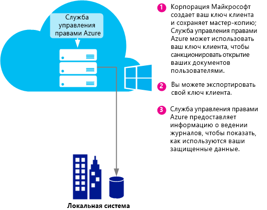
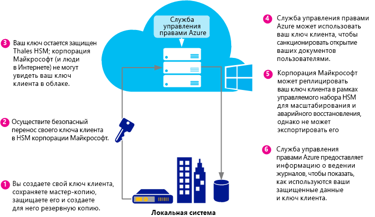

# Планирование и реализация ключа клиента службы Azure Rights Management
Используйте сведения в этом разделе для планирования ключа клиента службы Rights Management (RMS) для Azure RMS и управления им. Например, вместо того, чтобы ключом клиента управляла корпорация Майкрософт (по умолчанию), можно самостоятельно управлять ключом клиента, чтобы соответствовать определенным нормам в вашей организации.  Управление собственным ключом клиента также называется BYOK.

> [!NOTE]
> Ключ клиента RMS также называется ключом сертификата лицензиара сервера. Azure RMS обслуживает один или несколько ключей для каждой организации, которая подписалась на Azure RMS. При каждом использовании ключа для RMS в организации (например, ключи пользователей, ключи компьютера, ключи шифрования документов), они образуют криптографическую цепочку к ключу клиента RMS.

**Краткий обзор:** Используйте следующую таблицу как краткое руководство по рекомендуемой топологии ключа клиента. Затем обратитесь к следующим разделам для получения дополнительной информации.

Если развертывание Azure RMS выполняется с помощью ключа клиента, который управляется корпорацией Майкрософт, можно перейти на BYOK позже. Тем не менее сейчас для вашего ключа клиента Azure RMS нельзя изменить режим управления с BYOK на управляемый корпорацией Майкрософт.

|Бизнес-требование|Рекомендуемая топология ключа клиента|
|---------------------|-----------------------------------------|
|Развертывание службы управления правами Azure выполняется быстро и не требует специального оборудования|Управляется корпорацией Майкрософт|
|Нужна полная функциональность управления правами на доступ к данным (IRM) в Exchange Online с Azure RMS|Управление корпорацией Майкрософт|
|Ключи создаются пользователем и защищены в аппаратном модуле безопасности (HSM)|BYOK<br /><br />В настоящее время эта конфигурация приведет к ограниченной функциональности IRM в Exchange Online. Дополнительные сведения см. в разделе [Цены и ограничения BYOK](../Topic/Planning_and_Implementing_Your_Azure_Rights_Management_Tenant_Key.md#BKMK_Pricing).|
Смотрите следующие разделы, чтобы выбрать топологию ключа клиента, получить общие сведения о жизненном цикле ключа клиента, сведения о реализации BYOK и дальнейших действиях.

-   [Выберите топологию ключа клиента: управляется Майкрософт (по умолчанию) или управляется вами (BYOK)](../Topic/Planning_and_Implementing_Your_Azure_Rights_Management_Tenant_Key.md#BKMK_ChooseTenantKey)

-   [Цены и ограничения BYOK](../Topic/Planning_and_Implementing_Your_Azure_Rights_Management_Tenant_Key.md#BKMK_Pricing)

-   [Реализация BYOK](../Topic/Planning_and_Implementing_Your_Azure_Rights_Management_Tenant_Key.md#BKMK_ImplementBYOK)

-   [Дальнейшие шаги](../Topic/Planning_and_Implementing_Your_Azure_Rights_Management_Tenant_Key.md#BKMK_NextSteps)

## <a name="BKMK_ChooseTenantKey"></a>Выберите топологию ключа клиента: управляется Майкрософт (по умолчанию) или управляется вами (BYOK)
Решите, какая топология оптимально подходит для вашей организации. По умолчанию Azure RMS создает ключ клиента и управляет большинством аспектов жизненного цикла ключа клиента. Это самый простой вариант с наименьшими административными затратами. В большинстве случаев вам даже не нужно знать, что у вас есть ключ клиента. Просто зарегистрируйтесь в Azure RMS — остальной процесс управления ключами обрабатывается в корпорации Майкрософт.

Кроме того, вам может потребоваться полный контроль над ключом клиента, в который входит создание ключа клиента и локальное хранение мастер-копии. Этот сценарий обычно называется BYOK. При выборе этого варианта происходит следующее.

1.  Вы создаете ключ клиента в локальном расположении в соответствии с вашими ИТ-политиками.

2.  Затем вы безопасно переносите ключ клиента из аппаратного модуля безопасности (HSM), который находится в вашем владении, на аппаратные модули безопасности, которыми владеет и управляет корпорация Майкрософт. Во время этого процесса ключ клиента не покидает границы аппаратной защиты.

3.  После перемещения ключа клиента в корпорацию Майкрософт он защищается аппаратными модулями безопасности Thales. Корпорация Майкрософт совместно с Thales работала над обеспечением гарантии того, что ключ клиента невозможно извлечь из аппаратных модулей безопасности Майкрософт.

Хотя эта функция является необязательной, возможно, вам понадобятся журналы использования Azure RMS в мягком реальном времени, чтобы точно видеть, как и когда используется ваш ключ клиента.

> [!NOTE]
> В качестве дополнительной меры защиты Azure RMS использует отдельные системы безопасности для центров обработки данных в Северной Америке, EMEA (Европа, Ближний Восток и Африка) и Азии. При самостоятельном управлении ключом клиента он привязывается к системе безопасности региона, в котором зарегистрирован клиент RMS. Например, ключ клиента в Европе не может использоваться в центрах обработки данных в Северной Америке или Азии.

## <a name="BKMK_OverviewLifecycle"></a>Жизненный цикл ключа клиента
Если вы решите, что управлять ключом клиента должна корпорация Майкрософт, она будет обрабатывать большинство операций жизненного цикла ключа. Однако, если вы решите управлять ключом клиента самостоятельно, вы несете ответственность за многочисленные операции жизненного цикла ключа и некоторые дополнительные процедуры.

На следующих диаграммах показано сравнение этих двух вариантов. На первой диаграмме показано, насколько низки административные затраты в конфигурации по умолчанию, когда ключом клиента управляет корпорация Майкрософт.



На второй диаграмме показаны дополнительные действия, необходимые при самостоятельном управлении ключом клиента.



Если вы решили позволить корпорации Майкрософт управлять вашим ключом клиента, для создания ключа дальнейшие действия не требуются, можно пропустить следующие разделы и перейти непосредственно к разделу [Дальнейшие шаги](../Topic/Planning_and_Implementing_Your_Azure_Rights_Management_Tenant_Key.md#BKMK_NextSteps).

Если вы решили самостоятельно управлять ключом клиента, дополнительные сведения см. в следующих разделах.

### Дополнительные сведения об аппаратных модулях безопасности Thales и дополнениях Майкрософт
Azure RMS использует аппаратные модули безопасности Thales для защиты ваших ключей.

Thales e-Security — это ведущий глобальный поставщик решений шифрования данных и безопасности в кибернетической сфере для финансовых услуг, высоких технологий, производства, государственного сектора и технологий. Решения Thales, основанные на 40-летнем опыте защиты корпоративной и государственной информации, используются в четырех из пяти крупнейших энергетических и аэрокосмических компаний, 22 странах НАТО и защищают более 80 процентов платежных транзакций по всему миру.

Майкрософт сотрудничает с Thales для повышения уровня технического развития аппаратных модулей безопасности. Эти улучшения позволят получать стандартные преимущества размещаемых служб, не уменьшая контроль над ключами. В особенности эти усовершенствования позволят корпорации Майкрософт управлять аппаратными модулями безопасности за вас. Так как Azure RMS является облачной службой, она легко масштабируется в соответствии с потребностями вашей организации. В то же время ваш ключ защищен аппаратными модулями безопасности Майкрософт: вы получаете контроль над жизненным циклом ключа, так как создаете ключ и перемещаете его в аппаратные модули безопасности Майкрософт.

Дополнительные сведения см. в разделе [Аппаратные модули безопасности Thales и Azure RMS](http://www.thales-esecurity.com/msrms/cloud) на веб-сайте Thales.

## <a name="BKMK_Pricing"></a>Цены и ограничения BYOK
Организация с подпиской Azure, которая управляется ИТ-отделом, может использовать BYOK и вести журнал его использования без дополнительной платы. Организации, использующие RMS для отдельных пользователей, не могут использовать BYOK и ведение журнала, поскольку у них нет администратора клиента для настройки этих функций.

> [!NOTE]
> Дополнительные сведения о RMS для частных лиц см. в разделе [RMS для отдельных пользователей и служба Azure Rights Management](../Topic/RMS_for_Individuals_and_Azure_Rights_Management.md).


BYOK и ведение журнала легко работают с любым приложением, которое интегрируется с Azure RMS. Сюда входят облачные службы, такие как SharePoint Online, локальные серверы, на которых запущены Exchange и SharePoint, работающие со службой Azure RMS с помощью соединителя RMS, и клиентские приложения, например Office 2013. Вы получите журналы использования ключа независимо от того, какое приложение отправляет запросы Azure RMS.

Существует одно исключение: В настоящее время **служба Azure RMS в режиме BYOK несовместима с Exchange Online**.  Если вы хотите использовать Exchange Online, рекомендуется сейчас развернуть Azure RMS в режиме управления ключами по умолчанию, в котором корпорация Майкрософт создает ключ и управляет им. Перейти на BYOK можно позже, например когда Exchange Online будет поддерживать Azure RMS BYOK. Тем не менее, если ожидание нежелательно, то другой вариант — развертывание Azure RMS с BYOK сейчас с ограниченными возможностями службы управления правами для Exchange Online (незащищенные письма и незащищенные вложения остаются полностью функциональными):

-   Невозможно будет отобразить в Outlook Web Access защищенные письма или защищенные вложения.

-   Невозможно будет отобразить защищенные письма на мобильных устройствах, использующих Exchange ActiveSync IRM.

-   Транспортная расшифровка (например, для проверки на наличие вредоносных программ) и расшифровка журнала невозможны, поэтому защищенные письма почты и защищенного вложения будут пропущены.

-   Правила защиты транспорта и защиты от потери данных (DLP), которые обеспечивают выполнение политик IRM, неприменимы, поэтому защиту RMS невозможно применить с помощью этих методов.

-   Будет недоступен серверный поиск для защищенных писем, поэтому защищенные письма будут пропущены.

Если использовать Azure RMS BYOK с ограниченной функциональностью RMS для Exchange Online, то RMS будет работать с клиентами электронной почты в Outlook на Windows и Mac, а также с другими клиентами электронной почты, не использующими Exchange ActiveSync IRM.

Если выполняется перенос в Azure RMS из AD RMS, возможно, ключ был импортирован как доверенный домен публикации (TPD) для Exchange Online (также называется BYOK в терминологии Exchange, которая отделена от Azure RMS BYOK). В этом случае необходимо удалить доверенный домен публикации из Exchange Online, чтобы избежать конфликта шаблонов и политик. Дополнительные сведения см. в разделе [Remove-RMSTrustedPublishingDomain](https://technet.microsoft.com/library/jj200720%28v=exchg.150%29.aspx) из библиотеки командлетов Exchange Online.

В некоторых случаях исключение Azure RMS BYOK для Exchange Online на практике не является проблемой. Например, организации, которым нужны BYOK и ведение журнала, запускают приложения данных (Exchange, SharePoint, Office) локально и используют Azure RMS для функций, которые сложно получить в локальной службе AD RMS (например, совместная работа с другими компаниями и доступ к мобильным клиентам). И BYOK, и ведение журнала хорошо работают в этом сценарии и позволяют организации получить полный контроль над подпиской Azure RMS.

## <a name="BKMK_ImplementBYOK"></a>Реализация BYOK
Используйте сведения и процедуры в этом разделе, если вы решили самостоятельно создать ключ клиента и управлять им. Сценарий BYOK:

-   [Предварительные требования для BYOK](../Topic/Planning_and_Implementing_Your_Azure_Rights_Management_Tenant_Key.md#BKMK_Preqs)

-   [Создание и передача ключа клиента по Интернету](../Topic/Planning_and_Implementing_Your_Azure_Rights_Management_Tenant_Key.md#BKMK_BYOK_Internet)

-   [Создание и передача ключа клиента — лично](../Topic/Planning_and_Implementing_Your_Azure_Rights_Management_Tenant_Key.md#BKMK_BYOK_InPerson)

> [!IMPORTANT]
> Если вы уже начали использовать [!INCLUDE[aad_rightsmanagement_1](../Token/aad_rightsmanagement_1_md.md)] (служба активирована) и у вас есть пользователи, которые запустили Office 2010, обратитесь в службу поддержки пользователей Майкрософт, перед тем как запускать эти процедуры. В зависимости от вашего сценария и требований вы все еще можете использовать BYOK с некоторыми ограничениями или дополнительными действиями.
> 
> Также обратитесь в службу поддержки пользователей, если в вашей организации есть специальные политики для обработки ключей.

### <a name="BKMK_Preqs"></a>Предварительные требования для BYOK
Список предварительных требований для BYOK см. в следующей таблице.

|Требование|Дополнительные сведения|
|--------------|---------------------------|
|Подписка, которая поддерживает Azure RMS|Дополнительные сведения о доступных подписках см. в разделе [Поддерживающая Azure RMS облачная подписка](../Topic/Requirements_for_Azure_Rights_Management.md#BKMK_SupportedSubscriptions) статьи [Требования для службы Azure Rights Management](../Topic/Requirements_for_Azure_Rights_Management.md).|
|Вы не используете RMS для частных лиц и Exchange Online. Если же вы используете Exchange Online, следует понимать и принимать ограничения использования BYOK в этой конфигурации.|Дополнительные сведения о текущих ограничениях для BYOK см. в подразделе [Цены и ограничения BYOK](../Topic/Planning_and_Implementing_Your_Azure_Rights_Management_Tenant_Key.md#BKMK_Pricing) этой статьи. **Important:** В настоящее время BYOK несовместим с Exchange Online.|
|Аппаратный модуль безопасности Thales, смарт-карты и программное обеспечение поддержки<br /><br />При переходе с AD RMS на Azure RMS с использованием программного ключа для ключа оборудования необходимо иметь минимальную версию 11.62 для драйверов Thales.|Вы должны иметь доступ к аппаратному модулю безопасности Thales и базовые знания о работе аппаратных модулей безопасности Thales. См. раздел [Аппаратный модуль безопасности Thales](http://www.thales-esecurity.com/msrms/buy), чтобы ознакомиться со списком совместимых моделей или приобрести аппаратный модуль безопасности, если у вас его нет.|
|Если требуется переместить ключ клиента через Интернет, а не физически в Редмонде, США, необходимо следующее.<br /><br />1.  Автономная 64-разрядная рабочая станция с минимальной версией операционной системы Windows 7 и программным обеспечением Thales nShield версии не ниже 11.62.<br />    Если рабочая станция работает под управлением Windows 7, необходимо [установить Microsoft .NET Framework 4.5](http://go.microsoft.com/fwlink/?LinkId=225702).<br />2.  Рабочая станция, подключенная к Интернету, с версией операционной системы Windows не ниже Windows 7.<br />3.  USB-накопитель или другое переносное устройство хранения, на котором не меньше 16 МБ свободного места.|Эти предварительные требования не нужны при личной передаче ключа клиента в Редмонде.<br /><br />По соображениям безопасности рекомендуется не подключать первую рабочую станцию к сети. Однако это не применяется принудительно программным путем. **Note:** В дальнейших инструкциях эта рабочая станция называется отключенной рабочей станцией.<br />Кроме того, если ключ клиента предназначен для производственной сети, рекомендуется использовать вторую, отдельную рабочую станцию для скачивания набора средств и отправки ключа клиента. Но в целях тестирования можно использовать первую рабочую станцию. **Note:** В дальнейших инструкциях вторая рабочая станция называется подключенной к Интернету рабочей станцией.|
|Необязательно. Подписка Azure|Если необходимо записать в журнал сведения об использовании ключа клиента (и сведения об использовании службы Rights Management), для хранения журналов нужна подписка Azure и достаточно места в Azure.|
Процедуры для создания и использования собственного ключа клиента зависят от того, требуется сделать это по Интернету или лично:

-   **Передача по Интернету.** Для этого требуются дополнительные действия по настройке, такие как загрузка и использование набора средств и командлетов Windows PowerShell. Однако вам не нужно физически присутствовать на территории корпорации Майкрософт для передачи ключа клиента. Безопасность сохраняется следующими способами.

    -   Вы создаете ключ клиента на рабочей станции, которая находится не в сети, что сокращает возможные направления атак.

    -   Ключ клиента шифруется с помощью ключа обмена ключами, который остается зашифрованным, пока не будет передан в аппаратные модули безопасности Azure RMS. Только зашифрованная версия ключа клиента покидает исходную рабочую станцию.

    -   Средство задает свойства ключа клиента, которые привязывают ключ клиента к системе безопасности Azure RMS. Поэтому после того, как аппаратные модули безопасности Azure RMS получат и расшифруют ключ клиента, только эти аппаратные модули безопасности смогут использовать его. Ключ клиента невозможно экспортировать. Аппаратные модули безопасности Thales применяют принудительную привязку.

    -   Ключ обмена ключами, который используется для шифрования ключа клиента, создается в аппаратных модулях безопасности Azure RMS и не может быть экспортирован. Аппаратные модули безопасности принудительно запрещают отображение точной версии ключа обмена ключами вне аппаратного модуля безопасности. Кроме того, набор средств включает аттестацию Thales, что ключ обмена ключами не может быть экспортирован и был создан в подлинном аппаратном модуле безопасности, изготовленным Thales.

    -   Этот набор средств включает аттестацию Thales, что система безопасности Azure RMS также была создана в подлинном аппаратном модуле безопасности, изготовленном Thales. Это является доказательством того, что корпорация Майкрософт использует подлинное оборудование.

    -   Корпорация Майкрософт использует отдельные ключи обмена ключами, а также отдельные системы безопасности в каждом географическом регионе, что гарантирует, что ключ клиента можно использовать в центрах обработки данных в том же регионе, в котором он был зашифрован. Например, ключ клиента в Европе не может использоваться в центрах обработки данных в Северной Америке или Азии.

    > [!NOTE]
    > Ключ клиента можно безопасно перемещать через ненадежные компьютеры и сети, так как он зашифрован и защищен с помощью ограничений уровня контроля доступа, поэтому его можно использовать только в аппаратных модулях безопасности и аппаратных модулях безопасности Майкрософт для Azure RMS. Для проверки мер безопасности и получения дополнительных сведений от Thales можно использовать скрипты, предоставленные в наборе средств. [Управление ключом оборудования в облаке RMS](https://www.thales-esecurity.com/knowledge-base/white-papers/hardware-key-management-in-the-rms-cloud).

-   **Передача лично.** Для этого необходимо обратиться в службу поддержки пользователей Майкрософт, чтобы запланировать встречу по передаче ключа для Azure RMS. Передать ключ клиента в систему безопасности Azure RMS нужно в Редмонде, штат Вашингтон, США.

### <a name="BKMK_BYOK_Internet"></a>Создание и передача ключа клиента по Интернету
Используйте следующие процедуры, если необходимо передать ключ клиента по Интернету, а не лично на территории корпорации Майкрософт.

-   [Подготовка подключенной к Интернету рабочей станции](../Topic/Planning_and_Implementing_Your_Azure_Rights_Management_Tenant_Key.md#BKMK_InternetPrepareWorkstation)

-   [Подготовка отключенной рабочей станции](../Topic/Planning_and_Implementing_Your_Azure_Rights_Management_Tenant_Key.md#BKMK_DisconnectedPrepareWorkstation)

-   [Создание ключа клиента](../Topic/Planning_and_Implementing_Your_Azure_Rights_Management_Tenant_Key.md#BKMK_InternetGenerate)

-   [Подготовка ключа клиента к передаче](../Topic/Planning_and_Implementing_Your_Azure_Rights_Management_Tenant_Key.md#BKMK_InternetPrepareTransfer)

-   [Передача ключа клиента в службу Azure RMS](../Topic/Planning_and_Implementing_Your_Azure_Rights_Management_Tenant_Key.md#BKMK_InternetTransfer)

#### <a name="BKMK_InternetPrepareWorkstation"></a>Подготовка подключенной к Интернету рабочей станции
Чтобы подготовить рабочую станцию, подключенную к Интернету, выполните 3 следующих шага.

-   [Шаг 1. Установите Windows PowerShell для Azure Rights Management](../Topic/Planning_and_Implementing_Your_Azure_Rights_Management_Tenant_Key.md#BKMK_PrepareInternetConnectedWorkstation1)

-   [Шаг 2. Получение идентификатора клиента Azure Active Directory](../Topic/Planning_and_Implementing_Your_Azure_Rights_Management_Tenant_Key.md#BKMK_PrepareInternetConnectedWorkstation2)

-   [Шаг 3. Скачивание набора средств BYOK](../Topic/Planning_and_Implementing_Your_Azure_Rights_Management_Tenant_Key.md#BKMK_PrepareInternetConnectedWorkstation3)

##### <a name="BKMK_PrepareInternetConnectedWorkstation1"></a>Шаг 1. Установите Windows PowerShell для Azure Rights Management
На подключенной к Интернету рабочей станции скачайте и установите модуль Windows PowerShell для Azure Rights Management.

> [!NOTE]
> Если этот модуль Windows PowerShell уже установлен, выполните следующую команду в окне PowerShell, чтобы убедиться, что номер версии не ниже 2.1.0.0: `(Get-Module aadrm -ListAvailable).Version`

Инструкции по установке см. в разделе [Установка Windows PowerShell для Azure Rights Management](../Topic/Installing_Windows_PowerShell_for_Azure_Rights_Management.md).

##### <a name="BKMK_PrepareInternetConnectedWorkstation2"></a>Шаг 2. Получение идентификатора клиента Azure Active Directory
Запустите Windows PowerShell с параметром **Запуск от имени администратора**, а затем выполните следующие команды:

-   Используйте командлет [Connect-AadrmService](http://msdn.microsoft.com/library/windowsazure/dn629415.aspx), чтобы подключиться к службе Azure RMS:

    ```
    Connect-AadrmService
    ```
    При появлении запроса введите ваши учетные данные администратора для клиента [!INCLUDE[aad_rightsmanagement_1](../Token/aad_rightsmanagement_1_md.md)] (как правило, будет использоваться учетная запись, которая является глобальным администратором для Office 365 или Azure Active Directory).

-   Используйте командлет [Get-AadrmConfiguration](http://msdn.microsoft.com/library/windowsazure/dn629410.aspx) для отображения конфигурации клиента:

    ```
    Get-AadrmConfiguration
    ```
    Сохраните GUID из первой строки выходных данных (BPOSId). Это идентификатор клиента Azure Active Directory, который понадобится позже при подготовке ключа клиента для отправки.

-   Используйте командлет [Disconnect-AadrmService](http://msdn.microsoft.com/library/windowsazure/dn629416.aspx), чтобы отключиться от службы Azure RMS до тех пор, пока вы не будете готовы отправить свой ключ:

    ```
    Disconnect-AadrmService
    ```

Не закрывайте окно Windows PowerShell.

##### <a name="BKMK_PrepareInternetConnectedWorkstation3"></a>Шаг 3 Скачивание набора средств BYOK
Перейдите в центр загрузки Майкрософт и [загрузите набор средств BYOK](http://go.microsoft.com/fwlink/?LinkId=335781) для своего региона:

|Регион|Имя пакета|
|----------|--------------|
|Северная Америка|AzureRMS-BYOK-tools-UnitedStates.zip|
|Европа|AzureRMS-BYOK-tools-Europe.zip|
|Азия|AzureRMS-BYOK-tools-AsiaPacific.zip|
В набор включено следующее.

-   Пакет ключей обмена ключами с именем, которое начинается с **BYOK-KEK-pkg-**.

-   Пакет системы безопасности с именем, которое начинается с **BYOK-SecurityWorld-pkg-**.

-   Скрипт на Python с именем **verifykeypackage.py**.

-   Исполняемый файл командной строки с именем **KeyTransferRemote.exe**, файл метаданных с именем **KeyTransferRemote.exe.config** и связанные библиотеки DLL.

-   Повторно распространяемый пакет Visual C++ с именем **vcredist_x64.exe**.

Скопируйте пакет на USB-накопитель или другое переносное устройство.

#### <a name="BKMK_DisconnectedPrepareWorkstation"></a>Подготовка отключенной рабочей станции
Чтобы подготовить рабочую станцию, не подключенную к сети (к Интернету или внутренней сети), выполните 2 шага.

-   [Шаг 1. Подготовка отключенной рабочей станции с помощью аппаратного модуля безопасности Thales](../Topic/Planning_and_Implementing_Your_Azure_Rights_Management_Tenant_Key.md#BKMK_PrepareDisconnectedWorkstation1)

-   [Шаг 2. Установка набора средств BYOK на отключенную рабочую станцию](../Topic/Planning_and_Implementing_Your_Azure_Rights_Management_Tenant_Key.md#BKMK_PrepareDisconnectedWorkstation2)

##### <a name="BKMK_PrepareDisconnectedWorkstation1"></a>Шаг 1. Подготовка отключенной рабочей станции с помощью аппаратного модуля безопасности Thales
На отключенной рабочей станции установите программное обеспечение поддержки nCipher (Thales) на компьютере Windows, а затем подключите аппаратный модуль безопасности Thales на этом компьютере.

Убедитесь в том, что средства Thales находятся в пути **(%nfast_home%\bin** и **%nfast_home%\python\bin**. Введите, например,

```
set PATH=%PATH%;”%nfast_home%\bin”;”%nfast_home%\python\bin”
```
Дополнительные сведения см. в руководстве пользователя, поставляемом вместе с модулем безопасности Thales, или посетите веб-сайт Thales для Azure RMS по адресу [http://www.thales-esecurity.com/msrms/cloud](http://www.thales-esecurity.com/msrms/cloud).

##### <a name="BKMK_PrepareDisconnectedWorkstation2"></a>Шаг 2. Установка набора средств BYOK на отключенную рабочую станцию
Скопируйте пакет набора средств BYOK с USB-накопителя или другого переносного устройства, а затем выполните следующие действия.

1.  Извлеките файлы из скачанного пакета в любую папку.

2.  Запустите файл vcredist_x64.exe из этой папки.

3.  Следуйте инструкциям по установке компонентов среды выполнения Visual C++ для Visual Studio 2012.

#### <a name="BKMK_InternetGenerate"></a>Создание ключа клиента
Выполните эти 3 шага на отключенной рабочей станции для создания ключа клиента.

-   [Шаг 1. Создание системы безопасности](../Topic/Planning_and_Implementing_Your_Azure_Rights_Management_Tenant_Key.md#BKMK_InternetGenerate1)

-   [Шаг 2. Проверка скачанного пакета](../Topic/Planning_and_Implementing_Your_Azure_Rights_Management_Tenant_Key.md#BKMK_InternetGenerate2)

-   [Шаг 3. Создание нового ключа](../Topic/Planning_and_Implementing_Your_Azure_Rights_Management_Tenant_Key.md#BKMK_InternetGenerate3)

##### <a name="BKMK_InternetGenerate1"></a>Шаг 1. Создание системы безопасности
Откройте командную строку и запустите новую программу системы безопасности Thales.

```
new-world.exe --initialize --cipher-suite=DLf1024s160mRijndael --module=1 --acs-quorum=2/3
```
Эта программа создает файл **Security World** в каталоге %NFAST_KMDATA%\local\world, который соответствует папке C:\ProgramData\nCipher\Key Management Data\local. Можно использовать разные значения для кворума, но в нашем примере вам предложат ввести три пустых карты и закрепления для каждой из них. После этого для доступа к системе безопасности с правами администратора потребуются любые две карты (заданный кворум).  Эти карты станут **набором карт администратора** для новой системы безопасности. Вы можете указать пароль или ПИН-код для каждой карты ACS на этом этапе или добавить их позже с помощью команды.

> [!TIP]
> Можно проверить текущее состояние конфигурации вашего модуля безопасности (HSM) с помощью команды `nkminfo`.

Затем выполните следующие действия.

1.  Установите поставщика CNG Thales, как описано в документации Thales, и настройте его для использования новой системы безопасности.

2.  Сделайте резервную копию файла системы безопасности в папке **%nfast_kmdata%\local**. Защитите файл системы безопасности, карты администратора и их закрепления и убедитесь, что все имеют доступ не больше, чем к одной карте.

##### <a name="BKMK_InternetGenerate2"></a>Шаг 2. Проверка скачанного пакета
Этот шаг необязателен, но рекомендуется, чтобы вы могли проверить следующее.

-   Ключ обмена ключами, который включен в набор средств, создан в подлинном аппаратном модуле безопасности Thales.

-   Хэш системы безопасности Azure RMS, включенный в набор средств, создан в подлинном аппаратном модуле безопасности Thales.

-   Ключ обмена ключами не экспортируется.

> [!NOTE]
> Для проверки скачанного пакета аппаратный модуль безопасности должен быть подключен, включен и иметь систему безопасности (только что созданную).

###### Для проверки скачанного пакета выполните следующие действия.

1.  Запустите скрипт verifykeypackage.py, введя следующее в зависимости от региона.

    -   Для Северной Америки:

        ```
        python verifykeypackage.py -k BYOK-KEK-pkg-NA-1 -w BYOK-SecurityWorld-pkg-NA-1
        ```

    -   Для Европы:

        ```
        python verifykeypackage.py -k BYOK-KEK-pkg-EU-1 -w BYOK-SecurityWorld-pkg-EU-1
        ```

    -   Для Азии:

        ```
        python verifykeypackage.py -k BYOK-KEK-pkg-AP-1 -w BYOK-SecurityWorld-pkg-AP-1
        ```

    > [!TIP]
    > Программное обеспечение Thales включает интерпретатор Python в каталоге %NFAST_HOME%\python\bin

2.  Подтвердите, что вы видите следующее, что указывает на успешную проверку. **Результат:  УСПЕШНО**

Этот скрипт проверяет цепочку до корневого ключа Thales подписавшего. Хэш этого корневого ключа встроен в скрипт, и его значение должно быть **59178a47 de508c3f 291277ee 184f46c4 f1d9c639**. Вы можете также подтвердить это значение отдельно, посетив [веб-сайт Thales](http://www.thalesesec.com/).

После этого можно создать новый ключ, который будет ключом клиента RMS.

##### <a name="BKMK_InternetGenerate3"></a>Шаг 3 Создание нового ключа
Создайте ключ CNG с помощью программ Thales **generatekey** и **cngimport**.

Для создания ключа выполните следующую команду:

```
generatekey --generate simple type=RSA size=2048 protect=module ident=contosokey plainname=contosokey nvram=no pubexp=
```
После выполнения команды используйте эти инструкции.

-   Рекомендуемый размер ключа — 2048, но также поддерживается 1024-разрядные ключи RSA для существующих клиентов AD RMS, обладающих этими ключами и мигрирующих на Azure RMS.

-   Замените значение *contosokey* на **ident**, а **plainname** — любым строковым значением. Чтобы минимизировать административные затраты и сократить вероятность ошибок, рекомендуется использовать то же значение для обоих параметров с буквами в нижнем регистре.

-   В этом примере значение pubexp остается пустым (по умолчанию), но вы можете указать конкретные значения. Дополнительные сведения см. в документации Thales.

Затем выполните следующую команду для импорта ключа в CNG:

```
cngimport --import -M --key=contosokey --appname=simple contosokey
```
После выполнения команды используйте эти инструкции.

-   Замените *contoskey* тем же значением, которое указано в разделе [Шаг 1. Создание системы безопасности](../Topic/Planning_and_Implementing_Your_Azure_Rights_Management_Tenant_Key.md#BKMK_InternetGenerate1) статьи *Создание ключа клиента*.

-   Используйте параметр **-M**, чтобы ключ подходил для этого сценария. Без этого результирующий ключ будет пользовательским ключом для текущего пользователя.

Эта команда создает файл ключа с токеном в папке %NFAST_KMDATA%\local с именем, начинающимся с **key_caping_** и заканчивающимся идентификатором безопасности. Например: **key_caping_machine--801c1a878c925fd9df4d62ba001b94701c039e2fb** Этот файл содержит зашифрованный ключ.

> [!TIP]
> Текущее состояние конфигурации ваших ключей можно просмотреть с помощью команды `nkminfo –k`.

Сделайте резервную копию файла ключа с токеном в безопасном расположении.

> [!IMPORTANT]
> Позже при передаче ключа в Azure RMS корпорация Майкрософт не сможет экспортировать ключ обратно, поэтому крайне важно сделать резервную копию ключа и системы безопасности. За руководством и рекомендациями по резервному копированию ключа обратитесь в компанию Thales.

После этого можно передать свой ключ клиента в службу Azure RMS.

#### <a name="BKMK_InternetPrepareTransfer"></a>Подготовка ключа клиента к передаче
Выполните эти 4 шага на отключенной рабочей станции для подготовки ключа клиента.

-   [Шаг 1. Создание копии ключа с ограниченными разрешениями](../Topic/Planning_and_Implementing_Your_Azure_Rights_Management_Tenant_Key.md#BKMK_InternetPrepareTransfer1)

-   [Шаг 2. Проверка новой копии ключа](../Topic/Planning_and_Implementing_Your_Azure_Rights_Management_Tenant_Key.md#BKMK_InternetPrepareTransfer2)

-   [Шаг 3. Шифрование ключа с помощью ключа обмена ключами Майкрософт](../Topic/Planning_and_Implementing_Your_Azure_Rights_Management_Tenant_Key.md#BKMK_InternetPrepareTransfer3)

-   [Шаг 4. Копирование пакета передачи ключа на подключенную к Интернету рабочую станцию](../Topic/Planning_and_Implementing_Your_Azure_Rights_Management_Tenant_Key.md#BKMK_InternetPrepareTransfer4)

##### <a name="BKMK_InternetPrepareTransfer1"></a>Шаг 1. Создание копии ключа с ограниченными разрешениями
Чтобы ограничить разрешения в ключе клиента, выполните следующие действия.

-   В командной строке выполните одну из следующих команд в зависимости от региона.

    -   Для Северной Америки:

        ```
        KeyTransferRemote.exe -ModifyAcls -KeyAppName simple -KeyIdentifier contosokey -ExchangeKeyPackage BYOK-KEK-pkg-NA-1 -NewSecurityWorldPackage BYOK-SecurityWorld-pkg-NA-1
        ```

    -   Для Европы:

        ```
        KeyTransferRemote.exe -ModifyAcls -KeyAppName simple -KeyIdentifier contosokey -ExchangeKeyPackage BYOK-KEK-pkg-EU-1 -NewSecurityWorldPackage BYOK-SecurityWorld-pkg-EU-1
        ```

    -   Для Азии:

        ```
        KeyTransferRemote.exe -ModifyAcls -KeyAppName simple -KeyIdentifier contosokey -ExchangeKeyPackage BYOK-KEK-pkg-AP-1 -NewSecurityWorldPackage BYOK-SecurityWorld-pkg-AP-1
        ```

При выполнении этой команды замените *contoskey* тем же значением, которое указано в разделе [Шаг 1. Создание системы безопасности](../Topic/Planning_and_Implementing_Your_Azure_Rights_Management_Tenant_Key.md#BKMK_InternetGenerate1) статьи *Создание ключа клиента*.

Вас попросят вставить карты ACS системы безопасности и ввести пароль или ПИН-код, если он задан.

После завершения команды вы увидите **результат**: **УСПЕШНО**, а копия ключа клиента с ограниченными разрешениями появится в файле с именем key_xferacId_*&lt;contosokey&gt;*.

##### <a name="BKMK_InternetPrepareTransfer2"></a>Шаг 2. Проверка новой копии ключа
Дополнительно можно запустить служебные программы Thales, чтобы подтвердить минимальные разрешения в новом ключе клиента.

-   aclprint.py:

    ```
    "%nfast_home%\bin\preload.exe" -m 1 -A xferacld -K contosokey "%nfast_home%\python\bin\python" "%nfast_home%\python\examples\aclprint.py"
    ```

-   kmfile-dump.exe:

    ```
    "%nfast_home%\bin\kmfile-dump.exe" "%NFAST_KMDATA%\local\key_xferacld_contosokey"
    ```

При выполнении этой команды замените *contosokey* тем же значением, которое указано в разделе [Шаг 1. Создание системы безопасности](../Topic/Planning_and_Implementing_Your_Azure_Rights_Management_Tenant_Key.md#BKMK_InternetGenerate1) статьи *Создание ключа клиента*.

##### <a name="BKMK_InternetPrepareTransfer3"></a>Шаг 3 Шифрование ключа с помощью ключа обмена ключами Майкрософт
Выполните одну из следующих команд в зависимости от региона.

-   Для Северной Америки:

    ```
    KeyTransferRemote.exe -Package -KeyIdentifier contosokey -ExchangeKeyPackage BYOK-KEK-pkg-NA-1 -NewSecurityWorldPackage BYOK-SecurityWorld-pkg-NA-1 -TenantBposId GUID -KeyFriendlyName ContosoFirstkey
    ```

-   Для Европы:

    ```
    KeyTransferRemote.exe -Package -KeyIdentifier contosokey -ExchangeKeyPackage BYOK-KEK-pkg-EU-1 -NewSecurityWorldPackage BYOK-SecurityWorld-pkg-EU-1 -TenantBposId GUID -KeyFriendlyName ContosoFirstkey
    ```

-   Для Азии:

    ```
    KeyTransferRemote.exe -Package -KeyIdentifier contosokey -ExchangeKeyPackage BYOK-KEK-pkg-AP-1 -NewSecurityWorldPackage BYOK-SecurityWorld-pkg-AP-1 -TenantBposId GUID -KeyFriendlyName ContosoFirstkey
    ```

После выполнения команды используйте эти инструкции.

-   Замените *contosokey* идентификатором, который использовался для создания ключа в разделе [Шаг 1. Создание системы безопасности](../Topic/Planning_and_Implementing_Your_Azure_Rights_Management_Tenant_Key.md#BKMK_InternetGenerate1) статьи *Создание ключа клиента*.

-   Замените *GUID* идентификатором клиента Azure Active Directory, который вы получили в разделе [Шаг 2. Получение идентификатора клиента Azure Active Directory](../Topic/Planning_and_Implementing_Your_Azure_Rights_Management_Tenant_Key.md#BKMK_PrepareInternetConnectedWorkstation2) статьи *Подготовка подключенной к Интернету рабочей станции*.

-   Замените *ContosoFirstKey* меткой, которая будет использоваться для имени выходного файла.

После успешного завершения отобразится **результат**: **УСПЕШНО**, и появится новый файл в папке с таким именем: TransferPackage-*ContosoFirstkey*.byok

##### <a name="BKMK_InternetPrepareTransfer4"></a>Шаг 4. Копирование пакета передачи ключа на подключенную к Интернету рабочую станцию
Используйте USB-накопитель или другое переносное устройство для копирования выходного файла из предыдущего шага (KeyTransferPackage-*ContosoFirstkey*.byok) в подключенную к Интернету рабочую станцию.

> [!NOTE]
> Используйте рекомендации по обеспечению безопасности для защиты файла, поскольку в нем содержится ваш закрытый ключ.

#### <a name="BKMK_InternetTransfer"></a>Передача ключа клиента в службу Azure RMS
Выполните 3 следующих шага на подключенной к Интернету рабочей станции для передачи нового ключа клиента в службу Azure RMS.

-   [Шаг 1. Подключение к Azure RMS](../Topic/Planning_and_Implementing_Your_Azure_Rights_Management_Tenant_Key.md#BKMK_InternetTransfer1)

-   [Шаг 2. Отправка пакета ключа](../Topic/Planning_and_Implementing_Your_Azure_Rights_Management_Tenant_Key.md#BKMK_InternetTransfer2)

-   [Шаг 3. Перечисление всех ключей клиента — при необходимости](../Topic/Planning_and_Implementing_Your_Azure_Rights_Management_Tenant_Key.md#BKMK_InternetTransfer3)

##### <a name="BKMK_InternetTransfer1"></a>Шаг 1. Подключение к Azure RMS
Вернитесь в окно Windows PowerShell и введите следующее:

1.  Снова подключитесь к службе [!INCLUDE[aad_rightsmanagement_1](../Token/aad_rightsmanagement_1_md.md)]:

    ```
    Connect-AadrmService
    ```

2.  Используйте командлет [Get-AadrmKeys](http://msdn.microsoft.com/library/windowsazure/dn629420.aspx), чтобы просмотреть текущую конфигурацию ключа клиента:

    ```
    Get-AadrmKeys
    ```

##### <a name="BKMK_InternetTransfer2"></a>Шаг 2. Отправка пакета ключа
Используйте командлет [Add-AadrmKey](http://msdn.microsoft.com/library/windowsazure/dn629418.aspx), чтобы отправить пакет передачи ключа, скопированный с отключенной рабочей станции:

```
Add-AadrmKey –KeyFile <PathToPackageFile> -Verbose
```
> [!WARNING]
> Появится запрос на подтверждение действия. Важно помнить, что это действие невозможно отменить. После отправки ключа клиента он автоматически становится первичным ключом клиента организации, и пользователи начнут использовать этот ключ клиента при защите документов и файлов.

Если отправка завершена успешно, появится следующее сообщение: **Служба Rights Management успешно добавила ключ.**

Ожидайте задержку репликации для распространения изменения по всем центрам обработки данных [!INCLUDE[aad_rightsmanagement_1](../Token/aad_rightsmanagement_1_md.md)].

##### <a name="BKMK_InternetTransfer3"></a>Шаг 3 Перечисление всех ключей клиента — при необходимости
Еще раз используйте командлет Get-AadrmKeys, чтобы увидеть изменение в ключе клиента, и каждый раз, когда требуется увидеть список ключей клиента. Отображаемые ключи клиента включают начальный ключ клиента, созданный для вас корпорацией Майкрософт, и любые добавленные вами ключи клиента:

```
Get-AadrmKeys
```
Ключ клиента, помеченный как **Активный**, является ключом, который ваша организация в настоящее время использует для защиты документов и файлов.

После этого все шаги, необходимые для передачи ключа по Интернету, завершены, и можно перейти к разделу [Дальнейшие шаги](../Topic/Planning_and_Implementing_Your_Azure_Rights_Management_Tenant_Key.md#BKMK_NextSteps).

### <a name="BKMK_BYOK_InPerson"></a>Создание и передача ключа клиента — лично
Используйте следующие процедуры, если хотите передать ключ клиента лично, вместо того, чтобы передавать его по Интернету.

-   [Создание ключа клиента](../Topic/Planning_and_Implementing_Your_Azure_Rights_Management_Tenant_Key.md#BKMK_GenerateKey)

-   [Передача ключа клиента в службу Azure RMS](../Topic/Planning_and_Implementing_Your_Azure_Rights_Management_Tenant_Key.md#BKMK_Transfer)

#### <a name="BKMK_GenerateKey"></a>Создание ключа клиента
Для создания собственного ключа клиента выполните следующие 3 шага.

-   [Шаг 1. Подготовка рабочей станции с аппаратным модулем безопасности Thales](../Topic/Planning_and_Implementing_Your_Azure_Rights_Management_Tenant_Key.md#BKMK_GenerateYourKey1)

-   [Шаг 2. Создание системы безопасности](../Topic/Planning_and_Implementing_Your_Azure_Rights_Management_Tenant_Key.md#BKMK_GenerateYourKey2)

-   [Шаг 3. Создание нового ключа](../Topic/Planning_and_Implementing_Your_Azure_Rights_Management_Tenant_Key.md#BKMK_GenerateYourKey3)

##### <a name="BKMK_GenerateYourKey1"></a>Шаг 1. Подготовка рабочей станции с аппаратным модулем безопасности Thales
Установите программное обеспечение поддержки nCipher (Thales) на компьютер с ОС Windows. Подключите аппаратный модуль безопасности Thales на этом компьютере. Убедитесь, что средства Thales находятся в вашем пути. Дополнительные сведения см. в руководстве пользователя, включенном в аппаратный модуль безопасности Thales, или посетите веб-сайт Thales для Azure RMS по адресу [http://www.thales-esecurity.com/msrms/cloud](http://www.thales-esecurity.com/msrms/cloud).

##### <a name="BKMK_GenerateYourKey2"></a>Шаг 2. Создание системы безопасности
Откройте командную строку и запустите новую программу системы безопасности Thales.

```
new-world.exe --initialize --cipher-suite=DLf1024s160mRijndael --module=1 --acs-quorum=2/3
```
Эта программа создает файл **Security World** в каталоге %NFAST_KMDATA%\local\world, который соответствует папке C:\ProgramData\nCipher\Key Management Data\local. Можно использовать разные значения для кворума, но в нашем примере вам предложат ввести три пустых карты и закрепления для каждой из них. После этого любые две карты предоставят полный доступ к системе безопасности.  Эти карты станут **набором карт администратора** для новой системы безопасности.

Затем выполните следующие действия.

1.  Установите поставщика CNG Thales, как описано в документации Thales, и настройте его для использования новой системы безопасности.

2.  Сделайте резервную копию файла системы безопасности. Защитите файл системы безопасности, карты администратора и их закрепления и убедитесь, что все имеют доступ не больше, чем к одной карте.

После этого можно создать новый ключ, который будет ключом клиента RMS.

##### <a name="BKMK_GenerateYourKey3"></a>Шаг 3 Создание нового ключа
Создайте ключ CNG с помощью программ Thales **generatekey** и **cngimport**.

Для создания ключа выполните следующую команду:

```
generatekey --generate simple type=RSA size=2048 protect=module ident=contosokey plainname=contosokey nvram=no pubexp=
```
После выполнения команды используйте эти инструкции.

-   Рекомендуемый размер ключа — 2048, но также поддерживается 1024-разрядные ключи RSA для существующих клиентов AD RMS, обладающих этими ключами и переносимых на Azure RMS.

-   Замените значение *contosokey* на **ident**, а **plainname** — любым строковым значением. Чтобы минимизировать административные затраты и сократить вероятность ошибок, рекомендуется использовать то же значение для обоих параметров с буквами в нижнем регистре.

-   В этом примере значение pubexp остается пустым (по умолчанию), но вы можете указать конкретные значения. Дополнительные сведения см. в документации Thales.

Затем выполните следующую команду для импорта ключа в CNG:

```
cngimport --import –M --key=contosokey --appname=simple contosokey
```
После выполнения команды используйте эти инструкции.

-   Замените *contosokey* тем же значением, которое указано в шаге 1.

-   Используйте параметр **-M**, чтобы ключ подходил для этого сценария. Без этого результирующий ключ будет пользовательским ключом для текущего пользователя.

Эта команда создает файл ключа с токеном в папке %NFAST_KMDATA%\local с именем, начинающимся с **key_caping_** и заканчивающимся идентификатором безопасности. Например: **key_caping_machine--801c1a878c925fd9df4d62ba001b94701c039e2fb** Этот файл содержит зашифрованный ключ.

Сделайте резервную копию файла ключа с токеном в безопасном расположении.

> [!IMPORTANT]
> Позже при передаче ключа в службу Azure RMS корпорация Майкрософт получит невосстанавливаемую копию вашего ключа. Это означает, что никто не сможет возвратить ключ из аппаратного модуля безопасности в корпорации Майкрософт. Это позволит вам сохранить исключительный контроль над ключом клиента. Следовательно крайне важно сделать резервную копию ключа и системы безопасности. За руководством и рекомендациями по резервному копированию ключа обратитесь в компанию Thales.

После этого можно передать свой ключ клиента в службу Azure RMS.

#### <a name="BKMK_Transfer"></a>Передача ключа клиента в службу Azure RMS
После создания собственного ключа необходимо передать его в службу Azure RMS, перед тем как использовать. Для самого высокого уровня безопасности эту передачу следует осуществить вручную в офисе корпорации Майкрософт в Редмонде, штат Вашингтон, США. Для завершения этого процесса выполните 3 шага.

-   [Шаг 1. Передача ключа в корпорацию Майкрософт](../Topic/Planning_and_Implementing_Your_Azure_Rights_Management_Tenant_Key.md#BKMK_TransferYourKey1)

-   [Шаг 2. Передача ключа в систему безопасности Window Azure RMS](../Topic/Planning_and_Implementing_Your_Azure_Rights_Management_Tenant_Key.md#BKMK_TransferYourKey2)

-   [Шаг 3. Закрытие процедур](../Topic/Planning_and_Implementing_Your_Azure_Rights_Management_Tenant_Key.md#BKMK_TransferYourKey3)

###### Шаг 1. Передача ключа в корпорацию Майкрософт

-   Обратитесь в службу поддержки пользователей Майкрософт, чтобы запланировать встречу по передаче ключа для Azure RMS. В офис Майкрософт в Редмонде следует следующее.

    -   Кворум карт администратора. Если вы следовали предыдущим инструкциям в разделе [Шаг 2. Создание системы безопасности](../Topic/Planning_and_Implementing_Your_Azure_Rights_Management_Tenant_Key.md#BKMK_GenerateYourKey2), это могут быть любые две из трех карт.

    -   Сотрудник, имеющий право переносить карты администратора и закрепления (обычно два — по одному на каждую карту).

    -   Файл системы безопасности (%NFAST_KMDATA%\local\world) на USB-накопителе.

    -   Файл ключа с токеном на USB-накопителе.

###### Шаг 2. Передача ключа в систему безопасности Window Azure RMS

1.  После того, как вы прибудете в корпорацию Майкрософт для передачи ключа, произойдет следующее.

    -   Корпорация Майкрософт предоставит вам рабочую станцию вне сети с подключенным аппаратным модулем безопасности Thales, установленным программным обеспечением Thales и предзагруженным файлом системы безопасности Azure RMS в папке C:\Temp\Destination.

    -   Вы загрузите файл системы безопасности и файл ключа с токеном с USB-накопителя в папку C:\Temp\Source на рабочей станции.

    -   Операторы Azure RMS безопасно переместят ключ в систему безопасности Azure RMS с помощью служебных программ Thales.

    Это процесс похож на следующий, в котором последний параметр key-xfer-im в этом примере заменяется именем файла ключа с токеном:

    **C:\ mk-reprogram.exe --owner c:\Temp\Destination add c:\Temp\Source**

    **C:\ key-xfer-im.exe c:\Temp\Source c:\Temp\Destination --module c:\Temp\Source\key_caping_machine--801c1a878c925fd9df4d62ba001b94701c039e2fb**

2.  Mk-reprogram запросит вас и операторов Azure RMS подключить соответствующие карты администратора и закрепления. Эти команды выведут файл ключа с токеном в папке C:\Temp\Destination, которая содержит ключ, защищенный системой безопасности Azure RMS.

###### Шаг 3 Закрытие процедур

-   В вашем присутствии операторы Azure RMS выполнят следующие действия.

    -   Запустят средство, разработанное корпорацией Майкрософт совместно с Thales, которое удалит два разрешения: разрешение на восстановление ключа и разрешение на изменение разрешений. После этого данная копия ключа будет заблокирована в системе безопасности Azure RMS. Аппаратные модули безопасности Thales не разрешат операторам Azure RMS восстановить копию открытого текста ключа с помощью карт администратора.

    -   Скопируют файл результирующего ключа на USB-накопитель для последующей отправки в службу Azure RMS.

    -   Сбросят аппаратный модуль безопасности до заводских настроек и удалят рабочую станцию.

После этого все шаги, необходимые для личной передачи собственного ключа, будут завершены, и вы сможете вернуться в свою организацию для выполнения следующих действий.

## <a name="BKMK_NextSteps"></a>Дальнейшие шаги

1.  Начало использования ключа клиента.

    -   Если вы еще не сделали этого, вам нужно активировать службу Rights Management, чтобы ваша организация начала использовать службу RMS. Пользователи немедленно начинают использовать ключ клиента (управляемый корпорацией Майкрософт или вами).

        Дополнительные сведения об активации см. в разделе [Активация управления правами Azure](../Topic/Activating_Azure_Rights_Management.md).

    -   Если вы уже активировали службу Rights Management, а затем решили управлять собственным ключом клиента, пользователи постепенно переходят со старого ключа клиента на новый ключ клиента, и это перемещение может занять несколько недель Документы и файлы, защищенные с помощью старого ключа клиента, остаются доступными авторизованным пользователям.

2.  Рассмотрите включение ведения журнала использования, в котором записываются все транзакции, выполняемые службой RMS.

    Если вы решили управлять собственным ключом клиента, ведение журнала включает сведения об использовании ключа клиента. См. следующий пример файла журнала, отображенный в Excel, где типы запроса **Decrypt** и **SignDigest** показывают, что ключ клиента используется.

    

    Дополнительные сведения о ведении журнала использования см. в разделе [Ведение журнала и анализ использования Azure Rights Management](../Topic/Logging_and_Analyzing_Azure_Rights_Management_Usage.md).

3.  Обслуживание ключа клиента.

    Дополнительные сведения см. в [Операции для ключа клиента Azure Rights Management](../Topic/Operations_for_Your_Azure_Rights_Management_Tenant_Key.md).

## См. также
[Настройка службы Azure Rights Management](../Topic/Configuring_Azure_Rights_Management.md)

