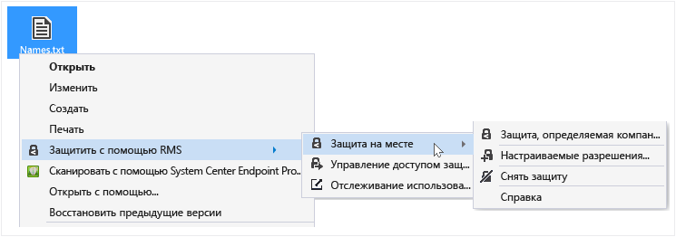
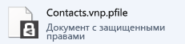

# Защита файла на устройстве (защита на месте) с помощью приложения для управления доступом Rights Management
При защите файла на месте он заменяет исходный незащищенный файл. Затем можно оставить файл на месте, скопировать его в другую папку, на другое устройство или сделать его папку общей, при этом файл будет защищен. Также можно вложить защищенный файл в сообщение электронной почты, хотя рекомендуется отправлять защищенные файлы по электронной почте непосредственно из Проводника или приложения Office (см. [Защита файла для отправки по электронной почте с использованием приложения для управления доступом Rights Management](../Topic/Protect_a_file_that_you_share_by_email_by_using_the_Rights_Management_sharing_application.md)).

> [!TIP]
> В случае появления ошибок при попытке защитить файлы см. раздел [Часто задаваемые вопросы о приложении для управления доступом Microsoft Rights Management для Windows](http://go.microsoft.com/fwlink/?LinkId=303971).

## Защита файла на устройстве (защита на месте)

1.  В проводнике выберите файл для защиты. Щелкните его правой кнопкой мыши, выберите **Защитить с помощью RMS**, а затем выберите **Защита на месте**. Например:

    

    > [!NOTE]
    > Если вы не видите параметр **Защитить с помощью RMS**, вероятнее всего, либо приложение для управления доступом RMS не установлено на компьютере, либо для завершения установки необходимо перезапустить компьютер. Дополнительные сведения о приложении для управления доступом RMS см. в разделе [Скачивание и установка приложения для управления доступом Rights Management](../Topic/Download_and_install_the_Rights_Management_sharing_application.md).

2.  Выполните одно из указанных ниже действий.

    -   Выберите шаблон политики: это предопределенные разрешения, которые обычно ограничивают доступ и использование людьми в вашей организации. Например, если ваша организация называется Contoso, Ltd, вы можете увидеть **Contoso, Ltd — только для конфиденциального просмотра**. Если файл защищается на этом компьютере в первый раз, сначала необходимо выбрать команду **Защита, определяемая компанией** для загрузки шаблонов.

        В следующий раз при выборе **Защиты на месте** вы увидите до 10 шаблонов для выбора. Если доступно более 10 шаблонов и необходимый вам шаблон не отображается, щелкните **Защита, определяемая компанией**, чтобы загрузить и просмотреть все шаблоны.

        При выборе шаблона политики можно также защитить несколько файлов и папку. При выборе папки все файлы в этой папке автоматически выбираются для защиты, но новые файлы, создаваемые в этой папке не будут защищаться автоматически.

    -   Выберите **Настраиваемые разрешения**: выберите этот параметр, если шаблоны не обеспечивают нужный уровень защиты или требуется явно задавать параметры защиты вручную. Укажите параметры, необходимые для этого файла, в диалоговом окне [Добавление защиты](http://technet.microsoft.com/library/dn574738.aspx) и нажмите кнопку **Применить**.

3.  Может появиться диалоговое окно с сообщением о том, что файл, которое затем возвращает фокус Проводнику. Теперь выбранный файл или файлы защищены. В некоторых случаях (при добавлении защиты изменяется расширение имени файла) исходный файл в Проводнике заменяется на новый файл со значком блокировки защиты Rights Management. Например:

    

Если позднее нужно снять защиту с файла, см раздел [Снятие защиты с файла с помощью приложения управления доступом Rights Management](../Topic/Remove_protection_from_a_file_by_using_the_Rights_Management_sharing_application.md).

## Примеры и другие инструкции
Примеры для использования Rights Management, приложения для управления доступом, справочные инструкции см. в следующих разделах руководства пользователя приложения для управления доступом Rights Management:

-   [Примеры использования приложения для управления доступом RMS](../Topic/Rights_Management_sharing_application_user_guide.md#BKMK_SharingExamples)

-   [Что необходимо сделать?](../Topic/Rights_Management_sharing_application_user_guide.md#BKMK_SharingInstructions)

## См. также
[Руководство пользователя по приложению управления доступом Rights Management](../Topic/Rights_Management_sharing_application_user_guide.md)

