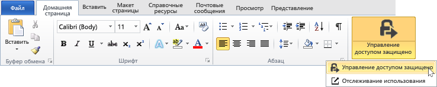

# Защита файла для отправки по электронной почте с использованием приложения для управления доступом Rights Management
При защите файла, который вы передаете по электронной почте, создается новая версия исходного файла. Исходный файл остается незащищенным, а новая версия защищается и автоматически присоединяется к сообщению, которое вы отправляете.

В некоторых случаях (для файлов, созданных в Microsoft Word, Excel и PowerPoint) приложение управления доступом RMS создает две версии файла, который прикрепляется к сообщению. Расширение второй версии файла — **PPDF**, это теневая копия файла в формате PDF. Эта версия файла гарантирует, что получатели всегда смогут прочитать файл, даже если у них не установлено приложение, в котором файл был создан. Это часто происходит, когда пользователи проверяют почту на мобильных устройствах и просматривают вложения. Все что нужно, чтобы открыть файл — это приложение управления доступом RMS. При этом они смогут прочитать вложенный файл, но не смогут изменить его, пока не откроют другую версию файла с помощью приложения, поддерживающего RMS.

Если ваша организация использует службу Azure RMS, вы можете отслеживать файлы, которыми вы делитесь с защитой.

-   Выберите параметр, чтобы получать сообщения, когда кто-то пытается открыть защищенные вложения. Каждый раз при доступе к файлу вы будете получать уведомление о том, кто попытался открыть файл и получилось ли это (прошел ли пользователь проверку подлинности).

-   Используйте сайт отслеживания документов. Вы можете даже отменить общий доступ к файлу на сайте отслеживания документов. Дополнительные сведения см. в [Отслеживайте и отзывайте доступ к документам с помощью приложения для RMS-доступа](../Topic/Track_and_revoke_your_documents_when_you_use_the_RMS_sharing_application.md).

## Использование Outlook: для защиты файла, отправляемого по электронной почте.

1.  Создайте сообщение и присоедините файл. Затем на вкладке **Сообщение** группы **RMS** щелкните **Защищенный общий доступ** и нажмите кнопку**Защищенный общий доступ**:

    

    Если вы не видите эту кнопку, то, вероятнее всего, либо приложение для управления доступом RMS не установлено на компьютере, либо не установлена последняя версия или для завершения установки необходимо перезапустить компьютер. Дополнительные сведения об установке приложения для управления доступом см. в разделе [Скачивание и установка приложения для управления доступом Rights Management](../Topic/Download_and_install_the_Rights_Management_sharing_application.md).

2.  Укажите параметры, необходимые для этого файла, в диалоговом окне [Добавление защиты](http://technet.microsoft.com/library/dn574738.aspx) и нажмите кнопку **Отправить**.

### Другие способы защиты файла, отправляемого по электронной почте
Помимо публикации защищенного файла с помощью Outlook можно также использовать следующие варианты.

-   Из проводника: этот метод работает для всех файлов.

-   Из приложения Office: этот метод работает для приложений, которые поддерживает приложение управления доступом RMS с помощью надстройки Office. При этом на ленте отображается группа **RMS**.

##### Использование проводника или приложения Office: для защиты файла, отправляемого по электронной почте.

1.  Используйте один из следующих методов.

    -   Из проводника: Щелкните файл правой кнопкой мыши, выберите **Защитить с помощью RMS**, а затем выберите **Поделиться с защитой**.

        

    -   Для приложений Office, Word, Excel и PowerPoint: Сначала сохраните файл. Затем на вкладке **Главная** в группе **RMS** щелкните **Поделиться с защитой** и снова выберите **Поделиться с защитой**.

        

    Если вы не видите эти параметры, то, вероятнее всего, либо приложение для управления доступом RMS не установлено на компьютере, либо не установлена последняя версия или для завершения установки необходимо перезапустить компьютер. Дополнительные сведения об установке приложения см. в разделе [Скачивание и установка приложения для управления доступом Rights Management](../Topic/Download_and_install_the_Rights_Management_sharing_application.md).

2.  Укажите параметры, необходимые для этого файла, в диалоговом окне [Добавление защиты](http://technet.microsoft.com/library/dn574738.aspx) и нажмите кнопку **Отправить**.

3.  Вы можете увидеть диалоговое окно с сообщением о том, что файл защищен, а затем — сообщение для получателей о том, что вложения защищены с помощью Microsoft RMS и им необходимо выполнить вход. Когда получатели щелкнут ссылку, чтобы войти, они увидят инструкции и ссылки для открытия защищенного вложения.

    Пример.

    

    Вам интересно: [Что такое файл .ppdf, который создается автоматически?](../Topic/Dialog_box_options_for_the_Rights_Management_sharing_application.md#BKMK_PPDF)

4.  Необязательно. Вы можете изменить любой элемент в этом сообщении. Например, можно добавить или изменить тему или текст сообщения.

    > [!WARNING]
    > Хотя можно добавить или удалить пользователей из этого сообщения, это не изменит разрешений для вложения, которые указаны в диалоговом окне **Поделиться с защитой** . Чтобы изменить эти разрешения, например позволить новому пользователю открывать файл, закройте сообщение без сохранения или отправки и вернитесь к шагу 1.

5.  Отправьте сообщение.

## Примеры и другие инструкции
Примеры для использования Rights Management, приложения для управления доступом, справочные инструкции см. в следующих разделах руководства пользователя приложения для управления доступом Rights Management:

-   [Примеры использования приложения для управления доступом RMS](../Topic/Rights_Management_sharing_application_user_guide.md#BKMK_SharingExamples)

-   [Что необходимо сделать?](../Topic/Rights_Management_sharing_application_user_guide.md#BKMK_SharingInstructions)

## См. также
[Руководство пользователя по приложению управления доступом Rights Management](../Topic/Rights_Management_sharing_application_user_guide.md)

