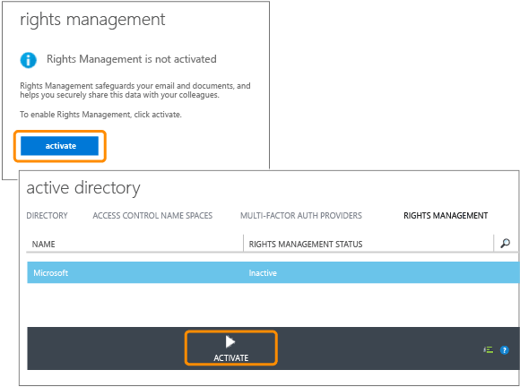

# Учебник по быстрому запуску для Azure Rights Management
Это руководство позволит вам быстро приступить к пробному использованию решения Microsoft Azure Rights Management (также известного под названием Azure RMS) в своей организации. Для этого потребуется выполнить всего пять шагов, что не займет у вас более 15 минут. Вы активируете службу, безопасно отправите конфиденциальный документ по электронной почте какому-либо адресату из другой организации, а затем сможете отследить, когда документ будет открыт. При отправке конфиденциального документа по электронной почте он шифруется во время передачи, и прочитать его может только адресат, воспользовавшись настроенными отправителем разрешениями.

Это руководство предназначено для ИТ-администраторов и консультантов и призвано помочь им оценить Azure Rights Management в качестве решения для защиты информации в организации. В рабочей среде инструкции по активации службы выполняются администратором, а инструкции по отправке документа — конечными пользователями. В этом руководстве представлены оба вида инструкций и демонстрируется полный сценарий безопасной отправки конфиденциального документа адресату из другой организации. Если при изучении этого руководства у вас возникнут проблемы, отправьте электронное письмо [AskIPTeam](mailto:askipteam@microsoft.com?subject=Having%20problems%20with%20the%20Quick%20Start%20tutorial), и мы постараемся оказать вам помощь.

Для изучения этого руководства вам потребуется следующее:

-   Подписка с поддержкой Azure Rights Management. Можно использовать платную или пробную подписку. Если нужно использовать функцию отслеживания документов, которая требуется на шаге 5, ваша подписка должна поддерживать возможность отслеживания документов. Дополнительные сведения о вариантах подписки и ссылки на бесплатные пробные версии см. в разделе [Поддерживающая Azure RMS облачная подписка](../Topic/Requirements_for_Azure_Rights_Management.md#BKMK_SupportedSubscriptions) статьи [Требования для службы Azure Rights Management](../Topic/Requirements_for_Azure_Rights_Management.md).

    Совет. Если вам потребуется подписка, займитесь ее приобретением заранее, потому что иногда эта процедура занимает много времени.

-   Учетная запись администратора для входа в центр администрирования Office 365 или в классический портал Azure, чтобы можно было активировать службу Rights Management. К этой учетной записи также должен быть прикреплен адрес электронной почты и функционирующая служба электронной почты (например, Exchange Online или Exchange Server).

-   Компьютер под управлением Windows (как минимум Windows 7 с пакетом обновления 1 (SP1)) с установленным набором приложений Office 2016, Office 2013 или Office 2010.

Итак, начнем!

## ШАГ 1. Активация службы Rights Management

Несмотря на то, что ваша подписка может поддерживать Azure Rights Management, по умолчанию эта служба отключена. Для ее активации вы можете воспользоваться центром администрирования Office 365 или классическим порталом Azure.

-   При наличии подписки Office 365, которая включает Azure Rights Management, или подписки Office 365 без Azure Rights Management, но с подпиской на Azure RMS уровня Премиум: **воспользуйтесь центром администрирования Office 365**.

-   Если у вас нет подписки Office 365: **Воспользуйтесь классическим порталом Azure**.

#### Активация службы Rights Management из центра администрирования Office 365

1.  Войдите на [портал Office 365](https://portal.office.com/) и выполните вход по своей рабочей или учебной учетной записи.

2.  Если центр администрирования Office 365 не отображается автоматически, щелкните значок запуска приложений в левом верхнем углу и выберите пункт **Администратор**. Плитка **Администратор** появляется только у администраторов Office 365.

    > [!TIP]
    > Справку центра администрирования см. в разделе [Сведения о центре администрирования Office 365 - справка администратора](https://support.office.com/article/About-the-Office-365-admin-center-Admin-Help-58537702-d421-4d02-8141-e128e3703547).

3.  На левой панели разверните элемент **ПАРАМЕТРЫ СЛУЖБЫ**.

4.  Щелкните **Rights Management**.

5.  На странице **RIGHTS MANAGEMENT** щелкните **Управление**.

6.  На странице **RIGHTS MANAGEMENT** щелкните **Активировать**.

7.  При появлении запроса **Вы хотите активировать службу Rights Management?**, щелкните **активировать**.

После этого должно отобразиться уведомление **Rights Management включена** и элемент управления, позволяющий его отключить (возможно, для этого придется обновить страницу вручную).

Пока не нужно щелкать **Дополнительные функции**. Откроется классический портал Azure, в котором вы можете настроить шаблоны, которые не нужны для работы с этим руководством. Центр администрирования Office 365 можно закрыть.

#### Активация Rights Management на портале Azure

1.  Перейдите на [классический портал Azure](http://go.microsoft.com/fwlink/p/?LinkID=275081) и выполните вход в систему.

2.  На левой панели щелкните **ACTIVE DIRECTORY**.

3.  На странице **active directory** щелкните **RIGHTS MANAGEMENT**.

4.  Выберите управляемый каталог для [!INCLUDE[aad_rightsmanagement_2](../Token/aad_rightsmanagement_2_md.md)], нажмите кнопку **ACTIVATE**, а затем подтвердите действие.

**Состояние RIGHTS MANAGEMENT** должно отображаться как **Активно**, а параметр **АКТИВИРОВАТЬ** заменяется на **ДЕАКТИВИРОВАТЬ**.

Несмотря на возможность настройки на портале и других параметров Rights Management, для работы с этим руководством это не требуется, поэтому классический портал Azure можно закрыть.

Это все, что нужно для первого шага. Служба активирована, поэтому теперь все пользователи вашей организации смогут защищать важные и конфиденциальные документы. В рабочей среде может потребоваться ограничить круг пользователей, которые могут делать это изначально, чтобы выполнить поэтапное развертывание. Для работы с данным руководством, однако, это не требуется.

В данном руководстве решение этой задачи не описывается, однако в рабочем развертывании, вероятно, потребуется также настроить настраиваемые шаблоны. Шаблоны позволяют пользователям быстро применить нужные параметры при необходимости защитить файлы. Активировав службу Rights Management, вы автоматически получаете два шаблона по умолчанию. В рабочей среде, скорее всего, их нужно будет дополнить настраиваемыми шаблонами. Тем не менее для работы с этим руководством шаблоны не нужны, поэтому можно переходить к следующему шагу.

|О чем нужна дополнительная информация?|Дополнительные сведения|
|------------------------------------------|---------------------------|
|Активация Rights Management и управление пользователями, которым разрешено защищать файлы и электронную почту, если служба активирована →|[Активация управления правами Azure](../Topic/Activating_Azure_Rights_Management.md)|
|Шаблоны по умолчанию и создание новых настраиваемых шаблонов   →|[Настройка настраиваемых шаблонов для службы Azure Rights Management](../Topic/Configuring_Custom_Templates_for_Azure_Rights_Management.md)|

## Шаг 2. Установка приложения для управления доступом Rights Management

Установка приложения для управления доступом Rights Management (также известного под названием "приложение RMS-доступа") не является обязательной для работы с Azure Rights Management, однако его рекомендуется установить на все компьютеры и мобильные устройства, поддерживающие Azure Rights Management. Приложение RMS-доступа интегрируется с приложениями Office путем установки надстройки Office, чтобы пользователи могли легко защищать файлы прямо из ленты. Кроме того, приложение позволяет защищать файлы любых типов, применив универсальную защиту для файлов, которые изначально не поддерживаются Azure Rights Management, и воспользоваться сайтом отслеживания документов, на котором пользователи могут отслеживать и отзывать защищенные файлы. Далее в этом руководстве мы будем работать с сайтом отслеживания документов.

Это приложение можно загрузить бесплатно, установка в рабочей среде может выполняться с использованием скрипта. Для целей данного руководства оно будет установлено локально.

#### Скачивание и установка приложения RMS-доступа

1.  Перейдите на страницу [Microsoft Rights Management](http://go.microsoft.com/fwlink/?LinkId=303970) веб-сайта корпорации Майкрософт.

2.  В разделе **Computers** (Компьютеры) щелкните значок **приложения RMS для Windows** и сохраните файл **Setup.exe**, чтобы установить приложение для управления доступом Microsoft Rights Management.

3.  Для локальной установки необходимо запустить скачанный файл Setup.exe от имени учетной записи администратора. В ответ на запрос системы о продолжении нажмите кнопку **Да**.

4.  На странице **Установка Microsoft RMS** нажмите кнопку **Далее** и дождитесь завершения установки.

5.  По окончании установки в ответ на запрос о перезагрузке компьютера выберите **Перезагрузить** или **Закрыть**, чтобы завершить установку.

Теперь вы сможете защищать файлы, содержащие информацию, доступ к которой вы хотите предоставить лишь ограниченному кругу лиц.

|Если требуются дополнительные сведения|Дополнительные сведения|
|------------------------------------------|---------------------------|
|Локальная установка приложения для управления доступом Rights Management для Windows и инструкции для пользователей   →|[Руководство пользователя по приложению управления доступом Rights Management](http://technet.microsoft.com/library/dn339006.aspx)|
|Установка приложения для управления доступом Rights Management для Windows с использованием скрипта и дополнительные технические сведения   →|[Руководство администратора по приложению управления доступом Rights Management](http://technet.microsoft.com/library/dn339003.aspx)|
|Разница между встроенной и универсальной защитой   →|[В чем разница между универсальной и встроенной защитой?](https://technet.microsoft.com/library/dn574738.aspx)|

## Шаг 3. Отправка по электронной почте документа, который требуется защитить

Для этого шага необходимо сначала создать и сохранить документ в Word, присвоив ему имя **Confidential.docx**. Это документ, который необходимо защитить. В контексте данного руководства неважно, какой текст содержится в документе, однако рекомендуется включить в документ какой-нибудь текст, чтобы можно было легко подтвердить, что наделенный соответствующими полномочиями получатель может его прочитать. Например, можно ввести следующий текст. **Если вы можете прочитать этот текст из вложения в электронное письмо, отправитель успешно предоставил вам доступ к файлу, защищенному с помощью Azure RMS.**

После этого можно безопасно обмениваться этим документом по электронной почте.

#### Безопасный обмен документами по электронной почте

1.  Создайте новое сообщение в Outlook и вложите в него только что созданный файл.

2.  В поле **Кому** укажите один или более адресов рабочей электронной почты. Убедитесь, что указан адрес рабочей электронной почты, например **janetm@contoso.com** или **p.dover@fabrikam.com**, потому что в настоящее время Azure Rights Management не поддерживает адреса личной электронной почты, которые можно использовать дома, пользуясь услугами своего поставщика услуг Интернета. Неважно, установлена ли служба Azure Rights Management у пользователя, которому вы отправляете сообщение.

3.  Укажите тему, например **Конфиденциальный документ**, а затем введите короткое сообщение, например **Прочитайте этот конфиденциальный документ и никому не сообщайте содержащуюся в нем информацию.**

4.  Затем на вкладке **Сообщение** в группе **RMS** щелкните **Защитить и поделиться** и снова выберите **Защитить и поделиться**.

5.  В диалоговом окне **Защитить и поделиться** выполните следующие действия.

    1.  Выберите **Читатель — только просмотр**.

        Это означает, что наши получатели смогут просматривать документ, но не смогут редактировать или распечатать его.

    2.  Выберите **Отправить мне электронное сообщение, если кто-то попытается открыть эти документы**.

        Вы будете получать электронное уведомление всякий раз, когда получатели попытаются открыть вложение или когда кто-то другой попытается открыть его, например если получатель перешлет электронное письмо коллеге. В этом случае вы увидите, что в доступе было отказано, а изучив сведения о пользователе, сможете решить, отправить ли ему или ей экземпляр документа, который можно будет открыть.

    3.  Выберите **Разрешить мгновенно отзывать доступ к этим документам**.

        В этом случае получатель сможет открывать вложение только при наличии доступа к Интернету. Преимущество такого сценария в том, что если впоследствии вы решите отозвать доступ к документу, адресат более не сможет открыть его. Если этот параметр не выбран, получатели смогут открыть документ и без доступа к Интернету. Недостаток такого сценария в том, что если впоследствии вы решите отозвать доступ к документу, изменение не вступит в силу немедленно.

    4.  Нажмите кнопку **Отправить сейчас**.

        Электронное письмо с вложением будет отправлено на указанные вами адреса электронной почты. Помимо вашего письма получатели увидят инструкции, позволяющие прочитать вложенный документ, который защищен службой Azure Rights Management.

После отправки защищенного документа попросите получателей дождаться получения и открыть его. Не закрывайте приложение Outlook, потому что оно снова потребуется нам на заключительном этапе, чтобы отследить вложение.

|Если требуются дополнительные сведения|Дополнительные сведения|
|------------------------------------------|---------------------------|
|Полные инструкции и альтернативные методы защиты файлов, отправленных по электронной почте   →|[Защита файла, отправленного по электронной почте, с помощью приложения для управления доступом Rights Management](https://technet.microsoft.com/library/dn574735.aspx)|
|Параметры, доступные в диалоговом окне **Защитить и поделиться** →|[Параметры, доступные в диалоговом окне приложения для управления доступом Rights Management](https://technet.microsoft.com/library/dn574738.aspx)|

## Шаг 4. Попросите получателей открыть полученный по электронной почте документ.

Получатели смогут читать защищенный документ, который вы отправили им во вложении, с разных устройств, включая iPad, iPhone, планшеты и телефоны Android, компьютеры Mac и Windows.

Попросите их прочитать электронное письмо, которое вы им отправили. Они увидят ваше письмо и следующий текст перед ним:

**Отправитель защитил вложение с помощью службы Microsoft RMS.** Чтобы **открыть их**, **необходимо** [войти](http://aka.ms/rms).

Щелкнув ссылку, они смогут получить инструкции по установке приложения RMS-доступа и, при необходимости, зарегистрироваться для получения бесплатной учетной записи. Бесплатная учетная запись предоставляет им подписку на RMS для отдельных пользователей. Благодаря этому наделенные соответствующими правами пользователи всегда смогут прочитать защищенный документ, даже если в организации не установлена служба Azure RMS. После этого они смогут прочитать защищенное вложение, выполнив следующие инструкции.

#### Просмотр защищенного документа во вложении

1.  Поскольку документ Word защищен службой Azure Rights Management, электронное письмо содержит два вложения. По сути, это две версии одного и того же файла с разными расширениями имени файла. Откройте версию с расширением **.ppdf** (**Confidential.ppdf**).

    Если на устройстве установлена версия [Office, которая поддерживает Rights Management](https://technet.microsoft.com/library/dn655136.aspx), можно открыть другую версию файла (**Confidential.docx**), чтобы просмотреть ее в Word.

2.  Если предложено ввести имя пользователя и пароль, введите имя пользователя в том же формате, что и адрес электронной почты, который использовался для отправки вам электронного письма с вложением. Например, **janetm@contoso.com** или **p.dover@fabrikam.com**. В поле пароля введите пароль, указанный при регистрации в службе RMS для отдельных пользователей. Если же в вашей организации используется Azure RMS, введите стандартный рабочий пароль.

Документ откроется, и вы сможете прочитать его содержимое. Например, он может содержать следующий текст: **Если вы можете прочитать этот текст из вложения в электронное письмо, отправитель успешно предоставил вам доступ к файлу, защищенному с помощью Azure RMS.** Поскольку документ доступен только для чтения, изменить его содержимое невозможно.

Можно также попросить получателя переслать электронное письмо другим адресатам (не указанным в числе адресатов вашего исходного сообщения). Даже если эти адресаты работают в организации с Azure Rights Management или используют собственную индивидуальную подписку на RMS, они не смогут открыть вложение. Система отправит запрос на ввод имени пользователя, и в доступе к документу будет отказано.

После того как получатель откроет вложение и, возможно, перешлет его другому адресату, ждите электронного уведомления об этом. Со временем электронные письма легко потерять, поэтому гораздо удобнее отслеживать доступ к документу с помощью сайта для отслеживания документов (см. заключительный шаг).

|Если требуются дополнительные сведения|Дополнительные сведения|
|------------------------------------------|---------------------------|
|Полные инструкции по просмотру файлов, защищенных с помощью Azure Rights Management   →|[Просмотр и использование файлов, защищенных с помощью службы Rights Management](https://technet.microsoft.com/library/dn574741.aspx)|
|Бесплатная подписка RMS для отдельных пользователей   →|[RMS для отдельных пользователей и служба Azure Rights Management](../Topic/RMS_for_Individuals_and_Azure_Rights_Management.md)|
|Две версии файла, отображаемые как вложения в электронное письмо   →|[Что такое автоматически создаваемый PPDF-файл?](https://technet.microsoft.com/library/dn574738.aspx)|

## Шаг 5. Отслеживание защищенного документа

> [!NOTE]
> Для выполнения этого шага потребуется подписка с поддержкой отслеживания документов. Инструкции по проверке доступности функции отслеживания документов в составе вашей подписки см. в статье [Сравнение возможностей служб Rights Management (RMS)](https://technet.microsoft.com/dn858608.aspx).

Этот шаг необязателен, но большинство пользователей хотят знать, открыл ли получатель отправленное вложение, когда и даже откуда. Например:

-   Вы ожидаете от кого-либо ответа к определенному времени, а на сайте отслеживания документа видно, что получатель еще не открыл документ, хотя срок приближается. Вы отправляете получателю еще одно электронное письмо или звоните ему, чтобы напомнить о сроке сдачи.

-   Увидев, что получатель открыл документ, спросите, нужно ли что-то прояснить или предоставить дополнительную информацию.

#### Отслеживание защищенного документа

1.  В Outlook на вкладке **Главная** в группе **RMS** щелкните **Отслеживать использование**.

2.  Если отобразится страница **Защитить и предоставить доступ на своих условиях**, щелкните **Войти** и снова введите свое имя пользователя и пароль.

3.  На странице **Общие документы** отобразится вложенный в электронное письмо документ, **Confidential.docx**. На этом этапе это единственный отображаемый файл, однако по мере отправки других защищенных документов список будет расти.

    На этой странице указано время отправки документа (электронного письма с защищенным вложением), дату последнего действия и имя получателя. Щелкните название документа для получения дополнительной информации.

4.  На новой странице с именем файла, который вы щелкнули, доступны сводные сведения только об этом документе, а также список других доступных для данного документа параметров (**Список**, **Временная шкала**, **Карта**, **Параметры**).

    Щелкните каждый из параметров, чтобы прочитать о разных способах отслеживания защищенного документа. Кроме того, на странице **Сводка** щелкните **Открыть в Excel**, чтобы экспортировать информацию в электронную таблицу, или щелкните **Отозвать права доступа**, чтобы отозвать доступ к документу.

Можно вернуться на этот сайт, чтобы отследить дальнейшие действия с защищенным документом или (при необходимости) отозвать доступ к нему. Сайт доступен даже с вашего мобильного устройства или планшета. Откройте в браузере следующую ссылку: [отслеживание документа](http://go.microsoft.com/fwlink/?LinkId=529562).

|Если требуются дополнительные сведения|Дополнительные сведения|
|------------------------------------------|---------------------------|
|Полные инструкции по отслеживанию документов   →|[Отслеживание документа и отзыв прав доступа с помощью приложения RMS-доступа](https://technet.microsoft.com/library/dn986611.aspx)|
|Двухминутное видео об отслеживании документов   →|[Отслеживание документов и отзыв прав доступа с помощью Azure RMS](http://channel9.msdn.com/Series/Information-Protection/Azure-RMS-Document-Tracking-and-Revocation)|
|Диагностика и устранение неполадок и вопросы клиентов   →|[Вопросы и ответы по отслеживанию документов](https://technet.microsoft.com/dn947488)|

## Дальнейшие шаги
Это руководство содержит пошаговое описание всего лишь одного сценария защиты данных с помощью Azure RMS. Другие распространенные варианты использования описаны в разделе [Azure RMS в действии](https://technet.microsoft.com/library/jj585026.aspx) статьи [Что такое управление правами Azure?](../Topic/What_is_Azure_Rights_Management_.md). Эта статья содержит и другие разделы, которые могут показаться вам полезными, например с информацией о том, как работает Azure RMS и какие проблемы бизнеса помогает решать эта служба.

Если вы готовы к процессу развертывания системы Azure RMS, используйте раздел [Стратегия развертывания Azure Rights Management](../Topic/Azure_Rights_Management_Deployment_Roadmap.md), где описывается процедура развертывания и содержатся ссылки на рабочие инструкции.

## См. также
[Начало работы со службой Azure Rights Management](../Topic/Getting_Started_with_Azure_Rights_Management.md)

