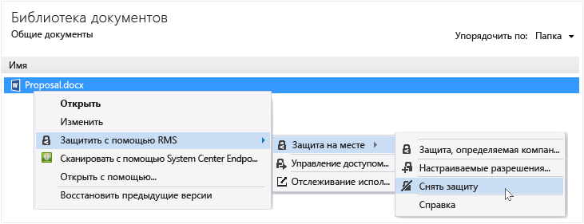

# Снятие защиты с файла с помощью приложения управления доступом Rights Management
Чтобы снять защиту с файла, который ранее был защищен с помощью приложения управления доступом RMS, используйте параметр **Удалить защиту** в проводнике.

> [!IMPORTANT]
> Чтобы снять защиту, необходимо быть владельцем файла.

### Удаление защиты с файла

1.  В проводнике щелкните правой кнопкой мыши файл (например Sample.ptxt), выберите **Защитить с помощью RMS**, щелкните **Защита на месте** и выберите **Удалить защиту**:

    

    Может появиться запрос на ввод учетных данных.

Исходный защищенный файл удаляется (например Sample.ptxt) и заменяется файлом с таким же именем, но с расширением незащищенного файла (например Sample.txt).

## Примеры и другие инструкции
Примеры для использования Rights Management, приложения для управления доступом, справочные инструкции см. в следующих разделах руководства пользователя приложения для управления доступом Rights Management:

-   [Примеры использования приложения для управления доступом RMS](../Topic/Rights_Management_sharing_application_user_guide.md#BKMK_SharingExamples)

-   [Что необходимо сделать?](../Topic/Rights_Management_sharing_application_user_guide.md#BKMK_SharingInstructions)

## См. также
[Руководство пользователя по приложению управления доступом Rights Management](../Topic/Rights_Management_sharing_application_user_guide.md)

