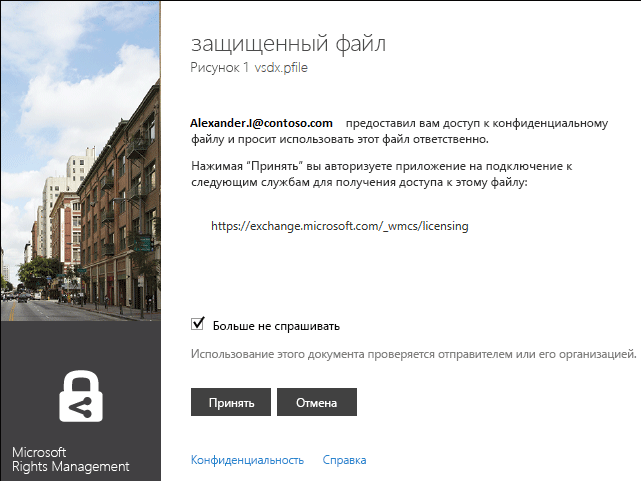

# Исправленная версия 3. Руководство по приложению для управления доступом Microsoft Rights Management
Данное руководство по приложению для управления доступом Microsoft Rights Management (RMS) для Windows помогает защищать важные документы и рисунки от людей, которые не должны их видеть, даже если вы отправляете их по электронной почте или сохраняете на другом устройстве. Это приложение также позволяет вам открывать и использовать файлы, защищенные другими пользователями, с помощью той же технологии Rights Management.

Это приложение для управления доступом обеспечивает такую защиту файлов следующими способами.

-   Оно добавляет функциональные возможности в проводник (также известный как проводник Windows в Windows 7 и более ранних версиях), чтобы при работе с файлами в папке вы могли легко защитить один файл, массово защитить несколько файлов или защитить все файлы в папке.

-   Оно обеспечивает защиту всех типов файлов и имеет встроенные средства просмотра для часто используемых типов текстовых и графических файлов.

-   Оно добавляет кнопку **Защищенный общий доступ** на панель инструментов Microsoft Office для Word, PowerPoint и Excel.

Все, что вам нужно — это компьютер, работающий под управлением ОС Windows 7 или Windows 8, и учетная запись локального администратора для установки приложения для управления доступом RMS. Затем загрузите и установите это бесплатное приложение от Майкрософт.

Если у вас есть вопросы, на которые вы не нашли ответ в этом руководстве, см. статью [Вопросы и ответы по приложению для управления доступом Microsoft Rights Management для Windows](http://go.microsoft.com/fwlink/?LinkId=303971).

## Примеры использования приложения для управления доступом RMS
Здесь приведены только некоторые примеры того, как можно использовать это приложение для управления доступом RMS в целях защиты ваших файлов.

|Сценарий|Решение, использующее приложение для управления доступом RMS|
|------------|----------------------------------------------------------------|
|**Я хочу безопасно скопировать конфиденциальный документ компании на другое устройство**<br /><br />Вы используете свой ПК для работы над конфиденциальным стратегическим документом компании и хотите скопировать его на флэш-накопитель USB, чтобы продолжить работу над ним после ухода из офиса и при отсутствии доступа к сети компании.|У вас есть приложение для управления доступом RMS, установленное как на ПК, так и на вашем ноутбуке. Вы защищаете файл в проводнике на ПК с помощью шаблона, чтобы к нему не могли получить доступ люди вне компании. Затем вы копируете этот файл на флэш-накопитель, подключаете его к ноутбуку и продолжаете работать с документом. Если вы удалите флэш-накопитель или потеряете ноутбук, никто за пределами компании не сможет получить доступ к этому документу.|
|**Я хочу безопасно поделиться финансовыми сведениями с лицом, которому я доверяю, но находящимся за пределами моей организации**<br /><br />Вы работаете с компанией-партнером и хотите отправить им по электронной почте электронную таблицу Excel, содержащую количественные данные планируемого объема продаж. Вы хотите, чтобы они могли просматривать эти данные, но не изменять их.|Вы нажимаете кнопку **Защищенный общий доступ** на ленте в Excel, вводите адреса электронной почты двух сотрудников компании-партнера, с которыми вы работаете, выбираете с помощью ползунка значение **Просмотр** и нажимаете кнопку **Отправить**.<br /><br />Когда это электронное письмо приходит в компанию-партнер, только получатели в этом письме могут увидеть отправленную электронную таблицу, и они не смогут сохранить, изменить, распечатать или переадресовать ее.|
|**Я хочу безопасно отправить технологическую схему по электронной почте некоему лицу, использующему устройство iOS**<br /><br />Ваша компания использует собственное технологическое приложение, и вы хотите отправить по электронной почте строго конфиденциальную схему коллеге, который, как вы знаете, регулярно проверяет электронную почту на своем устройстве iOS.|Вы щелкаете этот файл в проводнике правой кнопкой мыши и выбираете пункт **Защищенный общий доступ**. Приложение для управления доступом RMS распознает, что расширение файла не из приложения, которое поддерживает RMS, поэтому после вложения файла в сообщение электронной почты оно автоматически преобразует его в файл с универсальной защитой и автоматически выбирает параметр **Разрешить использование на всех устройствах**.<br /><br />Коллега получает электронное письмо на своем устройстве iOS, щелкает в нем ссылку, сообщающую, как загрузить приложение для управления доступом RMS, устанавливает версию для устройств iOS, а затем просматривает схему.|
|**Моя компания не использует Rights Management, но я получил сообщение электронной почты с вложением, защищенным RMS**<br /><br />Вы доверяете отправителю сообщения электронной почты, поскольку ранее вы вели с ним дела, и предполагаете, что, возможно, он отправил вам информацию о новой потенциальной коммерческой возможности.|Вы щелкаете ссылку в сообщении электронной почты, которая информирует вас, как загрузить приложение управления доступом RMS для вашего компьютера, устанавливаете его, а затем регистрируетесь для RMS для частных лиц. Майкрософт подтверждает, что ваша организация не имеет подписки на Office 365, отправляет вам электронное письмо для выполнения бесплатного процесса регистрации, и вы входите со своей новой учетной записью. Затем вы можете открыть вложение электронной почты, чтобы прочитать о новой коммерческой возможности.|

## <a name="BKMK_Install"></a>Загрузка и установка приложения для управления доступом RMS
> [!IMPORTANT]
> Для установки приложения для управления доступом RMS требуется учетная запись локального администратора. Если вы не вошли как локальный администратор, можно использовать вариант **Запуск от имени администратора** при запуске Setup.exe на шаге 3.

Чтобы установить приложение для управления доступом RMS, выполните следующие действия.

1.  Перейдите на страницу [Microsoft Rights Management](http://go.microsoft.com/fwlink/?LinkId=303970) на веб-сайте Майкрософт.

2.  В разделе **Компьютеры** щелкните значок **приложения RMS для Windows** и сохраните пакет установки приложения для управления доступом Microsoft Rights Management на своем компьютере.

3.  Дважды щелкните загруженный сжатый файл, а затем дважды щелкните файл **setup.exe**. Если будет предложено подтвердить продолжение, нажмите кнопку **Да**.

4.  На странице **установки Microsoft RMS** нажмите кнопку **Далее** и дождитесь завершения установки.

5.  По завершении установки нажмите кнопку **Перезапуск** для перезагрузки компьютера и завершения установки. Или нажмите кнопку **Закрыть**, чтобы перезагрузить компьютер для завершения установки позднее.

Теперь вы готовы приступить к защите файлов или чтению файлов, защищенных другими людьми.

## <a name="BKMK_UsingMSRMSApp"></a>Возможные действия
Следующие инструкции помогут работать с защищенными файлами.

### <a name="BKMK_CreatePTXT"></a>Создание защищенного текстового файла
Вы можете преобразовать обычный текстовый файл (TXT-файл) в защищенный файл с расширением PTXT.

##### Создание защищенного текстового файла (PTXT-файла)

1.  В проводнике щелкните папку правой кнопкой мыши, выберите пункт **Создать**, а затем выберите **Текстовый документ**.

2.  Переименуйте файл (например, задайте имя Sample.txt).

3.  Дважды щелкните этот файл, чтобы открыть его в блокноте.

4.  В блокноте добавьте в файл несколько строк текста и  сохраните его. В качестве примера текста можно использовать следующее.

    ```
    This is a sample text file.
    This is a sample text file.
    This is a sample text file.
    This is a sample text file. 
    This is a sample text file.
    This is a sample text file.
    ```

5.  Щелкните этот файл правой кнопкой мыши, выберите пункт **Защита на месте** и выберите шаблон из списка. Если вы впервые используете приложение для управления доступом RMS, сначала необходимо выбрать параметр **Защита, определяемая компанией**, чтобы загрузить шаблоны для вашей организации.

6.  На экране **Приложение для управления доступом Microsoft Rights Management** подтвердите политику, которую хотите применить, нажмите кнопку **Применить**, и после того как файл будет защищен, нажмите кнопку **Закрыть**.

### <a name="BKMK_ViewPTXT"></a>Просмотр защищенного текста (PTXT-файла) или защищенного файла изображения
Чтобы просмотреть защищенный текстовый файл (PTXT-файл) в проводнике, дважды щелкните этот файл (например, Sample.ptxt). Может быть предложено указать учетные данные. Когда файл откроется, вы увидите политику защиты файла вверху файла.

Защищенные графические файлы просматриваются и открываются таким же образом.

### <a name="BKMK_CreatePFILE"></a>Создание файла с универсальной защитой
Формат файла универсальной защиты (PFILE) можно использовать, чтобы предложить универсальный уровень защиты для типов файлов, которые непосредственно не поддерживаются приложением для управления доступом RMS или другими приложениями, предоставляющими встроенную защиту RMS-типа. Чтобы быстро узнать, какие приложения поддерживают встроенную защиту RMS, см. страницу [Microsoft Rights Management](http://go.microsoft.com/fwlink/?LinkId=303970) на веб-сайте Майкрософт.

Например, поскольку Microsoft Visio в настоящее время не поддерживает встроенную защиту для RMS, можно использовать универсальную защиту для VSD-файлов, созданных в Microsoft Visio.

> [!TIP]
> В чем разница между встроенной (собственной) защитой и универсальной защитой?
> 
> -   Когда вы используете для файла универсальную защиту, неавторизованные пользователи не могут открыть файл. Но после того как авторизованный пользователь откроет этот файл, он сможет переадресовать его в незащищенном состоянии другим пользователям или сохранить в расположении, к которому имеют доступ другие пользователи. Однако они будут видеть сообщение в верхней части файла с указанием, какие разрешения у них имеются для этого файла, и просьбой соблюдать их, но эта защита не может быть применена принудительно. Кроме того, при универсальной защите файла нельзя указать более строгие ограничения, чем авторизация. Например, при использовании пользовательских разрешений ползунок в приложении для управления доступом RMS автоматически выбирает разрешение **СОВЛАДЕЛЕЦ**, и его нельзя изменить на более строгое разрешение, такое как **ПРОСМОТР** или **СОАВТОР**.
> -   Для сравнения: при использовании встроенной защиты RMS с приложениями, которые ее поддерживают (например, с файлами Office), эта защита применяется к файлу, даже если файл затем отправляется кому-либо еще или сохраняется в другом месте. И при защите этих файлов вы можете использовать более ограничивающие разрешения, такие как разрешение только на чтение или разрешение на правку, но не на печать или копирование. Например, если вы применяете пользовательские разрешения, ползунок в приложении для управления доступом автоматически выбирает для разрешений значение **РЕДАКТОР**, которое можно изменить на более строгое или менее строгое.

##### Пример: Создание файла с универсальной защитой (PFILE) из документа Visio (VSD-файла)

1.  В проводнике щелкните папку правой кнопкой мыши, выберите пункт **Создать**, а затем выберите **Новый документ Visio**.

2.  Переименуйте файл (например, задайте имя Sample.vsd).

3.  Дважды щелкните этот файл, чтобы открыть его в Visio.

4.  В Visio добавьте в этот документ элементы, а затем сохраните и закройте файл.

5.  Щелкните этот файл правой кнопкой мыши, выберите пункт **Защита на месте** и выберите шаблон политики из списка. Если вы впервые используете приложение для управления доступом RMS, сначала необходимо выбрать параметр **Защита, определяемая компанией**, чтобы загрузить шаблоны для вашей организации.

6.  На экране **Приложение для управления доступом Microsoft Rights Management** выберите нужную политику, а затем нажмите кнопку **Применить**.

7.  Появится сообщение о том, что защищенный файл был сохранен как PFILE-файл (например, Sample.vsd.pfile). Исходный файл удаляется.

### <a name="BKMK_ViewPFILE"></a>Просмотр файла с универсальной защитой (PFILE-файла)
Чтобы просмотреть файл с универсальной защитой (PFILE), в проводнике дважды щелкните PFILE-файл (например, Sample.vsd.pfile) и нажмите **Открыть**.

### <a name="BKMK_Unprotect"></a>Снятие защиты с файла
Чтобы снять защиту (т. е. удалить защиту) с файла, который был ранее защищен, используйте параметр **Снять защиту**.

1.  Щелкните файл (например, Sample.ptxt) правой кнопкой мыши, выберите пункт **Защита на месте**, а затем нажмите**Снять защиту**. Может быть предложено указать учетные данные.

2.  Исходный защищенный файл удаляется (например, Sample.ptxt) и заменяется файлом с тем же именем, но незащищенным расширением (например, Sample.txt).

### <a name="BKMK_ProtectCustom"></a>Защита файла с помощью собственных разрешений
Самым простым способом защиты файла является использование шаблонов, но вы также можете задать собственные разрешения. Это называется созданной пользователем защитой и полезно в следующих ситуациях.

-   Вы хотите разрешить доступ к файлу только пользователям из определенного списка, которые идентифицируются по своим адресам электронной почты.

-   Вы хотите ограничить использование файла только определенными правами, например правами только на чтение документа.

Чтобы защитить файл с помощью разрешений, созданных пользователем, щелкните правой кнопкой мыши файл, выберите пункт **Защита на месте** и нажмите **Пользовательские разрешения**. Появится следующий экран:


Введите адреса электронной почты пользователей, с помощью ползунка выберите разрешения для этого файла и нажмите кнопку **Применить**.

### <a name="BKMK_UserDefined"></a>Использование файлов, имеющих пользовательскую защиту
Большая часть открываемых файлов будет защищена путем применения шаблонов. Однако пользователи также могут защитить файлы, используя свои собственные разрешения, которые называются созданной пользователем защитой.

Для текстовых и графических форматов файлов этот уровень защиты требует, чтобы все приложения, используемые для редактирования, сохранения или ограничения использования текстовых или графических файлов, были разработаны для поддержки защиты RMS и реализации API-защиты, предоставляемых в пакете SDK AD RMS.

При просмотре защищенного текстового файла, имеющего пользовательскую защиту, можно заметить небольшие различия в разрешениях, отображаемых для файла, как показано в следующем примере.

Для файлов, защищенных с помощью формата файла универсальный защиты (PFILE), на экране подтверждения отображаются определенные права и разрешения, которые были заданы пользователем, а не имя шаблона, использовавшегося для защиты файла, как показано на следующем рисунке.



### <a name="BKMK_ShareProtected"></a>Защита контента для отправки по электронной почте
Чтобы защитить контент, который требуется отправить с помощью сообщения электронной почты, щелкните правой кнопкой мыши файл и выберите пункт **Защищенный общий доступ**. Появится следующий экран:


Введите адреса электронной почты в список пользователей, с помощью ползунка выберите разрешения для файла и нажмите кнопку **Отправить**. Outlook создает сообщение электронной почты для получателей с коротким сообщением, которое можно изменить, и вкладывает в него защищенный файл. Исходный файл не защищается.

Чтобы разрешить пользователям просматривать защищенные файлы на устройствах, не являющихся устройствами Windows, установите флажок **Разрешить использование на всех устройствах**. Пользователям может потребоваться загрузить приложение для  управления доступом RMS для своего устройства, и ссылка для этого имеется в сообщении электронной почты.

### <a name="BKMK_Multiple"></a>Применение защиты к нескольким файлам и папкам
При использовании проводника не обязательно применять защиту к файлам по одному. Вместо этого можно выбрать несколько файлов или все файлы в папке, если эти файлы еще не защищены.

##### Защита нескольких файлов или всех файлов в выбранной папке

1.  В проводнике выберите несколько файлов или папку, содержащую файлы для защиты.

2.  Щелкните выбранные файлы или папку правой кнопкой мыши, выберите пункт **Защита на месте** и выберите шаблон из списка. Если вы впервые используете приложение для управления доступом RMS, сначала необходимо выбрать параметр **Защита, определяемая компанией**, чтобы загрузить шаблоны для вашей организации.

3.  На экране **Приложение для управления доступом Microsoft Rights Management** подтвердите защиту этих файлов.

> [!TIP]
> При наличии ошибок см. статью [Вопросы и ответы по приложению для управления доступом Microsoft Rights Management для Windows](http://go.microsoft.com/fwlink/?LinkId=303971).

### <a name="BKMK_OfficeToolbar"></a>Использование надстройки «Панель инструментов Office»
Можно защищать и отправлять файлы Word, PowerPoint и Excel непосредственно в Microsoft Office с помощью надстройки для приложения Microsoft Rights Management в ленте Office .

В группе **Защита** щелкните элемент **Защищенный общий доступ**, чтобы запустить приложение для управления доступом Microsoft Rights Management.


### <a name="BKMK_AccessKeys"></a>Использование сочетаний клавиш
Нажмите клавишу **ALT** для просмотра имеющихся клавиш доступа, а затем нажмите сочетание **ALT** + клавиша доступа, чтобы выбрать параметр.

Например, в диалоговом окне **Защищенный общий доступ** нажмите клавишу **ALT** для просмотра клавиш доступа, а затем нажмите сочетание клавиш **ALT + u**, чтобы установить флажок **Пользователи должны входить в систему каждый раз, когда открывают этот файл**.


## См. также
[Загрузка приложения для управления доступом Microsoft Rights Management](http://go.microsoft.com/fwlink/?LinkId=303970)
 [Вопросы и ответы по приложению для управления доступом Microsoft Rights Management в Windows](http://go.microsoft.com/fwlink/?LinkId=303971)

