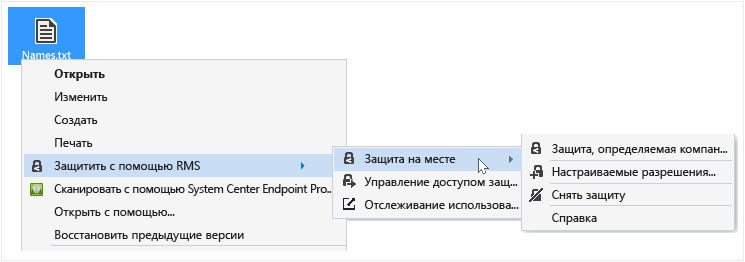
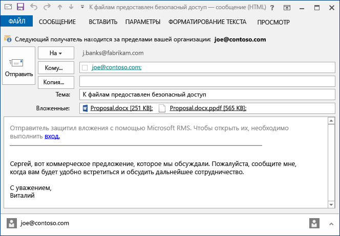
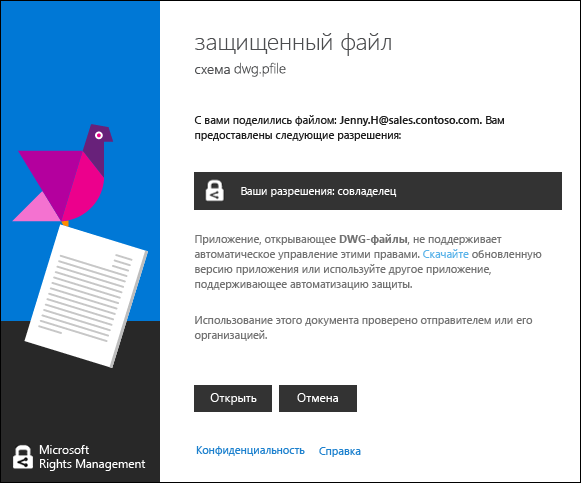

# Руководство пользователя по приложению для управления доступом Rights Management: исправление для одной темы
Приложение для управления доступом Microsoft Rights Management (RMS) для Windows помогает защищать важные документы и рисунки от людей, которые не должны их видеть, даже если вы отправляете их по электронной почте или сохраняете на другом устройстве. Это приложение также можно использовать для открытия и использования файлов, защищенных другими пользователями с помощью той же технологии Rights Management.

Все, что вам нужно, — это компьютер, работающий под управлением ОС не ниже Windows 7, и учетная запись локального администратора для установки приложения для управления доступом RMS. Затем [загрузите и установите](http://go.microsoft.com/fwlink/?LinkId=303970) это бесплатное приложение от Майкрософт.

Если у вас есть вопросы, на которые вы не нашли ответ в этом руководстве, см. статью [Вопросы и ответы по приложению для управления доступом Microsoft Rights Management для Windows](http://go.microsoft.com/fwlink/?LinkId=303971).

Ниже приведены только некоторые примеры того, как можно использовать это приложение для управления доступом в целях защиты ваших файлов.

|Требуется…|Как это сделать|
|--------------|-------------------|
|**...безопасно поделиться финансовыми сведениями с лицом, которому я доверяю, но находящимся за пределами моей организации**  Вы работаете с компанией-партнером и хотите отправить им по электронной почте электронную таблицу Excel, содержащую количественные данные планируемого объема продаж. Вы хотите, чтобы они могли просматривать эти данные, но не изменять их.|Вы используете кнопку «Защищенный общий доступ» на ленте в Excel, вводите адреса электронной почты двух сотрудников компании-партнера, с которыми вы работаете, выбираете с помощью ползунка значение «Просмотр» и нажимаете кнопку «Отправить».  Когда это электронное письмо приходит в компанию-партнер, только получатели в этом письме могут увидеть отправленную электронную таблицу, и они не смогут сохранить, изменить, распечатать или переадресовать ее.  Подробные сведения: см. подраздел **Защита файла, отправляемого по электронной почте** в разделе [Возможные действия](../Topic/Rights_Management_sharing_application_user_guide_-_revision_for_single_topic.md#BKMK_UsingMSRMSApp) данного руководства.|
|**…безопасно отправить документ по электронной почте кому-либо, использующему устройство iOS**  Вы хотите отправить по электронной почте конфиденциальный документ Word коллеге, который, как вы знаете, регулярно проверяет электронную почту на своем устройстве iOS.|Вы щелкаете этот файл в проводнике правой кнопкой мыши и выбираете пункт «Защищенный общий доступ». В приложении для управления доступом RMS вы выбираете параметр «Разрешить использование на всех устройствах» и отправляете этот файл как вложение своему коллеге.  Коллега получает электронное письмо на своем устройстве iOS, щелкает в нем ссылку, сообщающую, как загрузить приложение для управления доступом, устанавливает версию для устройств iOS, а затем просматривает документ.  Подробные сведения: см. подраздел **Защита файла, отправляемого по электронной почте** в разделе [Возможные действия](../Topic/Rights_Management_sharing_application_user_guide_-_revision_for_single_topic.md#BKMK_UsingMSRMSApp) данного руководства.|
|**…прочитать полученное в электронном сообщении вложение, содержащее защищенный файл, которое не удается прочитать, поскольку в организации не используется Rights Management**  Вы доверяете отправителю сообщения электронной почты, поскольку ранее вы вели с ним дела, и предполагаете, что, возможно, он отправил вам информацию о новой потенциальной коммерческой возможности.|Вы следуете инструкциям в этом электронном письме и щелкаете ссылку, чтобы зарегистрироваться для Microsoft Rights Management. Майкрософт подтверждает, что ваша организация не имеет подписки на Office 365, отправляет вам электронное письмо для выполнения бесплатного процесса регистрации, и вы входите со своей новой учетной записью. Далее вы щелкаете вторую ссылку в письме, чтобы установить приложение для управления доступом Rights Management и затем открыть вложение в письме, чтобы прочитать о новой коммерческой возможности.  Подробные сведения: см. подраздел **Просмотр и использование файлов, защищенных с помощью Rights Management** в разделе [Возможные действия](../Topic/Rights_Management_sharing_application_user_guide_-_revision_for_single_topic.md#BKMK_UsingMSRMSApp) данного руководства.|
|**…защитить конфиденциальные файлы компании на своем ноутбуке, чтобы к ним не могли получить доступ люди, не являющиеся сотрудниками компании**  Вы часто бываете в поездках и используете свой ноутбук для получения и обновления файлов в папке, которая должна быть защищена от несанкционированного доступа.|На вашем ноутбуке установлено приложение для управления доступом RMS. Вы используете проводник, чтобы защитить файлы с помощью шаблона, который быстро защищает файлы. В случае утери ноутбука вы можете быть уверены, что никто за пределами компании не сможет получить доступ к этим документам.  Подробные сведения: см подраздел **Защита файла на устройстве (защита на месте)** в разделе [Возможные действия](../Topic/Rights_Management_sharing_application_user_guide_-_revision_for_single_topic.md#BKMK_UsingMSRMSApp) данного руководства.|

## Возможные действия
Следующие инструкции помогут работать с защищенными файлами.

### Загрузка и установка приложения для управления доступом Rights Management

1.  Перейдите на страницу [Microsoft Rights Management](http://go.microsoft.com/fwlink/?LinkId=303970) на веб-сайте Майкрософт.

2.  В разделе **Компьютеры** щелкните значок **приложения RMS для Windows** и сохраните пакет установки приложения для управления доступом Microsoft Rights Management на своем компьютере.

3.  Дважды щелкните загруженный сжатый файл, а затем дважды щелкните файл **setup.exe**. Если будет предложено подтвердить продолжение, нажмите кнопку **Да**.

    > [!TIP]
    > Может потребоваться прокрутить список в текущей папке вниз, чтобы увидеть файл **setup.exe**.

4.  На странице **установки Microsoft RMS** нажмите кнопку **Далее** и дождитесь завершения установки.

5.  По завершении установки нажмите кнопку **Перезапуск** для перезагрузки компьютера и завершения установки. Или нажмите кнопку **Закрыть**, чтобы перезагрузить компьютер для завершения установки позднее.

Теперь вы готовы приступить к защите файлов или чтению файлов, защищенных другими людьми.

#### Дополнительные сведения
Для установки приложения для управления доступом требуется учетная запись локального администратора. Если вы не вошли как локальный администратор, можно использовать вариант **Запуск от имени администратора** при запуске Setup.exe на шаге 3.

### Защита файла на устройстве (защита на месте)

1.  В проводнике выберите файл, папку или несколько файлов для защиты. Щелкните выбранные файлы или папку правой кнопкой мыши, а затем выберите пункт **Защита на месте**. Например:

    

    > [!NOTE]
    > Если вы не видите пункт **Защита на месте**, то скорее всего либо на этом компьютере не установлено приложение для управления доступом, либо необходимо перезагрузить компьютер для завершения установки. Дополнительные сведения об установке приложения для управления доступом см. в инструкциях **Загрузка и установка приложения для управления доступом Rights Management** в разделе [Возможные действия](../Topic/Rights_Management_sharing_application_user_guide_-_revision_for_single_topic.md#BKMK_UsingMSRMSApp) данного руководства.

2.  Выполните одно из указанных ниже действий.

    -   Выберите шаблон политики. Это предопределенные разрешения, ограничивающие доступ и использование сотрудниками в вашей организации. Если вы впервые защищаете файл на этом компьютере, сначала необходимо выбрать параметр **Защита, определяемая компанией** для загрузки шаблонов. Имя шаблонов начинается с имени компании, а затем следует  описательное имя разрешения. Например: **«Contoso — только конфиденциальный просмотр»**

    -   Выберите параметр **Пользовательские разрешения**. Выберите этот параметр, если шаблоны не обеспечивают нужный уровень защиты. Например, вы хотите предоставить доступ пользователям вне организации или хотите самостоятельно задать параметры защиты. Укажите параметры, необходимые для этого файла, в диалоговом окне **добавления защиты**, а затем нажмите кнопку **Применить**.

        > [!NOTE]
        > Дополнительные сведения о параметрах в этом диалоговом окне см. в разделе **Указание параметров в диалоговом окне Rights Management** инструкциям [Возможные действия](../Topic/Rights_Management_sharing_application_user_guide_-_revision_for_single_topic.md#BKMK_UsingMSRMSApp) данного руководства.

3.  Вы можете быстро взглянуть на диалоговое окно, чтобы увидеть, что файл защищен, и затем вернуться в проводник. Теперь выбранные файлы защищены. В некоторых случаях (когда добавление защиты изменяет расширение имени файла) исходный файл в проводнике заменяется на новый файл со значком блокировки защиты Rights Management. Например:

    

Если в будущем понадобится снять защиту с файла, см. инструкции по **снятию защиты с файла** в разделе [Возможные действия](../Topic/Rights_Management_sharing_application_user_guide_-_revision_for_single_topic.md#BKMK_UsingMSRMSApp) данного руководства.

#### Дополнительные сведения
При защите файла на месте этот файл заменяет исходный, незащищенный файл. Затем можно оставить файл там, где он есть, скопировать его в другую папку или устройство или открыть к нему доступ, и этот файл останется защищенным. Вы также можете вложить защищенный файл в сообщение электронной почты, хотя рекомендуется отправлять защищенный файл по электронной почте непосредственно из проводника или приложения Office (см. подраздел **Защита файла, отправляемого по электронной почте** в разделе [Возможные действия](../Topic/Rights_Management_sharing_application_user_guide_-_revision_for_single_topic.md#BKMK_UsingMSRMSApp) данного руководства).

Этот же способ можно использовать для защиты нескольких файлов одновременно или папки. При защите папки все файлы в этой папке автоматически выбираются для защиты, но новые файлы, создаваемые в этой папке, не будут защищаться автоматически.

Если при попытке защитить файлы возникают ошибки, см. статью [Вопросы и ответы по приложению для управления доступом Microsoft Rights Management для Windows](http://go.microsoft.com/fwlink/?LinkId=303971).

### Защита файла, отправляемого по электронной почте

1.  Выберите один из следующих вариантов.

    -   В проводнике: щелкните файл правой кнопкой мыши файл и выберите пункт **Защищенный общий доступ**.

        

    -   В приложении Office: убедитесь, что сначала сохранили файл. Затем в группе **Защита** щелкните **Защищенный общий доступ**.

        

    > [!NOTE]
    > Если вы не видите эти параметры для защищенного общего доступа, то, скорее всего, приложение для управления доступом не установлено на этом компьютере, или необходимо перезагрузить компьютер для завершения установки. Дополнительные сведения об установке приложения для управления доступом см. в инструкциях **Загрузка и установка приложения для управления доступом Rights Management** в разделе [Возможные действия](../Topic/Rights_Management_sharing_application_user_guide_-_revision_for_single_topic.md#BKMK_UsingMSRMSApp) данного руководства.

2.  Укажите параметры, необходимые для этого файла, в диалоговом окне **Защищенный общий доступ**, а затем нажмите кнопку **Применить**.

    

    > [!NOTE]
    > Дополнительные сведения о параметрах в этом диалоговом окне см. в разделе **Указание параметров в диалоговом окне Rights Management** инструкциям [Возможные действия](../Topic/Rights_Management_sharing_application_user_guide_-_revision_for_single_topic.md#BKMK_UsingMSRMSApp) данного руководства.

3.  Вы можете быстро взглянуть на диалоговое окно, сообщающее, что файл защищен, а затем посмотреть созданное для вас сообщение электронной почты с темой **Делюсь с вами защищенными файлами**. В этом сообщении электронной почты выбранный файл вложен и защищен, а текст сообщения содержит ссылки на:

    -   RMS для частных лиц;

    -   приложение для управления доступом RMS;

    -   руководство пользователя.

    Пример:

    

4.  Дополнительно Вы можете изменить в этом сообщении электронной почты все, что хотите. Например, можно добавить или изменить тему или текст в сообщении.

    > [!WARNING]
    > Хотя вы можете добавлять или удалять получателей этого сообщения электронной почты, это не изменяет разрешения для вложения, указанного в диалоговом окне **Защищенный общий доступ**. Если вы хотите изменить эти разрешения, например предоставить новому лицу разрешение на открытие файла, закройте это сообщение без сохранения или отправки и вернитесь к шагу 1.

5.  Отправьте это сообщение электронной почты.

#### Дополнительные сведения
Когда вы защищаете файл, отправляемый по электронной почте, создается новая версия исходного файла. Исходный файл остается незащищенным, а новая версия защищается и автоматически вкладывается в сообщение электронной почты, которое вы затем отправляете.

Это сообщение электронной почты содержит тему по умолчанию и текст по умолчанию, которые можно изменить перед отправкой.

Существует два способа защиты файла, который отправляется по электронной почте.

-   Из проводника. Этот способ работает для всех файлов.

-   Из приложения Office. Этот способ работает для приложений, которые поддерживает приложение для управления доступом Rights Management с использованием надстройки Office, поэтому вы видите на ленте группу **Защита**.

> [!NOTE]
> В этой версии приложения для управления доступом Rights Management отсутствует надстройка для Outlook, позволяющая защищать файлы и сообщения электронной почты непосредственно в приложении Outlook. Вместо нее используйте процедуру из этого раздела.

### Просмотр и использование файлов, защищенных с помощью Rights Management

#### Просмотр защищенного файла
В проводнике или в сообщении электронной почты, содержащем вложение, дважды щелкните защищенный файл и введите учетные данные, если будет предложено сделать это. Как открытие файла зависит от способа его защиты

-   Если файл был защищен с помощью универсальной защиты (имеет расширение PFILE):

    вы увидите диалоговое окно **защищенного файла** в приложении для управления доступом, сообщающее, кто защитил файл, и что вы должны соблюдать разрешения совладельца. Сообщается также, что будет выполняться аудит вашего действия по открытию файла.

    

    Нажмите кнопку **Открыть**, чтобы прочитать файл.

-   Если файл был защищен с помощью собственной защиты (не имеет расширение имени файла PFILE):

    этот файл откроется в приложении, связанном с расширением исходного файла, и вверху файла будет отображаться баннер ограничений. Этот баннер может отображать разрешения, которые применяются к файлу, или предоставлять ссылку на них. Например, может появиться следующий баннер, в котором вы должны нажать ссылку **Разрешения в данный момент ограничены**, чтобы увидеть фактические разрешения, примененные к файлу, и пользователей, которым разрешен доступ к этому файлу.

    

    Для этого файла также выполняется аудит до тех пор, пока он защищен.

##### Дополнительные сведения
Прежде чем вы сможете увидеть защищенный файл, RMS сначала необходимо подтвердить, что вы авторизованы для просмотра, что выполняется путем проверки вашего имени пользователя и пароля. В некоторых случаях они могут быть кэшированы и запрос учетных данных не появится. В других случаях будет предложено ввести учетные данные.

Если ваша организация не использует ни Azure Rights Management (Azure RMS), ни AD RMS, вы можете обратиться за бесплатной учетной записью, которая будет принимать ваши учетные данные, чтобы вы могли открывать файлы, защищенные с помощью RMS. Чтобы получить эту учетную запись, щелкните ссылку [RMS для частных лиц](http://go.microsoft.com/fwlink/?LinkId=309469).

#### Использование защищенных файлов (например, редактирование и печать файла)
Если защищенный файл имеет расширение PFILE:

-   сохраните открытый файл и присвойте ему новое расширение файла, связанное с приложением, которое вы хотите использовать.

    Например, если файл был защищен с использованием имени файла document.vsdx.pfile, просмотрите этот файл и сохраните его в проводнике как document.vsdx.

    Этот новый файл больше не защищен. Если вы хотите защитить его, необходимо сделать это вручную. См. инструкции **по защите файла на устройстве (защите на месте) с помощью приложения для управления доступом Rights Management** в разделе [Возможные действия](../Topic/Rights_Management_sharing_application_user_guide_-_revision_for_single_topic.md#BKMK_UsingMSRMSApp) данного руководства.

Если изначально защищенный файл не имеет расширение PFILE:

-   вы можете только просматривать такой файл, если у вас нет приложения, понимающего Rights Management. Такие приложения называются информированными приложениями Rights Management Приложения Office 2013 и Office 2010 (например, Word, Excel, PowerPoint и Outlook) являются примерами приложений, информированных для Rights Management. Однако приложения, которые не исходят от корпорации Майкрософт, например приложения других компаний и ваши собственные бизнес-приложения, также могут быть информированными для Rights Management.

    Приложения, информированные для Rights Management, знают, как открывать файлы, защищенные другими информированными приложениями Rights Management. Они также сохраняют защиту, примененную к файлу, даже если вы изменяете этот файл или сохраняете его под другим именем или в другом месте. Эти приложения позволяют использовать файл в соответствии с разрешениями, которые в текущий момент применяются к файлу, так что при наличии разрешений на использование файла вы можете это делать. Например, если файл был защищен с разрешением только на чтение, вы не сможете изменять или печатать его.

### Снятие защиты с файла
В проводнике щелкните правой кнопкой мыши файл (например, Sample.ptxt), выберите пункт **Защита на месте**, а затем нажмите**Снять защиту**.

Может быть предложено указать учетные данные.

#### Дополнительные сведения
Исходный защищенный файл удаляется (например, Sample.ptxt) и заменяется файлом с тем же именем, но незащищенным расширением (например, Sample.txt).

Чтобы снять защиту (т. е. удалить защиту) с файла, который был защищен с помощью приложения для управления доступом RMS, используйте параметр **Снять защиту** в проводнике.

> [!IMPORTANT]
> Чтобы снять защиту, необходимо быть владельцем файла.

### Использование сочетаний клавиш в приложении для управления правами Rights Management
Нажмите клавишу **ALT** для просмотра имеющихся клавиш доступа, а затем нажмите сочетание **ALT** + клавиша доступа, чтобы выбрать параметр.

#### Дополнительные сведения
Например, в диалоговом окне **Защищенный общий доступ** нажмите клавишу **ALT** для просмотра клавиш доступа, а затем нажмите сочетание клавиш **ALT + u**, чтобы установить флажок **Пользователи должны входить в систему каждый раз, когда открывают этот файл**.

### Указание параметров в диалоговом окне Rights Management

|Option|Описание|
|----------|------------|
|**ПОЛЬЗОВАТЕЛИ**|Введите адреса электронной почты пользователей, которые должны иметь возможность открыть файл. Несколько адресов указывайте через точку с запятой. Это могут быть адреса электронной почты внутри или вне вашей организации.  Например: janetm@contoso.com; pdover@fabricom.com|
|**Разрешить использование на всех устройствах**|Если выбирается этот параметр, который разрешает пользователям открывать файл на мобильных устройствах, таких как iPad, автоматически устанавливаются разрешения **СОВЛАДЕЛЕЦ** (все разрешения), и таким образом для защиты файла используется универсальная защита.|
|**РАЗРЕШЕНИЯ**|Переместите ползунок в разрешение, которое требуется для этого файла.  В некоторых случаях автоматически задается разрешение СОВЛАДЕЛЕЦ и изменить его не удается. Это происходит при выборе параметра **Разрешить использование на всех устройствах**. Это также происходит при защите файла, который не может быть внутренне защищен RMS, и поэтому должна использоваться универсальная защита. Приложение для управления доступом определяет это, исходя из расширения имени файла. **Tip:** Чтобы быстро узнать, какие приложения поддерживают встроенную защиту, см. страницу [Microsoft Rights Management](http://go.microsoft.com/fwlink/?LinkId=303970) на веб-сайте Майкрософт.|
|**Пользователи должны входить в систему каждый раз, когда открывают этот файл**|Выберите этот параметр, если вам нужен более высокий уровень защиты файла, поскольку он означает, что при каждом доступе к файлу будет проверяться проверка подлинности указанных вами пользователей. Если их учетные данные не кэшированы, то у них будет запрашиваться имя пользователя и пароль. Однако данный параметр требует, чтобы эти пользователи всегда имели доступ к Интернету для открытия файла, и может быть неудобно всегда вводить учетные данные для разблокировки файла и ожидать завершения процесса проверки подлинности.|
|**Срок действия контента истекает**|Выберите этот параметр только для зависящих от времени файлов, чтобы выбранные пользователи не могли открывать эти файлы после указанной вами даты. Вы по-прежнему сможете открывать исходный файл.|

#### Дополнительные сведения
та таблица помогает указать параметры в диалоговых окнах **добавления защиты** и **защищенного общего доступа** приложения для управления доступом. Вы видите это диалоговое окно при защите файла на месте и выборе пользовательских разрешений или при защите файла для совместного использования.

Дополнительные сведения о защите файла на месте и защите файла для совместного использования см. в разделе [Возможные действия](../Topic/Rights_Management_sharing_application_user_guide_-_revision_for_single_topic.md#BKMK_UsingMSRMSApp) этого руководства.

## См. также
[Руководство администратора по приложению управления доступом Rights Management](../Topic/Rights_Management_sharing_application_administrator_guide.md)
 [Загрузка приложения для управления доступом Microsoft Rights Management](http://go.microsoft.com/fwlink/?LinkId=303970)
 [Вопросы и ответы по приложению для управления доступом Microsoft Rights Management в Windows](http://go.microsoft.com/fwlink/?LinkId=303971)

