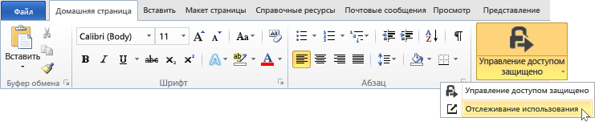
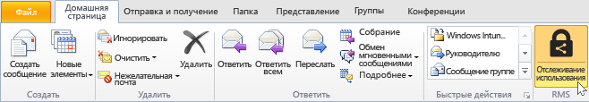
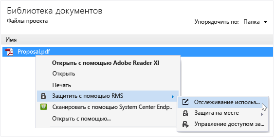
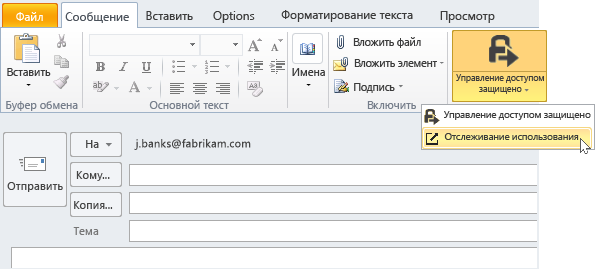

# Отслеживайте и отзывайте доступ к документам с помощью приложения для RMS-доступа
После того как вы защитили ваши документы с помощью приложения для управления RMS-доступом, если ваша организация использует Azure Rights Management, а не Active Directory Rights Management, вы сможете отслеживать, как люди используют защищенные документы. При необходимости также можно отозвать доступ к этим документам, когда вы хотите убрать их из общего доступа. Для этого используется **веб-сайт отслеживания документов**, который доступен с компьютеров под управлением Windows, Mac и даже с планшетов и мобильных телефонов.

> [!TIP]
> Двухминутное видео: [Отслеживание документов и отзыв прав доступа с помощью Azure RMS](http://channel9.msdn.com/Series/Information-Protection/Azure-RMS-Document-Tracking-and-Revocation)

При доступе к этому веб-сайту для отслеживания документов необходимо выполнить вход в систему. Если у вашей организации есть [подписка, которая поддерживает отслеживание и отзыв документа,](https://technet.microsoft.com/dn858608.aspx) и вам назначена лицензия для этой подписки, вы можете увидеть, кто пытался открыть защищенные файлы и была ли попытка успешной (успешно ли прошла проверка подлинности). Также вы узнаете, где и когда пользователи пытались получить доступ к документу. Кроме того:

-   Если необходимо отменить общий доступ к документу: Щелкните **Отменить доступ**, обратите внимание на период времени, в течение которого документ по-прежнему будет доступен, решите, следует ли уведомить пользователей об отмене доступа к документу, и введите сообщение.

-   Для экспорта в Excel: Щелкните **Открыть в Excel**, чтобы изменить данные и создать собственные представления и графики.

-   Чтобы настроить уведомления по электронной почте: Щелкните **Параметры** и укажите, следует ли отправлять уведомления по электронной почте при обращении к документу.

-   Если у вас есть вопросы или вы хотите оставить отзыв о сайте отслеживания документов: Щелкните значок справки для доступа к [вопросам и ответам по отслеживанию документа](http://go.microsoft.com/fwlink/?LinkId=523977).

## Использование Office для доступа к сайту отслеживания документов

-   Для приложений Office, Word, Excel и PowerPoint: На вкладке **Главная** в группе **RMS** щелкните **Поделиться с защитой** и снова выберите **Отслеживать использование**.

    

-   Для Outlook: На вкладке **Главная** в группе **RMS** щелкните **Отслеживать использование**.

    

Если вы не видите эти параметры, то, вероятнее всего, либо приложение для управления доступом RMS не установлено на компьютере, либо не установлена последняя версия или для завершения установки необходимо перезапустить компьютер. Дополнительные сведения об установке приложения см. в разделе [Скачивание и установка приложения для управления доступом Rights Management](../Topic/Download_and_install_the_Rights_Management_sharing_application.md).

### Другие способы отслеживания документов и отмены доступа к ним
Кроме отслеживания документов на компьютерах Windows с помощью приложений Office вы также можете использовать следующие альтернативные варианты.

-   **Браузер**: этот метод работает для всех поддерживаемых устройств.

-   **Проводник**: этот метод работает для компьютеров Windows.

-   **Сообщения Outlook**: этот метод работает для компьютеров Windows.

##### Использование браузера для доступа к сайту отслеживания документов

-   В поддерживаемом браузере перейдите на [сайт отслеживания документов](http://go.microsoft.com/fwlink/?LinkId=529562).

    Поддерживаемые браузеры: Мы рекомендуем использовать Internet Explorer по крайней мере версии 10, но можно использовать и любой из следующих браузеров:

    -   Internet Explorer: версия 10 и более поздняя

    -   Internet Explorer 9 с обновлением MS12-037: совокупное обновление безопасности для Internet Explorer, 12 июня 2012 г.

    -   Mozilla Firefox: версия 12 и более поздняя

    -   Apple Safari 5: версия 5 и более поздняя

    -   Google Chrome: версия 18 и более поздняя

##### Использование проводника для доступа к сайту отслеживания документов

-   Щелкните файл правой кнопкой мыши, выберите **Защитить с помощью RMS**, а затем выберите **Отслеживать использование**.

    

##### Использование сообщения Outlook для доступа к сайту отслеживания документов

-   В сообщении на вкладке **Сообщение** в группе **RMS** щелкните **Защитить и поделиться** и выберите **Отслеживать использование**.

    

## Примеры и другие инструкции
Примеры для использования Rights Management, приложения для управления доступом, справочные инструкции см. в следующих разделах руководства пользователя приложения для управления доступом Rights Management:

-   [Примеры использования приложения для управления доступом RMS](../Topic/Rights_Management_sharing_application_user_guide.md#BKMK_SharingExamples)

-   [Что необходимо сделать?](../Topic/Rights_Management_sharing_application_user_guide.md#BKMK_SharingInstructions)

## См. также
[Руководство пользователя по приложению управления доступом Rights Management](../Topic/Rights_Management_sharing_application_user_guide.md)

