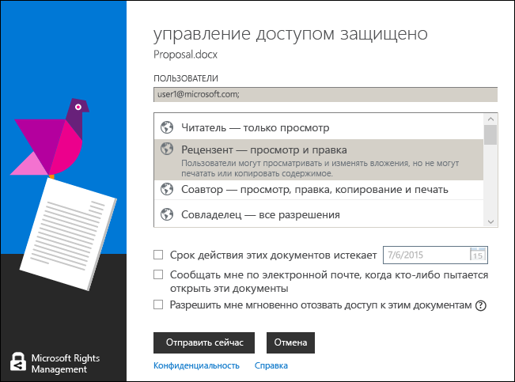

# использование сочетаний клавиш в приложении управления доступом Rights Management
При использовании приложения управления доступом RMS нажмите клавишу **ALT** для просмотра доступных клавиш доступа и одновременно нажмите клавишу **ALT** и клавишу доступа, чтобы выбрать параметр.

Например, в диалоговом окне **Поделиться с защитой** нажмите клавишу **ALT** для просмотра клавиш доступа, а затем нажмите **ALT+m**, чтобы установить флажок **Уведомлять меня по электронной почте, когда кто-то пытается открыть эти документы**.

## Примеры и другие инструкции
Примеры для использования Rights Management, приложения для управления доступом, справочные инструкции см. в следующих разделах руководства пользователя приложения для управления доступом Rights Management:

-   [Примеры использования приложения для управления доступом RMS](../Topic/Rights_Management_sharing_application_user_guide.md#BKMK_SharingExamples)

-   [Что необходимо сделать?](../Topic/Rights_Management_sharing_application_user_guide.md#BKMK_SharingInstructions)

## См. также
[Руководство пользователя по приложению управления доступом Rights Management](../Topic/Rights_Management_sharing_application_user_guide.md)

