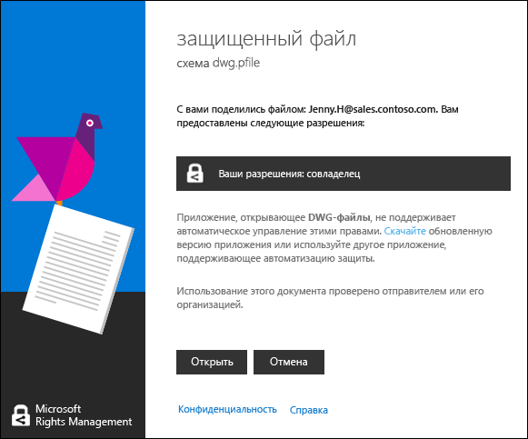

# Просмотр и использование файлов, защищенных с помощью службы Rights Management
Если [приложение для управления доступом Rights Management (RMS)](https://technet.microsoft.com/library/dn574734%28v=ws.10%29.aspx) установлено на компьютере, просмотреть защищенный файл можно, просто дважды щелкнув его. Файл может быть вложением в сообщении электронной почты или он встретился при использовании Проводника.

> [!NOTE]
> Перед просмотром защищенного файла RMS необходимо сначала убедиться, что вы имеете права для просмотра файла, и это делается путем проверки имени пользователя и пароля. В некоторых случаях они могут быть кэшированы, и запрос учетных данных не появится. В других случаях будет предложено ввести учетные данные.
> 
> Если ваша организация не использует Azure Rights Management (Azure RMS) или AD RMS, можно обратиться за бесплатной учетной записью, которая будет принимать ваши учетные данные, чтобы можно было открывать файлы, защищенные с помощью службы RMS.
> 
> -   Чтобы обратиться за этой учетной записью, щелкните ссылку, чтобы зарегистрироваться в службе [RMS для частных лиц](http://go.microsoft.com/fwlink/?LinkId=309469).
> 
>     При регистрации используйте адрес электронной почты в организации, а не личный адрес электронной почты. Если вы регистрируетесь, поскольку получили защищенное вложение, используйте тот же адрес, который был использован для получения сообщения электронной почты.
> -   Дополнительные сведения см. в разделе [RMS для частных лиц и Microsoft Azure Rights Management](http://technet.microsoft.com/library/dn592127.aspx).

## Просмотр защищенного файла
С помощью Проводника или сообщения электронной почты, которое содержит вложение, дважды щелкните защищенный файл и введите учетные данные, если будет предложено сделать это.

Если вы видите две версии файла с разными расширениями, откройте файл с расширением PPDF только в том случае, если не удается открыть другой файл. Если не удается открыть PPDF-версию, сначала установите [приложение для управления доступом RMS](http://technet.microsoft.com/library/dn574734.aspx), которое позволяет открывать файлы, имеющие расширение PPDF.

> [!NOTE]
> Дополнительные сведения см. в разделе [Что такое файл .ppdf, который создается автоматически?](../Topic/Dialog_box_options_for_the_Rights_Management_sharing_application.md#BKMK_PPDF).

Способ открытия файла зависит от того, как он был защищен. Это можно определить, просмотрев расширение имени файла. В любом случае при открытии файла может быть проведен аудит, и файл остается в режиме аудита все время, пока защищен. Кроме того, если файл был получен как вложение электронной почты, отправитель может получать уведомления по электронной почте каждый раз при открытии файла.

|Расширение имени файла и защита|Дополнительные сведения|
|-----------------------------------|---------------------------|
|Файл имеет расширение **.pfile**.  Файл был защищен в общем порядке.|При открытии файла появится диалоговое окно **Защищенный файл** приложения для управления доступом, которое указывает, кто защитил файл, и что вам нужно соблюдать разрешения совладельца. Щелкните **Открыть** для чтения файла.  |
|Файл имеет расширение **.ppdf**, или это защищенный текст или изображение (например, **.ptxt** или **.pjpg**).  Файл изначально защищен как копия только для чтения.|Файл открывается с помощью средства просмотра, которое устанавливается вместе с приложением для управления доступом RMS. Это файл только для чтения, даже если сохранить его в другом месте или переименовать.|
|Другие расширения имен файлов.  Файл изначально защищен.|Файл откроется в приложении, связанном с расширением имени исходного файла, и баннер с ограничениями отображается в верхней части файла. Этот баннер может отображать разрешения, примененные к документу, или ссылку на них. Например, может появиться следующее — здесь необходимо нажать кнопку **Разрешения ограничены**, чтобы открыть фактические разрешения, которые применяются к файлу, и список людей, имеющих доступ к нему:  |
Полный список расширений имен файлов, которые поддерживает Rights Management, см. в разделах [Поддерживаемые типы файлов и расширения имен файлов](../Topic/Rights_Management_sharing_application_administrator_guide.md#BKMK_SupportFileTypes) статьи [Руководство администратора по приложению управления доступом Rights Management](../Topic/Rights_Management_sharing_application_administrator_guide.md). Если нужного расширения нет в списке, воспользуйтесь поиском в Интернете, чтобы проверить, поддерживается ли оно каким-либо другим приложением.

> [!NOTE]
> Если файл поддерживается Rights Management и не открывается, загрузите [инструмент RMS Analyzer](https://www.microsoft.com/en-us/download/details.aspx?id=46437) и воспользуйтесь им. Следуйте инструкциям инструмента для обнаружения проблем, которые могут препятствовать открытию защищенного документа.

## Использование защищенных файлов (например, редактирование и печать файла)
Если после открытия защищенного файла требуется не только его чтение, но и, например, редактирование, копирование или печать:

|Расширение имени файла|Инструкции|
|--------------------------|--------------|
|Файл имеет расширение **.pfile**.|Сохраните открытый файл и присвойте ему новое расширение файла, связанное с приложением, которое вы хотите использовать.  Например если файл был защищен с использованием имени document.vsdx.pfile, просмотрите файл и сохраните файл в проводнике как document.vsdx.  Новый файл больше не защищен. Если вы хотите защитить его, необходимо сделать это вручную. Инструкции см. в разделе [Защита файла на устройстве &#40;защита на месте&#41; с помощью приложения для управления доступом Rights Management](../Topic/Protect_a_file_on_a_device__protect_in-place__by_using_the_Rights_Management_sharing_application.md).|
|Файл имеет расширение **.ppdf**, или это защищенный текст или изображение (например, **.ptxt** или **.pjpg**).|Можно только просматривать файл, если нужно переименовать или переместить его, защита остается с файлом.|
|Другие расширения имен файлов.|Устройство должны иметь приложения, поддерживающее Rights Management, чтобы использовать эти файлы. Такие приложения называются приложениями, работающими с RMS. Приложения Office 2016, Office 2013 и Office 2010 (например Word, Excel, PowerPoint и Outlook) являются примерами приложений, работающими c Rights Management. Однако приложения, которые выпускаются не корпорацией Майкрософт, а другими компаниями, и бизнес-приложения вашей организации также могут работать с Rights Management.  Приложения, которые работают с Rights Management, способны открывать файлы, защищенные другими приложениями, работающими с Rights Management. Кроме того, они сохраняют защиту, примененную к файлу, даже если изменить файл или сохранить его с другим именем файла или в другом месте. Эти приложения позволяют использовать файл в соответствии с разрешениями, которые применяются к нему в настоящее время, чтобы при наличии разрешения на использование файла это можно было сделать. Например можно иметь разрешение на то, чтобы изменить файл, но не напечатать.|

## Примеры и другие инструкции
Примеры для использования Rights Management, приложения для управления доступом, справочные инструкции см. в следующих разделах руководства пользователя приложения для управления доступом Rights Management:

-   [Примеры использования приложения для управления доступом RMS](../Topic/Rights_Management_sharing_application_user_guide.md#BKMK_SharingExamples)

-   [Что необходимо сделать?](../Topic/Rights_Management_sharing_application_user_guide.md#BKMK_SharingInstructions)

## См. также
[Руководство пользователя по приложению управления доступом Rights Management](../Topic/Rights_Management_sharing_application_user_guide.md)

