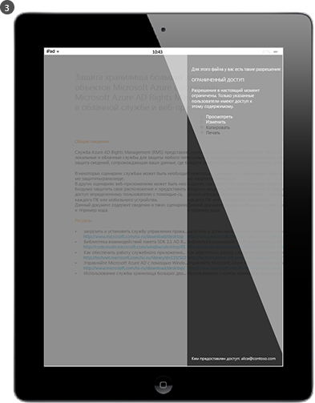

# Что такое управление правами Azure?
Azure Rights Management (Azure RMS) — это решение для защиты информации для организаций, которым нужно защитить свои данные в сложной современной бизнес-среде.

Среди проблем — обязательное наличие подключения к Интернету, а также ситуация, когда пользователи берут к себе на работу свои персональные устройства, получают доступ к корпоративным данным по пути на работу и с работы и делятся конфиденциальной информацией со своими партнерами по бизнесу. При выполнении повседневной работы пользователи делятся информацией с помощью электронной почты, сайтов обмена файлами, а также облачных служб. В этих условиях традиционные средства контроля безопасности (например, списки управления доступом и разрешения NTFS) и брандмауэры характеризуются ограниченной эффективностью в случае, когда вы хотите обеспечивать защиту своих корпоративных данных и одновременно рассчитываете на эффективную работу своих пользователей.

В свою очередь, система Azure RMS может защищать конфиденциальную информацию вашей компании при любых сценариях. Она использует шифрование, удостоверения и политики авторизации для защиты файлов и электронной почты и работает на различных устройствах — телефонах, планшетах и ПК. Данные можно защитить как внутри организации, так и за ее пределами, поскольку эта защита остается с данными, даже в том случае, когда они покидают границы организации. Например, кто-либо из сотрудников отправляет документ по электронной почте в компанию-партнер или сохраняет его на своем облачном диске. Такая постоянная защита, предоставляемая Azure RMS, позволяет не только защищать ваши корпоративные данные, но может быть обязательной по закону для обеспечения соответствия требованиям, выполнения требований по представлению документов или просто рекомендуется для эффективного управления сведениями.

Но, кроме того, и это крайне важно, авторизованные пользователи и службы (например, поиска и индексации) могут продолжать читать и проверять данные, которые защищает система Azure RMS, что было бы сложно осуществить с помощью других решений по защите информации, где используется одноранговое шифрование. Данная возможность иногда называется "обоснование на основе данных" и является ключевым элементом при обеспечении контроля за данными вашей организации.

На рисунке ниже показано, как система Azure RMS работает в качестве решения по управлению правами для Office 365, а также для локальных серверов и служб. Вы также увидите, что она поддерживает популярные устройства конечного пользователя, которые работают под управлением ОС Windows, Mac OS, iOS, Android и Windows Phone.

> [!TIP]
> На этом этапе дополнительные ресурсы могут оказаться полезными:
> 
> -   Двухминутное видео: [Что такое Microsoft Azure Rights Management](http://technet.microsoft.com/dn833005.aspx)
> -   Руководство, состоящее из пяти шагов: [Учебник по быстрому запуску для Azure Rights Management](../Topic/Quick_Start_Tutorial_for_Azure_Rights_Management.md)
> -   Требования Azure RMS, в том числе варианты подписки для покупки или оценки: [Требования для службы Azure Rights Management](../Topic/Requirements_for_Azure_Rights_Management.md)

Дополнительная информация об Azure RMS приводится в следующих разделах.

-   [Какие проблемы позволяет решить система Azure RMS?](../Topic/What_is_Azure_Rights_Management_.md#BKMK_RMSrequirements)

    -   [Нормативные требования и требования безопасности](../Topic/What_is_Azure_Rights_Management_.md#BKMK_RMScompliance)

-   [Azure RMS в действии: что видят администраторы и пользователи?](../Topic/What_is_Azure_Rights_Management_.md#BKMK_RMSpictures)

    -   [Включение и настройка службы Rights Management](../Topic/What_is_Azure_Rights_Management_.md#BKMK_Example_ManagementPortal)

    -   [Автоматическая защита файлов на файловых серверах под управлением Windows Server с инфраструктурой классификации файлов](../Topic/What_is_Azure_Rights_Management_.md#BKMK_Example_FCI)

    -   [Автоматическая защита сообщений электронной почты с помощью Exchange Online и политик предотвращения потери данных](../Topic/What_is_Azure_Rights_Management_.md#BKMK_Example_DLP)

    -   [Автоматическая защита файлов с помощью SharePoint Online и защищенных библиотек](../Topic/What_is_Azure_Rights_Management_.md#BKMK_Example_SharePoint)

    -   [Пользователи могут безопасно обмениваться вложениями с мобильными пользователями](../Topic/What_is_Azure_Rights_Management_.md#BKMK_Example_SharingApp)

-   [Как работает Azure RMS? Взгляд изнутри](../Topic/What_is_Azure_Rights_Management_.md#BKMK_HowRMSworks)

    -   [Элементы управления шифрования, используемые Azure RMS: Алгоритмы и длины ключей](../Topic/What_is_Azure_Rights_Management_.md#BKMK_RMScrytographics)

    -   [Пошаговое руководство по работе с Azure RMS: первое использование, защита контента, использование контента](../Topic/What_is_Azure_Rights_Management_.md#BKMK_Walthrough)

-   [Дальнейшие шаги](../Topic/What_is_Azure_Rights_Management_.md#BKMK_NextSteps)

## Какие проблемы позволяет решить система Azure RMS?
Таблица ниже позволяет идентифицировать бизнес-требования или проблемы, с которыми может сталкиваться ваша организация, а также дает возможность понять, каким образом Azure RMS может способствовать их решению.

|Требование или проблема|Устраняется с помощью системы Azure RMS|
|---------------------------|-------------------------------------------|
|Защита файлов всех типов|√ Предыдущая версия системы управления правами позволяла защищать только файлы Office при использовании собственной защиты. Теперь [универсальная защита](https://technet.microsoft.com/library/dn574738%28v=ws.10%29.aspx) означает, что поддерживаются все типы файлов.|
|Повсеместная защита файлов|√ При сохранении файла в папку ([Защита на месте](https://technet.microsoft.com/library/dn574733%28v=ws.10%29.aspx)) защита остается с файлом, даже если он копируется в хранилище, которое не находится под управлением ИТ-служб, например, в облачное хранилище.|
|Безопасный обмен файлами по электронной почте|√ Когда файл предоставляется для общего пользования по электронной почте ([Управление доступом защищено](https://technet.microsoft.com/library/dn574735%28v=ws.10%29.aspx)), файл защищен как вложение в сообщении электронной почты с инструкциями по открытию защищенного вложения. Текст самого сообщения электронной почты не шифруется, поэтому, получатель может всегда прочесть такие инструкции. Однако, так как присоединенный документ защищен, открыть его смогут только авторизованные пользователи, даже в том случае, если сообщение или документ отправляется другим пользователям.|
|Аудит и мониторинг|√ Вы можете [проводить аудит и контролировать использование](https://technet.microsoft.com/library/dn529121.aspx) защищенных файлов даже после того, как эти файлы покидают границы организации.  Предположим, что вы работаете в компании Contoso, Ltd. Вы совместно работаете над проектом с тремя пользователями из компании Fabrikam, Inc. Вы отправляете этим трем пользователям защищенный документ, доступный только для чтения. Функция аудита системы RMS Azure может предоставлять следующую информацию:  -   Открывали ли пользователи, которых вы указали в компании Fabrikam, данный документ и в какое время. -   Пытались ли другие пользователи, не указанные вами, открыть документ (и смогли ли они это сделать) — возможно, так как он был отправлен или сохранен в общем месте, к которому могли получить доступ другие пользователи. -   Пытался ли кто либо из указанных пользователей напечатать или изменить документ (и смог ли он это сделать).|
|Поддержка для всех часто используемых устройств, не только компьютеров Windows|√ [Поддерживаемые устройства](https://technet.microsoft.com/library/dn655136.aspx) включают следующие.  -   Компьютеры Windows и телефоны -   Компьютеры Mac -   Планшеты iOS и телефоны -   Планшеты и телефоны Android|
|Поддержка совместной работы типа «бизнес-бизнес»|√ Так как Azure RMS представляет собой облачную службу, не нужно явным образом настраивать доверительные отношения с другими организациями перед тем, как можно будет совместно использовать с ними защищенный контент. Если у них уже есть Office 365 или каталог Azure AD, совместная работа с организациями будет поддерживаться автоматически. Если это не так, пользователи могут зарегистрироваться для получения бесплатной подписки на [RMS для частных лиц](https://technet.microsoft.com/library/dn592127.aspx).|
|Поддержка для локальных служб, а также Office 365|√ В дополнение к работе[без проблем с Office 365](https://technet.microsoft.com/library/jj585004.aspx)можно также использовать Azure RMS с помощью следующих локальных служб при развертывании [соединителя RMS](https://technet.microsoft.com/library/dn375964.aspx):  -   Exchange Server -   Сервер SharePoint -   Windows Server, на котором выполнятся инфраструктура классификации файлов|
|Простая активация|√ [Активация службы Rights Management](https://technet.microsoft.com/library/jj658941.aspx) для пользователей выполняется с помощью всего нескольких щелчков мыши на классическом портале Azure.|
|Возможность масштабирования в пределах организации (при необходимости)|√ Так как Azure RMS функционирует как облачная служба с эластичностью Azure, делающей возможным горизонтальное и вертикальное масштабирование, вам не нужно провизионировать или развертывать дополнительные локальные серверы.|
|Возможность создания простых и гибких политик|√ [Настраиваемые шаблоны политик правил](https://technet.microsoft.com/library/dn642472.aspx) позволяют администраторам быстро и легко применять политики, а пользователям — применять нужный уровень защиты для каждого документа и позволять только пользователям в вашей организации получать к ним доступ.  Например, чтобы предоставить общий доступ к корпоративному стратегическому документу для всех сотрудников, для всех внутренних сотрудников можно применить политику «только для чтения». Затем, применительно к более конфиденциальному документу (например, финансовому отчету) доступ можно предоставить только руководителям.|
|Широкая поддержка приложений|√ Azure RMS тесно интегрируется с приложениями и службами Microsoft Office, и расширяет поддержку для других приложений благодаря использованию приложения управления доступом RMS.  √ Пакет [Microsoft Rights Management SDK](https://msdn.microsoft.com/library/hh552972%28v=vs.85%29.aspx) содержит интерфейсы API для ваших внутренних разработчиков и поставщиков программного обеспечения, которые позволяют создавать собственные приложения, поддерживающие систему Azure RMS.  Дополнительные сведения см. в [Поддержка приложениями Azure Rights Management](../Topic/How_Applications_Support_Azure_Rights_Management.md).|
|Служба ИТ должна обеспечивать контроль за данными|√ Организации имеют возможность управлять своим ключом клиента и использовать решение "[используй свой ключ](https://technet.microsoft.com/library/dn440580.aspx)" (BYOK) с сохранением ключа клиента в аппаратных модулях безопасности (HSM).  √ Поддержка аудита и [ведение журнала использования](https://technet.microsoft.com/library/dn529121.aspx) для анализа бизнес-информации, отслеживания нарушений и (если есть утечка информации) выполнения расследования.  √ Делегированный доступ с использованием [функции суперпользователя](https://technet.microsoft.com/library/mt147272.aspx) гарантирует, что ИТ-отдел всегда может получить доступ к защищенному содержимому, даже в том случае, если документ был защищен сотрудником, который уже не работает в вашей организации. Следует отметить, что системы однорангового шифрования могут терять доступ к корпоративным данным.  √ Синхронизация [только тех атрибутов каталога, которые необходимы Azure RMS](https://azure.microsoft.com/documentation/articles/active-directory-aadconnectsync-attributes-synchronized/) для поддержки стандартных удостоверений локальных учетных записей Active Directory с помощью [средства синхронизации каталога](https://azure.microsoft.com/documentation/articles/active-directory-aadconnect-get-started-tools-comparison/), такого как Azure AD Connect.  √ Поддержка единого входа в облако без репликации паролей с помощью AD FS.  √ Организации всегда могут перестать пользоваться Azure RMS без потери доступа к содержимому, которое прежде защищалось Azure RMS. Сведения о процессе отказа от использования см. в статье [Деактивация службы Azure Rights Management и вывод ее из использования](../Topic/Decommissioning_and_Deactivating_Azure_Rights_Management.md). Кроме того, организации, развернувшие службы Active Directory Rights Management (AD RMS), могут осуществить [миграцию на Azure RMS](https://technet.microsoft.com/library/dn858447.aspx) без потери доступа к данным, которые были защищены AD RMS ранее.|
> [!TIP]
> Если вы знакомы с локальной версией Rights Management, службами Active Directory Rights Management Services (RMS AD), вам может оказаться интересной сравнительная таблица в разделе [Сравнение Azure Rights Management и AD RMS](../Topic/Comparing_Azure_Rights_Management_and_AD_RMS.md).

### Нормативные требования и требования безопасности
Azure RMS поддерживает следующие нормативные требования и требования безопасности.

√ Использование стандартных отраслевых методов криптографии и поддержка FIPS 140-2. Для получения дополнительных сведений см. раздел [Элементы управления шифрования, используемые Azure RMS: Алгоритмы и длины ключей](../Topic/What_is_Azure_Rights_Management_.md#BKMK_RMScrytographics) в этой статье.

√ Поддержка аппаратных модулей безопасности Thales (HSM) для хранения ключей клиента в центрах обработки данных Microsoft Azure. Система Azure RMS использует разные механизмы обеспечения безопасности для своих центров обработки данных в Северной Америке, регионах EMEA (Европа, Ближний Восток и Африка), а также в Азии, благодаря чему гарантируется, что ваши ключи могут использоваться исключительно в вашем регионе.

√ Система имеет следующие сертификаты:

-   ISO/IEC 27001:2013 (включает [ISO/IEC 27018](http://azure.microsoft.com/blog/2015/02/16/azure-first-cloud-computing-platform-to-conform-to-isoiec-27018-only-international-set-of-privacy-controls-in-the-cloud/))

-   Аттестаты SOC 2 SSAE 16/ISAE 3402

-   HIPAA BAA

-   Типовая статья ЕС

-   FedRAMP, являющейся частью Azure Active Directory в сертификации Office 365, выпущенной HHS для FedRAMP Agency Authority to Operate

-   PCI DSS, уровень 1

Дополнительные сведения о внешних сертификациях см. в разделе [Центр управления безопасностью Azure](http://azure.microsoft.com/support/trust-center/compliance/).

## Azure RMS в действии: что видят администраторы и пользователи?
Некоторые типичные примеры того, как администраторы и пользователи видят и могут использовать Azure RMS для защиты важной или конфиденциальной информации.

> [!NOTE]
> Во всех этих примерах, где Azure RMS используется для защиты данных, владелец содержимого продолжает иметь полный доступ к данным (файлу или электронной почте), даже если примененная защита предоставляет разрешения группе, членом которой владелец не является, или даже если примененная защита включает дату окончания срока действия.
> 
> Аналогичным образом ИТ-специалисты могут всегда получить доступ к защищенным данным без ограничений, используя функцию суперпользователя Rights Management, предоставляющую делегированный доступ авторизованным пользователям или службам, которые можно указать. Кроме того, сотрудник ИТ-отдела может отслеживать использование защищенных данных, например чтобы узнать, кто получает доступ к ним и когда.

Другие снимки экрана и видеоролики с RMS в действии см. на [портале служб Microsoft Rights Management](http://www.microsoft.com/rms), в [Блоге группы Microsoft Rights Management (RMS)](http://blogs.technet.com/b/rms) и в[проверенном содержимом для Azure RMS на сайте Curah!](http://curah.microsoft.com/Search?query="Azure%20RMS").

### Включение и настройка службы Rights Management
Хотя для активации и настройки Azure RMS можно использовать Windows PowerShell, проще это делать на портале управления. Когда служба активирована, в ней есть два шаблона по умолчанию, которые администраторы и пользователи могут выбрать для быстрого и простого применения защиты информации к файлам. Можно также создать собственные шаблоны для дополнительных параметров и настроек.

|||
|-|-|
|  [Полная картина](http://technet.microsoft.com/98d53a12-3b19-4622-bb1e-75ef56df5438) (по умолчанию в том же окне браузера)|Для активации RMS можно использовать центр администрирования Office 365 (первый рисунок) или классический портал Azure (второй рисунок).  Активация одним щелчком и подтверждение вторым, и вот уже включена защита информации для администраторов и пользователей в организации.|
|  [Полная картина](http://technet.microsoft.com/596e4fec-124c-41b1-8efd-63d5179193fb) (по умолчанию в том же окне браузера)|После активации для вашей организации автоматически станут доступны два шаблона политики прав. Один шаблон предназначен только для чтения (в название шаблона включено **Только для конфиденциального просмотра**), второй — для чтения и изменения (**Конфиденциально**).  Если эти шаблоны применяются к файлам или сообщениям электронной почты, то они ограничат доступ для пользователей в вашей организации. Это очень простой и быстрый способ предотвратить утечку информации к пользователям за пределами организации. **Tip:** Вы легко узнаете эти шаблоны по умолчанию, потому что в начало их названий будет автоматически добавлено название вашей организации. В нашем примере это **VanArsdel, Ltd**. Если вы не хотите, чтобы пользователи видели эти шаблоны, или хотите создать собственные шаблоны, это можно сделать на классическом портале Azure. Как показано на этом рисунке, мастер проводит пользователя через процесс создания пользовательского шаблона.|
|  [Полная картина](http://technet.microsoft.com/f5df80e5-efc9-4c0f-91be-060225977356) (по умолчанию в том же окне браузера)|Автономный доступ, параметры истечения срока действия и необходимость немедленной публикации шаблона (обеспечения его видимости в приложениях, поддерживающих управление правами) — это примеры некоторых доступных параметров конфигурации для создания собственных шаблонов.|
|  [Полная картина](http://technet.microsoft.com/597a3402-fd5a-4bcf-b5e6-5c983dbde697) (по умолчанию в том же окне браузера)|В результате публикации этих шаблонов пользователи смогут выбирать их в приложениях, например в проводнике и Microsoft Word.  -   Пользователь может выбрать шаблон по умолчанию **VanArsdel, Ltd — конфиденциально**. После этого только сотрудники VanArsdel смогут открывать и использовать документ, даже если он будет отправлен по электронной почте за пределы организации или сохранен в общедоступном месте. -   Пользователь может выбрать пользовательский шаблон, который создан администратором, — **Отдел продаж и маркетинга — только чтение и печать**. В этом случае доступ к файлу будет запрещен не только для пользователей за пределами организации, но и для ее сотрудников, не относящихся к отделу продаж и маркетинга. Кроме того, эти сотрудники не имеют полных прав доступа к документу, а только права для чтения и печати. Например, им нельзя его изменить или скопировать.|
Дополнительные сведения см. в разделах [Активация управления правами Azure](../Topic/Activating_Azure_Rights_Management.md) и [Настройка настраиваемых шаблонов для службы Azure Rights Management](../Topic/Configuring_Custom_Templates_for_Azure_Rights_Management.md).

Чтобы помочь пользователям организовать защиту важных файлов, см. раздел [Помощь пользователям по защите файлов с использованием Azure Rights Management](../Topic/Helping_Users_to_Protect_Files_by_Using_Azure_Rights_Management.md).

Далее приведены примеры того, как администраторы могут применять шаблоны для автоматической настройки защиты информации в файлах и сообщениях электронной почты.

### Автоматическая защита файлов на файловых серверах под управлением Windows Server с инфраструктурой классификации файлов
В этом примере показано, как можно использовать Azure RMS для автоматической защиты файлов на файловом сервере под управлением Windows Server 2012 или более поздней версии и настроить использование инфраструктуры классификации файлов.

Существует много способов применения значений классификации к файлам. Например, можно проверять содержимое файлов и соответствующим образом применять встроенные классификации, например режим конфиденциальности и персональные данные. Тем не менее, в этом примере администратор создает пользовательскую классификацию **маркетинг**, которая автоматически применяется ко всем документам пользователя, хранящимся в папке **маркетинговые акции**. Хотя эта папка защищена разрешениями NTFS, которые дают доступ только членам группы маркетинга, администратор знает, что эти разрешения могут быть потеряны, если кто-то из группы переместит или отправит файлы в сообщении электронной почты. После этого доступ к данным в файлах могут получить неавторизованные пользователи.

|||
|-|-|
|  [Полная картина](http://technet.microsoft.com/cf18c56b-c301-4640-8d9e-9e677e494091) (по умолчанию в том же окне браузера)|Администраторы устанавливают и настраивают соединитель Rights Management (RMS), который выступает в качестве посредника между локальными серверами и Azure RMS.|
|  [Полная картина](http://technet.microsoft.com/ba3e247d-ea5e-4009-8eac-74f70270ece0) (по умолчанию в том же окне браузера)|На файловом сервере администратор настраивает правила классификации и задачи, чтобы все файлы пользователя в папке **Маркетинговые акции** автоматически классифицировались, как **Маркетинг** и защищались с помощью шифрования RMS.  Она выбирает пользовательский шаблон RMS, созданный в первом примере, который дает доступ только сотрудникам отдела продаж и маркетинга: **Продажи и маркетинг, только чтение и печать**  В результате все документы в этой папке автоматически настраиваются с классификацией "Маркетинг" и будут защищены шаблоном RMS для отдела продаж и маркетинга.|
|  [Полная картина](http://technet.microsoft.com/ad666594-68df-4289-835a-235b2af9bf4b) (по умолчанию в том же окне браузера)|Как RMS помогает предотвратить утечку данных к людям, которые не должны иметь доступ к важной или конфиденциальной информации:  -   Джанет из отдела маркетинга отправила в сообщении электронной почты конфиденциальный отчет из папки "Маркетинговые акции". Этот отчет, содержащий новые функции продуктов и планы рекламы, запрашивается сотрудником, который в настоящее время находится в служебной командировке. Однако Ольга по ошибке отправляет его другому человеку. Она не заметила, что случайно выбрала получателя с похожим именем из другой компании.     Получателю не удастся прочитать конфиденциальный отчет, так как он не является членом группы "Отдел продаж и маркетинга".|
Дополнительные сведения см. в [Развертывание соединителя службы Azure Rights Management](../Topic/Deploying_the_Azure_Rights_Management_Connector.md).

### Автоматическая защита сообщений электронной почты с помощью Exchange Online и политик предотвращения потери данных
В предыдущем примере показано, как можно автоматически защитить файлы, содержащие конфиденциальные сведения, но что если сведения содержатся не в файле, а в сообщении электронной почты? Именно здесь могут пригодиться политики предотвращения потери данных Exchange Online (DLP), которые либо предлагают пользователям применить защиту информации (с помощью советов политик), либо автоматически применяют их (с помощью правил транспорта).

В этом примере администратор настраивает политику, чтобы защитить организацию в соответствии с нормативными актами США по защите персональных данных, но правила также можно настроить для соответствия другим нормативным требованиям или настраиваемым правилам, которые вы можете определить.

|||
|-|-|
|  [Полная картина](http://technet.microsoft.com/58461319-3981-4b7f-a195-956a1778e907) (по умолчанию в том же окне браузера)|Шаблон Exchange с именем **Личные сведения (PII), США** используется администратором для создания и настройки новой политики DLP. Этот шаблон ищет сведения (такие как номера социального страхования и номера водительских удостоверений) в сообщениях электронной почты.  Правила настраиваются таким образом, что сообщения электронной почты, содержащие эти сведения и отправляемые за пределы организации, автоматически защищаются с помощью шаблона RMS, давая доступ лишь сотрудникам компании.  Вот правило, настроенное для использования одного из шаблонов по умолчанию (**VanArsdel, Ltd — конфиденциально**) из первого примера. Можно также видеть, что ассортимент шаблонов включает все созданные пользовательские шаблоны, а также параметр **Запрет перенаправления**, который относится к Exchange.|
|  [Полная картина](http://technet.microsoft.com/bfb0762d-06fb-42e4-beff-eb391f4bedf0) (по умолчанию в том же окне браузера)|Менеджер по найму создает сообщение электронной почты, которое содержит номер социального страхования недавно принятого сотрудника. Он отправляет сообщение электронной почты получателю Шэри в отделе кадров.|
|  [Полная картина](http://technet.microsoft.com/59e3b68e-4bed-4962-bb1e-e82d82f8000a) (по умолчанию в том же окне браузера)|Если это сообщение электронной почты отправлено или переадресовано кому-либо вне организации, то правило DLP автоматически применяет защиту прав.  Когда сообщение покидает инфраструктуру организации, оно шифруется, поэтому указанный в нем номер социального страхования нельзя прочитать во время передачи или в почтовом ящике получателя. Получатель не сможет прочитать сообщение, если он не является сотрудником компании VanArsdel.|
Дополнительные сведения см. в следующих разделах.

-   [Exchange Online и Exchange Server](../Topic/How_Applications_Support_Azure_Rights_Management.md#BKMK_ExchangeIntro) в статье [Поддержка приложениями Azure Rights Management](../Topic/How_Applications_Support_Azure_Rights_Management.md).

-   [Exchange Online: настройка службы управления правами на доступ к данным](../Topic/Configuring_Applications_for_Azure_Rights_Management.md#BKMK_ExchangeOnline) в статье [Настройка приложений для службы Azure Rights Management](../Topic/Configuring_Applications_for_Azure_Rights_Management.md).

### Автоматическая защита файлов с помощью SharePoint Online и защищенных библиотек
Здесь рассказывается, как можно с легкостью защитить документы с помощью SharePoint Online и защищенных библиотек.

В этом примере администратор SharePoint в компании Contoso создал библиотеки для каждого отдела, которые используются для централизованного хранения и извлечения документов для редактирования и управления версиями. Например, создана библиотека для отдела продаж, библиотека для отдела маркетинга, библиотека для отдела кадров и т. д. После отправки или создания в одной из этих библиотек защищенного документа он наследует защиту библиотеки (т. е. не требуется выбирать шаблон политики прав), становится автоматически защищенным и остается таковым, даже если он перемещается за пределы библиотеки SharePoint.

|||
|-|-|
|  [Полная картина](http://technet.microsoft.com/2fc90989-9289-4431-9e6a-07740b7f6e5a) (по умолчанию в том же окне браузера)|Администратор включает управление правами на доступ к данным для информации сайта SharePoint.|
|  [Полная картина](http://technet.microsoft.com/a18f2e99-5ac4-4103-a88c-527846374091) (по умолчанию в том же окне браузера)|Затем она включает Rights Management для библиотеки. Хотя есть и дополнительные параметры, обычно такой простейшей настройки достаточно.  Когда документы загружены из библиотеки, они автоматически защищаются Rights Management, наследуя защиту, настроенную для библиотеки.|
|  [Увеличенное изображение](http://technet.microsoft.com/0ebd6806-0190-441e-84db-72ac4b97e4a2) (открывается в том же окне браузера по умолчанию)|Когда кто-то из отдела продаж извлекает из библиотеки отчет о продажах, то он видит вверху сообщение о том, что это защищенный документ с ограниченным доступом.  Документ остается защищенным даже в том случае, если пользователь переименовывает его, сохраняет его в другом месте или отправляет по электронной почте. Каким бы ни было имя файла, где бы он ни хранился и кому бы ни отправлялся, прочесть его смогут только сотрудники отдела продаж.|
Дополнительные сведения см. в следующих разделах.

-   [SharePoint Online и SharePoint Server](../Topic/How_Applications_Support_Azure_Rights_Management.md#BKMK_SharePointIntro) в статье [Поддержка приложениями Azure Rights Management](../Topic/How_Applications_Support_Azure_Rights_Management.md).

-   [SharePoint Online и OneDrive для бизнеса: настройка службы управления правами на доступ к данным](../Topic/Configuring_Applications_for_Azure_Rights_Management.md#BKMK_SharePointOnline) в статье [Настройка приложений для службы Azure Rights Management](../Topic/Configuring_Applications_for_Azure_Rights_Management.md).

### Пользователи могут безопасно обмениваться вложениями с мобильными пользователями
В предыдущих примерах показано, как администраторы могут автоматически применять защиту информации к важным и конфиденциальным данным. Есть некоторые случаи, когда пользователям может потребоваться самостоятельно применять защиту. Например, если они занимаются совместной работой с партнерами в другой организации, то им потребуются особые разрешения или параметры, которые не определены в шаблонах, для особых ситуаций, которые не затрагиваются в предыдущих примерах. В таких ситуациях пользователи могут применять шаблоны RMS самостоятельно или настроить пользовательские разрешения.

В этом примере показано, как пользователи легко могут предоставить доступ к документу сотрудникам другой компании. При этом они могут быть уверены в том, что документ защищен, а получатели смогут прочесть его, в том числе на популярных мобильных устройствах. В этом сценарии используется приложение для управления доступом Rights Management, которое можно автоматически развертывать на компьютерах Windows в вашей организации. Также пользователи могут установить его самостоятельно.

В этом примере Алиса из Contoso отправляет сообщение электронной почты с конфиденциальным документом Word Бобу из компании Fabrikam. Он читает документ на своем iPad, также он может прочитать его с легкостью на iPhone, планшете Android или телефоне, компьютере Mac, Windows Phone или компьютере Windows.

|||
|-|-|
|  [Полная картина](http://technet.microsoft.com/feeef78d-3c2e-432b-817d-d06f784be226) (по умолчанию в том же окне браузера)|На своем ПК с ОС Windows Алиса создает обычное сообщение электронной почты и прикрепляет документ.  Она щелкает пункт **Защитить и поделиться** на ленте, открывается диалоговое окно **Управление доступом защищено** приложения RMS-доступа.  Алиса хочет предоставить Бобу только возможность просмотра и редактирования документа и не хочет разрешать ему копировать или печатать его, поэтому она выбирает режим **Рецензент — просмотр и редактирование**. Также она хочет получать уведомления по электронной почте, когда кто-то пытается открыть документ, иметь возможность отозвать документ позже при необходимости и знать, что отзыв произойдет немедленно.|
|  [Полная картина](http://technet.microsoft.com/e748fd78-8bba-4168-96cf-f96def078283) (по умолчанию в том же окне браузера)|Боб видит сообщение электронной почты на своем iPad.  Помимо сообщения Анны с вложением, он получил инструкции о том, как установить приложение для управления доступом RMS на iPad и зарегистрироваться в нем. Алексей выполняет их.|
|  [Полная картина](http://technet.microsoft.com/7dba5ff9-a61d-4a83-8adc-d6ffb0e85df6) (по умолчанию в том же окне браузера)|Боб теперь может открыть вложение. Сначала ему предлагается войти, чтобы гарантировать, что он является целевым получателем.  Когда Боб просматривает документ, он также видит данные об ограничении доступа, которые сообщают ему, что ему можно просмотреть и изменить документ, но не скопировать или распечатать.|
|  [Полная картина](http://technet.microsoft.com/9f642a2e-58ad-44ab-9f81-f890d15380f9) (по умолчанию в том же окне браузера)|Алиса получает сообщение электронной почты, которое сообщает ей, что Боб успешно открыл отправленный документ, а также когда он это сделал.  Если Боб пересылает сообщение электронной почты с вложением или сохраняет его где-либо, где другие пользователи смогут получить доступ к нему, или же оно перехватывается в сети, то другие пользователи не смогут прочесть документ.|
Дополнительные сведения см. в разделе[Защита файла, которым вы делитесь по электронной почте](https://technet.microsoft.com/library/dn574735.aspx) и [Просмотр и использование защищенных файлов](https://technet.microsoft.com/library/dn574741.aspx) в [Руководстве по приложению управления доступом Rights Management](https://technet.microsoft.com/library/dn339006.aspx).

Кроме того, [Учебник по быстрому запуску для Azure Rights Management](../Topic/Quick_Start_Tutorial_for_Azure_Rights_Management.md) содержит пошаговые инструкции для этого сценария.

Теперь, когда вы познакомились с примерами использования Azure RMS, вам может быть интересно, как работает это решение. Дополнительные технические сведения о работе Azure RMS см. в следующем разделе.

## Как работает Azure RMS? Взгляд изнутри
Важно понимать, что при работе Azure RMS служба управления правами (и Microsoft) не видит и не сохраняет ваши данные в рамках процесса защиты информации. Сведения, которые вы защищаете, никогда не отправляются и не сохраняются в Azure, если только вы явным образом не сохраняете их в Azure или не используйте другую облачную службу, которая сохраняет их в Azure. Azure RMS просто делает данные в документе нечитаемыми для всех, кроме авторизованных пользователей и служб:

-   Данные шифруются на уровне приложения и включают политику, определяющую авторизованное использование для этого документа.

-   В случае использования защищенного документа легитимным пользователем или при его обработке авторизованной службой данные в документе расшифровываются и применяются права, которые определены в политике.

На высоком уровне можно увидеть, как работает этот процесс на следующем рисунке. Документ, содержащий секретную формулу, защищен и успешно открывается авторизованным пользователем или службой. Документ защищен ключом содержимого (зеленый ключ на этом рисунке). Этот ключ уникален для каждого документа и помещается в заголовке файла, где он защищен корневым ключом клиента службы управления правами (красный ключ на этом рисунке). Ключ клиента может формироваться и управляться корпорацией Microsoft, или вы можете создавать свой собственный ключ клиента и управлять им.

На протяжении всего процесса защиты, когда службы Azure RMS выполняют шифрование и расшифровку, авторизацию и применяют ограничения, секретная формула никогда не отправляется в Azure.

Подробное описание того, что при этом происходит, см. в разделе [Пошаговое руководство по работе с Azure RMS: первое использование, защита контента, использование контента](../Topic/What_is_Azure_Rights_Management_.md#BKMK_Walthrough) в этой статье.

Технические сведения об алгоритмах и длине ключей, которые использует Azure RMS, см. в следующем разделе.

### Элементы управления шифрования, используемые Azure RMS: Алгоритмы и длины ключей
Даже если вам не требуется знать, как работают службы RMS, вас могут спросить об элементах управления шифрованием, которые они используют, чтобы убедиться в соответствии защиты отраслевым стандартам.

|||
|-|-|
|Метод защиты документации:|Алгоритм: AES  Длина ключа: 128 бит и 256 бит 1|
|Метод защиты ключа:|Алгоритм: RSA  Длина ключа: 2048 бит|
|Подписание сертификата:|Алгоритм: SHA-256|
1 256 бит используется приложением управления доступом Rights Management для универсальной защиты и собственной защиты, если файл имеет расширение имени PPDF либо является защищенным текстовым документом или изображением (PTXT или PJPJ).

### Пошаговое руководство по работе с Azure RMS: первое использование, защита контента, использование контента
Чтобы получить более подробное представление о работе Azure RMS, рассмотрим типичный процесс после [активации службы Azure RMS](https://technet.microsoft.com/library/jj658941.aspx), когда пользователь впервые использует службу RMS на своем компьютере под управлением Windows (этот процесс иногда называют **инициализацией среды пользователя** или начальной загрузкой), **защищает контент** (документ или сообщение электронной почты), а затем **потребляет** (открывает и использует) контент, который был защищен кем-либо еще шаг за шагом.

После инициализации среды пользователя этот пользователь может защитить документы или использовать защищенные документы на данном компьютере.

> [!NOTE]
> Если пользователь переходит на другой компьютер Windows или другой пользователь использует этот же компьютер Windows, процесс инициализации повторяется.

#### Инициализация среды пользователя
Прежде чем пользователь сможет защитить контент или использовать защищенный контент на компьютере Windows, необходимо подготовить среду пользователя на устройстве. Это однократный процесс, который выполняется автоматически без вмешательства пользователя, когда он пытается защитить или использовать защищенный контент:

|||
|-|-|
||Клиент службы управления правами на компьютере сначала подключается к Azure RMS и проверяет подлинность пользователя с помощью своей учетной записи Azure Active Directory.  Если учетная запись пользователя включена в федерацию с Azure Active Directory, проверка подлинности выполняется автоматически и пользователю не предлагается ввести учетные данные.|

|||
|-|-|
||После проверки подлинности пользователя соединение автоматически перенаправляется на клиента RMS в организации, который выпускает сертификаты. Эти сертификаты дают пользователям возможность пройти проверку подлинности Azure RMS для защиты контента в автономном режиме и использования защищенного контента.  Копия сертификата пользователя хранится в Azure RMS. Таким образом, если пользователь переходит на другое устройство, сертификаты создаются с помощью тех же самых ключей.|

#### Защита содержимого
Когда пользователь защищает документ, RMS-клиент выполняет следующие действия над незащищенным документом:

|||
|-|-|
||Клиент RMS создает случайный ключ (ключ содержимого) и шифрует документ с помощью этого ключа с использованием алгоритма симметричного шифрования AES.|

|||
|-|-|
||Затем клиент RMS создает сертификат, который включает политику для документа на основе шаблона или указанных определенных прав для документа. Эта политика включает права для различных пользователей или групп и другие ограничения, например дату окончания срока действия.  Затем клиент RMS использует ключ организации, полученный при инициализации среды пользователя, и использует этот ключ для шифрования политики и симметричного ключа содержимого. Клиент RMS также подписывает политику с помощью сертификата пользователя, который был получен при инициализации среды пользователя.|

|||
|-|-|
||И наконец, клиент RMS внедряет политику в файл с текстом ранее зашифрованного документа. Все это вместе образует защищенный документ.  Этот документ можно хранить в любом месте или совместно использовать с помощью любого метода, а политика всегда сохраняется вместе с зашифрованным документом.|

#### Потребление содержимого
Когда пользователь хочет использовать защищенный документ, клиент RMS начинает свою работу с запроса доступа к службе управления правами Azure:

|||
|-|-|
||Прошедший проверку подлинности пользователь отправляет политику документа и сертификаты пользователя в Azure RMS. Служба расшифровывает и оценивает политику, а также создает список прав (если таковые имеются), которые пользователь имеет в отношении этого документа.|

|||
|-|-|
||Затем служба извлекает ключ содержимого AES из расшифрованной политики. Этот ключ далее шифруется с помощью открытого ключа RSA пользователя, который был получен вместе с запросом.  Далее повторно зашифрованный ключ содержимого встраивается в лицензию на использование зашифрованных данных вместе со списком прав пользователя, которые затем возвращаются клиенту RMS.|

|||
|-|-|
||Наконец, клиент RMS принимает лицензию на использование зашифрованных данных и расшифровывает ее с помощью собственного закрытого ключа пользователя. Это позволяет клиенту RMS расшифровывать текст документа по мере необходимости и отображать его на экране.  Клиент также расшифровывает список прав и передает их в приложение, которое применяет эти права в пользовательском интерфейсе приложения.|

#### Варианты
В предыдущих пошаговых руководствах описаны стандартные сценарии, но существуют некоторые варианты:

-   **Мобильные устройства** Когда мобильные устройства защищают или используют файлы с помощью Azure RMS, технологическая схема гораздо проще. Мобильные устройства не проходят сначала процесс инициализации пользователя, поскольку вместо этого каждая транзакция (для защиты или для использования содержимого) независима. Как и в случае с компьютерами Windows, мобильные устройства подключаются к службе управления правами Azure и проходят проверку подлинности. Чтобы защитить содержимое, мобильные устройства отправляют политику, а Azure RMS отправляет им лицензию на публикацию и симметричный ключ для защиты документа. Для использования контента, когда мобильные устройства подключены к службе управления правами Azure и проходят проверку подлинности, они отправляют политику документа в Azure RMS и запрашивают лицензию на использование документа. В ответ Azure RMS отправляет необходимые ключи и ограничения мобильным устройствам. Оба процесса используют TLS для защиты обмена ключами и других коммуникаций.

-   **Соединитель RMS**: При использовании Azure RMS с соединителем RMS технологическая схема остается неизменной. Единственное отличие заключается в том, что соединитель действует как ретранслятор между локальными службами (например, Exchange Server и SharePoint Server) и Azure RMS. Сам соединитель не выполняет никаких операций, таких как инициализация среды пользователя или шифрование и расшифровка. Он просто передает данные, которые обыкновенно поступают на сервер AD RMS, обрабатывая трансляцию между протоколами, используемыми на каждой из сторон. Этот сценарий позволяет использовать Azure RMS с локальными службами.

-   **Универсальная защита (.pfile)** В случаях, когда Azure RMS обеспечивает универсальную защиту файла, поток операций практически такой же, как и при защите содержимого, за исключением того, что клиент RMS создает политику, которая предоставляет все права. При использовании файла он расшифровывается до его передачи в целевое приложение. Этот сценарий позволяет защитить все файлы, даже если они не имеют встроенной поддержки RMS.

-   **Защищенный PDF (.ppdf)**: Если изначально служба Azure RMS защищает файл Office, она также создает копию этого файла и защищает ее таким же образом. Единственное отличие заключается в том, что копия файла имеет формат PPDF, который приложение управления доступом RMS может открывать только для просмотра. Этот сценарий позволяет отправлять защищенные вложения по электронной почте, зная, что получатель на мобильном устройстве всегда будет иметь возможность их прочитать, даже если мобильное устройство не содержит приложение со встроенной поддержкой защищенных файлов Office.

## Дальнейшие шаги
Дополнительные сведения о системе Azure RMS см. в других разделах статьи [Начало работы со службой Azure Rights Management](../Topic/Getting_Started_with_Azure_Rights_Management.md), например [Поддержка приложениями Azure Rights Management](../Topic/How_Applications_Support_Azure_Rights_Management.md), в которых показано, как ваши существующие приложения могут интегрироваться с Azure RMS для обеспечения защиты информации. Ознакомьтесь с разделом [Терминология для Azure Rights Management](../Topic/Terminology_for_Azure_Rights_Management.md), где рассматриваются термины, которые могут вам попадаться при настройке и использовании системы Azure RMS, а также прочтите раздел [Требования для службы Azure Rights Management](../Topic/Requirements_for_Azure_Rights_Management.md) перед началом процедуры развертывания. Если вы хотите попробовать это на практике, воспользуйтесь [Учебник по быстрому запуску для Azure Rights Management](../Topic/Quick_Start_Tutorial_for_Azure_Rights_Management.md).

Если вы готовы к развертыванию Azure RMS в вашей организации, используйте статью [Стратегия развертывания Azure Rights Management](../Topic/Azure_Rights_Management_Deployment_Roadmap.md), в которой описаны этапы развертывания и содержатся ссылки на пошаговые инструкции.

> [!TIP]
> Для получения дополнительных сведений и справки используйте ресурсы и ссылки в разделе [Информация и поддержка Azure Rights Management](../Topic/Information_and_Support_for_Azure_Rights_Management.md).

## См. также
[Начало работы со службой Azure Rights Management](../Topic/Getting_Started_with_Azure_Rights_Management.md)

